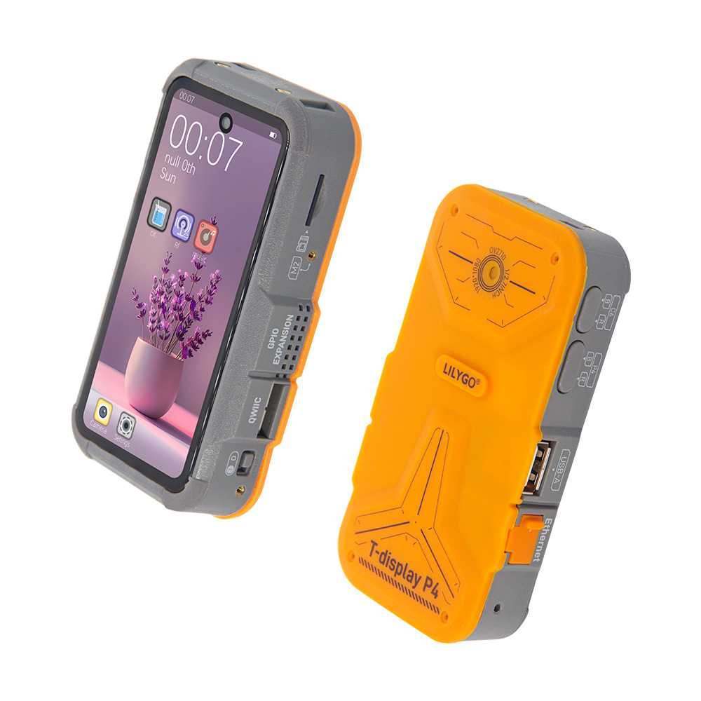
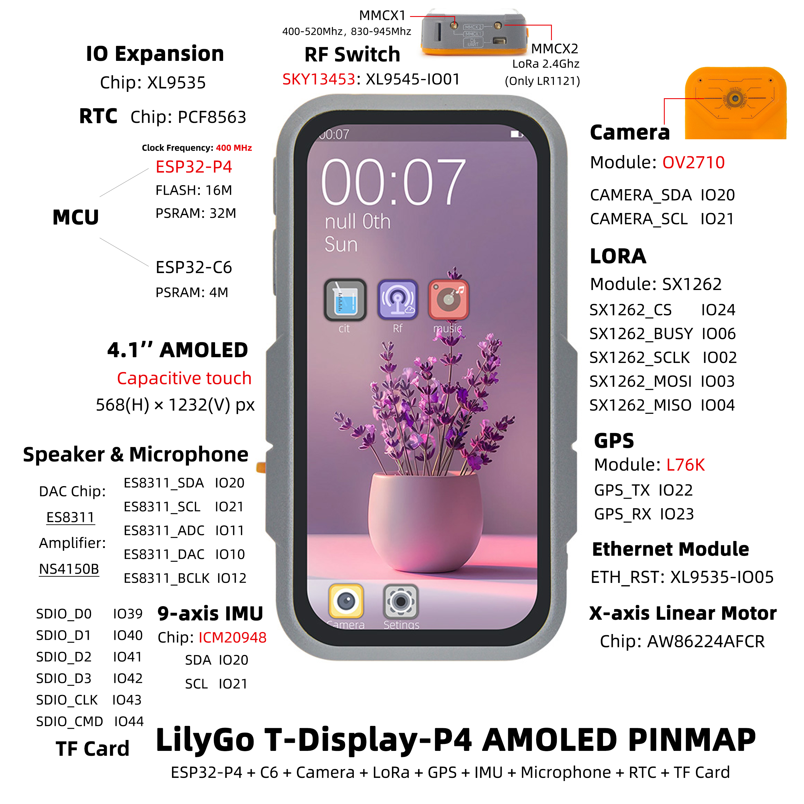
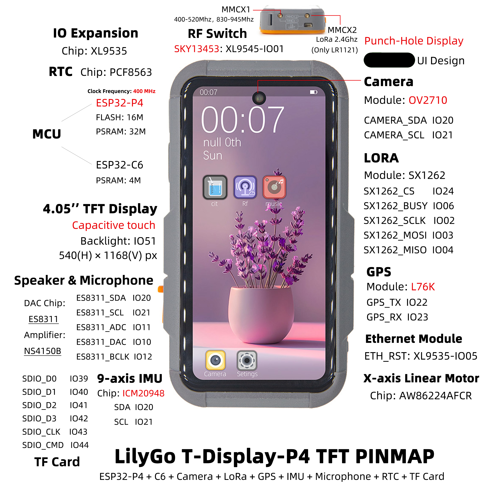
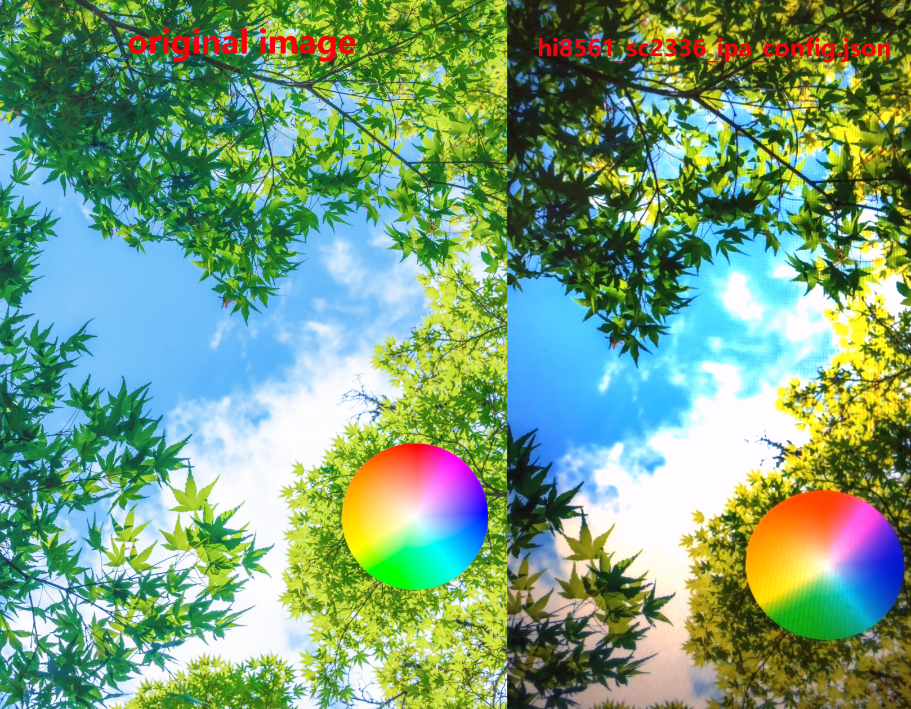
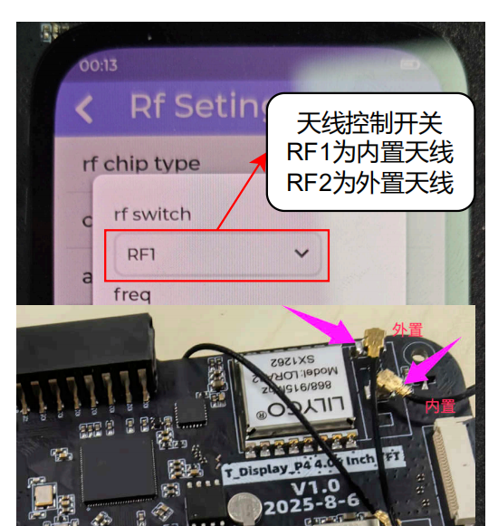
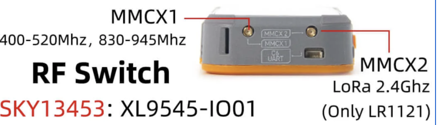
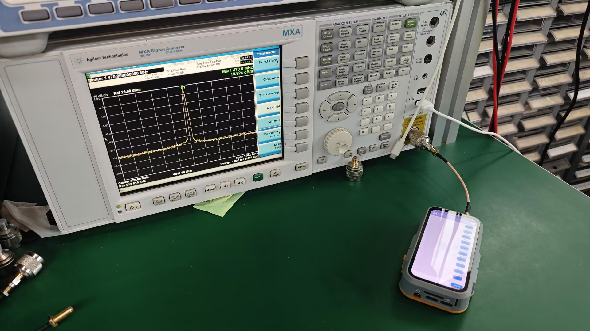

    <a target="_blank" style="margin: 1em;color: white; font-size: 0.9em; border-radius: 0.3em; padding: 0.5em 2em; background-color:rgb(63, 201, 28)" href="https://lilygo.cc/products/t-display-p4">Official Store</a>

## Version History:
| Version | Update date | Update description |
| :-----: | :---------: | :---------------- |
| T-Display-P4_V1.0 | 2025-06-13 | Initial version |
| T-Display-P4-Keyboard_V1.0 | 2025-09-12 | Keyboard expansion board initial version |

## Purchase Links

| Product | SOC | FLASH | PSRAM | Link |
| :-----: | :--: | :---: | :---: | :--: |
| T-Display-P4_V1.0 | ESP32-P4 | 16MB | - | [LILYGO Mall](https://lilygo.cc/products/t-display-p4) |
| T-Display-P4-Keyboard_V1.0 | - | - | - | [LILYGO Mall](https://lilygo.cc/products/t-display-p4-keyboard) |

## Table of Contents
- [Description](#description)
- [Preview](#preview)
- [Modules](#modules)
- [Software Deployment](#software-deployment)
- [Pin Overview](#pin-overview)
- [Related Tests](#related-tests)
- [FAQ](#faq)
- [Projects](#projects)

## Description

T-Display-P4 is a multi‑functional development board based on the **ESP32‑P4** high‑performance core, designed for complex graphics processing, multimedia interaction, and IoT applications. Main features include:

1.  **High‑Performance Processing**: Equipped with ESP32‑P4 processor, supports complex graphics and video tasks.
2.  **HD Display**: Features a 4.05‑inch MIPI interface screen with a resolution of 540×1168px, supporting touch.
3.  **Dual‑Core Collaboration**: Onboard ESP32‑C6 auxiliary processor, supports Wi‑Fi 6 and Bluetooth 5.3.
4.  **Rich Peripherals**: Integrates speaker, microphone, linear vibration motor, LoRa, GPS, Ethernet, camera, battery monitoring, and other modules.
5.  **High Expandability**: Provides abundant GPIO interfaces, supports keyboard expansion board (T-Display-P4-Keyboard).

## Preview

### Physical Image

### Pin Diagrams

T-Display-P4 has two versions: Amoled and TFT. Pin diagrams are as follows:

#### Amoled Version

#### TFT Version

## Modules

### T-Display-P4 Main Board

#### Core Processor
* **Chip**: ESP32-P4
* **FLASH**: 16MB
* **Documentation**: [Espressif Official Documentation](https://www.espressif.com/en/support/documents/technical-documents)

#### Auxiliary Processor
* **Module**: ESP32-C6-MINI-1U
* **Chip**: ESP32-C6-FH4
* **PSRAM**: 4MB
* **Communication Protocol**: SDIO
* **Documentation**: [ESP32-C6-MINI-1U Datasheet](https://www.espressif.com/sites/default/files/documentation/esp32-c6-mini-1_mini-1u_datasheet_en.pdf)

#### Display and Touch
| Model | H0405S002T002-V0 (TFT) | H0410S001AMT001-V0 (AMOLED) |
| :--- | :--- | :--- |
| **Size** | 4.05 inch | 4.1 inch |
| **Type** | α-Si TFT | AMOLED |
| **Resolution** | 540×1168px | 568×1232px |
| **Interface** | MIPI + I2C | MIPI + I2C |
| **Driver Chip** | HI8561 | RM69A10 + GT9895 |
| **Brightness** | 550 cd/m² | 500 cd/m² |
| **Contrast** | 1200:1 | 20000:1 |
| **Touch Points** | 10 points | 10 points |
| **Documentation** | [HI8561](https://github.com/Xinyuan-LilyGO/T-Display-P4/tree/main/information/HI8561_Preliminary%20_DS_V0.00_20230511.pdf) | [RM69A10](https://github.com/Xinyuan-LilyGO/T-Display-P4/tree/main/information/RM69A10_DataSheet_V0.2_20230330%20(Public%20version).pdf)   [GT9895](https://github.com/Xinyuan-LilyGO/T-Display-P4/tree/main/information/GT9895_Datasheet_V1.1.pdf) |

#### Audio Module
* **DAC Chip**: ES8311
* **Amplifier Chip**: NS4150B
* **Microphone**: Mic head
* **Communication Protocol**: I2S
* **Documentation**: [ES8311](https://github.com/Xinyuan-LilyGO/T-Display-P4/tree/main/information/ES8311.pdf) 、[NS4150B](https://github.com/Xinyuan-LilyGO/T-Display-P4/tree/main/information/NS4150B.pdf)

#### Vibration Motor
* **Driver Chip**: AW86224AFCR
* **Communication Protocol**: I2C
* **Documentation**: [AW86224](https://github.com/Xinyuan-LilyGO/T-Display-P4/tree/main/information/AW86224AFCR.pdf)

#### LoRa Module
* **Module**: HPD16A
* **Chip**: SX1262
* **Communication Protocol**: SPI
* **Documentation**: [SX1261-2](https://github.com/Xinyuan-LilyGO/T-Display-P4/tree/main/information/DS_SX1261-2_V2_1.pdf)

#### GPS Module
* **Module**: L76K
* **Communication Protocol**: UART
* **Documentation**: [L76K](https://github.com/Xinyuan-LilyGO/T-Display-P4/tree/main/information/L76KB-A58.pdf)

#### RTC Clock
* **Chip**: PCF8563
* **Communication Protocol**: I2C
* **Documentation**: [PCF8563](https://github.com/Xinyuan-LilyGO/T-Display-P4/tree/main/information/PCF8563.pdf)

#### Charging Management
* **Chip**: LGS4056H
* **Description**: Supports three‑wire battery NTC temperature detection
* **Documentation**: [LGS4056H](https://github.com/Xinyuan-LilyGO/T-Display-P4/tree/main/information/LGS4056H.pdf)

#### Battery Monitoring
* **Chip**: BQ27220
* **Communication Protocol**: I2C
* **Documentation**: [BQ27220](https://github.com/Xinyuan-LilyGO/T-Display-P4/tree/main/information/bq27220_en.pdf)

#### Camera
* **Model**: OV2710 (MIPI interface)
* **Documentation**: [OV2710](https://github.com/Xinyuan-LilyGO/T-Display-P4/tree/main/information/OV2710_CSP3_DS_2.0_KING%20HORN%20ENTERPRISES%20Ltd..pdf)

#### Inertial Sensor
* **Chip**: ICM20948
* **Communication Protocol**: I2C
* **Documentation**: [ICM20948](https://github.com/Xinyuan-LilyGO/T-Display-P4/tree/main/information/ICM20948.pdf)

#### IO Expansion
* **Chip**: XL9535
* **Communication Protocol**: I2C
* **Documentation**: [XL9535](https://github.com/Xinyuan-LilyGO/T-Display-P4/tree/main/information/XL95x5.pdf)

### T-Display-P4-Keyboard Expansion Board

#### Keyboard Driver
* **Chip**: TCA8418
* **Communication Protocol**: I2C
* **Documentation**: [TCA8418](https://github.com/Xinyuan-LilyGO/T-Display-P4/tree/main/information/tca8418.pdf)

#### Backlight Driver
* **Chip**: SY7200A
* **Communication Protocol**: PWM
* **Documentation**: [SY7200A](https://github.com/Xinyuan-LilyGO/T-Display-P4/tree/main/information/SY7200AABC.pdf)

#### IO Expansion
* **Chip**: XL9555
* **Communication Protocol**: I2C
* **Documentation**: [XL9555](https://github.com/Xinyuan-LilyGO/T-Display-P4/tree/main/information/XL95x5.pdf)

#### Wireless Module (T-MixRF)
| Module | Chip | Protocol | Documentation |
| :--- | :--- | :--- | :--- |
| **CC1101** | CC1101 | SPI | [CC1101](https://github.com/Xinyuan-LilyGO/T-Display-P4/tree/main/information/cc1101.pdf) |
| **NRF24L01** | NRF24L01 | SPI | [NRF24L01](https://github.com/Xinyuan-LilyGO/T-Display-P4/tree/main/information/NRF24L01P-R.pdf) |
| **NFC** | ST25R3916 | SPI | [ST25R3916](https://github.com/Xinyuan-LilyGO/T-Display-P4/tree/main/information/st25r3916.pdf) |

### Overview

| Component | Description |
| :--: | :--: |
| MCU | ESP32-S3R8 Dual-core LX7 microprocessor |
| FLASH| 16MB |
| PSRAM | 8MB|
| Display | 1.91 inch RM67162 IPS AMOLED |
| Touch | Capacitive Touch Screen |
| LoRa | LR1121 (1276/868/915MHz) |
| Storage | TF Card |
| RTC | PCF85063ATL/1 |
| Power Management | AXPM65611 + BQ25896 |
| Wireless | 2.4 GHz Wi-Fi & Bluetooth 5 (LE) |
| USB | 1 × USB Port and OTG (TYPE-C) |
| IO Interface | 2×13 Dual-row Expansion Interface |
| Expansion Interface | FPC Antenna + TF Card + STEMMA QT/QWIIC + JST-GH 1.25MM |
| Buttons | 1 x RESET Button + 1 x BOOT Button |
| Mounting Holes | 4 × 2mm Positioning Holes |
| Dimensions | **60×32×12mm** |

## Quick Start

### Example Support

#### T-Display-P4 Examples

| example | `[vscode][esp-idf-v5.4.0]` | description | picture |
| ------  | ------ | ------ | ------ | 
| [afe](https://github.com/Xinyuan-LilyGO/T-Display-P4/tree/main/main/examples/afe) |  ![alt text][supported] | | |
| [aw86224](https://github.com/Xinyuan-LilyGO/T-Display-P4/tree/main/main/examples/aw86224) |  ![alt text][supported] | | |
| [bq27220](https://github.com/Xinyuan-LilyGO/T-Display-P4/tree/main/main/examples/bq27220) |  ![alt text][supported] | | |
| [deep_sleep](https://github.com/Xinyuan-LilyGO/T-Display-P4/tree/main/main/examples/deep_sleep) |  ![alt text][supported] | | |
| [es8311](https://github.com/Xinyuan-LilyGO/T-Display-P4/tree/main/main/examples/es8311) |  ![alt text][supported] | | |
| [es8311_sd_wav](https://github.com/Xinyuan-LilyGO/T-Display-P4/tree/main/main/examples/es8311_sd_wav) |  ![alt text][supported] | | |
| [esp_hosted_mcu_sdio_wifi](https://github.com/Xinyuan-LilyGO/T-Display-P4/tree/main/main/examples/esp_hosted_mcu_sdio_wifi) |  ![alt text][supported] | | |
| [esp32c6_at_host_sdio_uart](https://github.com/Xinyuan-LilyGO/T-Display-P4/tree/main/main/examples/esp32c6_at_host_sdio_uart) |  ![alt text][supported] | | |
| [esp32c6_at_host_sdio_wifi](https://github.com/Xinyuan-LilyGO/T-Display-P4/tree/main/main/examples/esp32c6_at_host_sdio_wifi) |  ![alt text][supported] | | |
| [icm20948](https://github.com/Xinyuan-LilyGO/T-Display-P4/tree/main/main/examples/icm20948) |  ![alt text][supported] | | |
| [iic_scan](https://github.com/Xinyuan-LilyGO/T-Display-P4/tree/main/main/examples/iic_scan) |  ![alt text][supported] | | |
| [l76k](https://github.com/Xinyuan-LilyGO/T-Display-P4/tree/main/main/examples/l76k) |  ![alt text][supported] | | |
| [lvgl_9_ui](https://github.com/Xinyuan-LilyGO/T-Display-P4/tree/main/main/examples/lvgl_9_ui) |  ![alt text][supported] |Factory Example | |
| [pcf8563](https://github.com/Xinyuan-LilyGO/T-Display-P4/tree/main/main/examples/pcf8563) |  ![alt text][supported] | | |
| [radiolib_sx1262_send_receive](https://github.com/Xinyuan-LilyGO/T-Display-P4/tree/main/main/examples/radiolib_sx1262_send_receive) |  ![alt text][supported] | | |
| [screen_camera](https://github.com/Xinyuan-LilyGO/T-Display-P4/tree/main/main/examples/screen_camera) |  ![alt text][supported] | | |
| [screen_lvgl](https://github.com/Xinyuan-LilyGO/T-Display-P4/tree/main/main/examples/screen_lvgl) |  ![alt text][supported] | | |
| [screen_lvgl_touch_draw](https://github.com/Xinyuan-LilyGO/T-Display-P4/tree/main/main/examples/screen_lvgl_touch_draw) |  ![alt text][supported] | | |
| [sgm38121](https://github.com/Xinyuan-LilyGO/T-Display-P4/tree/main/main/examples/sgm38121) |  ![alt text][supported] | | |
| [sx1262_gfsk_send_receive](https://github.com/Xinyuan-LilyGO/T-Display-P4/tree/main/main/examples/sx1262_gfsk_send_receive) |  ![alt text][supported] | | |
| [sx1262_lora_send_receive](https://github.com/Xinyuan-LilyGO/T-Display-P4/tree/main/main/examples/sx1262_lora_send_receive) |  ![alt text][supported] | | |
| [sx1262_tx_continuous_wave](https://github.com/Xinyuan-LilyGO/T-Display-P4/tree/main/main/examples/sx1262_tx_continuous_wave) |  ![alt text][supported] | | |
| [tusb_serial_device](https://github.com/Xinyuan-LilyGO/T-Display-P4/tree/main/main/examples/tusb_serial_device) |  ![alt text][supported] | | |
| [xl9535](https://github.com/Xinyuan-LilyGO/T-Display-P4/tree/main/main/examples/Vibration_Motor) |  ![alt text][supported] | | |
| [xiaozhi](https://github.com/78/xiaozhi-esp32) |  ![alt text][supported] | | |
#### T-Display-P4-Keyboard Examples

| example | `[vscode][esp-idf-v5.4.0]` | description | picture |
| ------  | ------ | ------ | ------ | 
| [radiolib_cc1101_send_receive](https://github.com/Xinyuan-LilyGO/T-Display-P4/tree/main/main/keyboard_examples/radiolib_cc1101_send_receive) |  ![alt text][supported] | | |
| [radiolib_nrf24l01_send_receive](https://github.com/Xinyuan-LilyGO/T-Display-P4/tree/main/main/keyboard_examples/radiolib_nrf24l01_send_receive) |  ![alt text][supported] | | |
| [screen_tca8418_lvgl_touch_draw](https://github.com/Xinyuan-LilyGO/T-Display-P4/tree/main/main/keyboard_examples/screen_tca8418_lvgl_touch_draw) |  ![alt text][supported] | | |
| [st25r3916](https://github.com/Xinyuan-LilyGO/T-Display-P4/tree/main/main/keyboard_examples/st25r3916) |  ![alt text][supported] | | |
| [tca8418](https://github.com/Xinyuan-LilyGO/T-Display-P4/tree/main/main/keyboard_examples/tca8418) |  ![alt text][supported] | | |
| [xl9555](https://github.com/Xinyuan-LilyGO/T-Display-P4/tree/main/main/keyboard_examples/xl9555) |  ![alt text][supported] | | |

[supported]: https://img.shields.io/badge/-supported-green "example"

### ESP-IDF Visual Studio Code
1. Install [Visual Studio Code](https://code.visualstudio.com/Download), choose the installation according to your system type.

2. Open the "Extensions" in the sidebar of Visual Studio Code (or use <kbd>Ctrl</kbd>+<kbd>Shift</kbd>+<kbd>X</kbd> to open extensions), search for the "ESP-IDF" extension and install it.

3. While the extension is installing, use the git command to clone the repository:

        git clone --recursive https://github.com/Xinyuan-LilyGO/T-Display-P4.git

    You need to add "--recursive" when cloning. If not added during cloning, you need to initialize the submodules later:

        git submodule update --init --recursive

4. Download and install [ESP-IDF v5.4.1](https://dl.espressif.cn/dl/esp-idf/?idf=4.4), record the installation path, open the previously installed "ESP-IDF" extension and open "Configure ESP-IDF Extension", select the "USE EXISTING SETUP" menu, select the "Search ESP-IDF in system" field, correctly configure the previously recorded installation path:
   - **ESP-IDF directory (IDF_PATH):** `Your installation path xxx\Espressif\frameworks\esp-idf-v5.4`  
   - **ESP-IDF Tools directory (IDF_TOOLS_PATH):** `Your installation path xxx\Espressif`  
    Click the "install" button in the bottom right corner to install the framework.

5. Click the ESP-IDF extension menu "SDK Configuration Editor" in the bottom menu bar of Visual Studio Code, search for the "Select the example to build" field in the search bar, select the project you need to compile, then search for the "Select the camera type" field, select the camera type onboard your board, and click Save.

6. Click "Set Espressif device target" in the bottom menu bar of Visual Studio Code, select **ESP32P4**, click "Build Project" in the bottom menu bar, wait for the build to complete, then click "Select port to use" in the bottom menu bar, then click "Flash Project" to flash the program.

    

### Firmware Downloads

| firmware | description | picture |
| ------  | ------  | ------ |
| [t_display_p4_lvgl_9_ui](https://github.com/Xinyuan-LilyGO/T-Display-P4/tree/main/firmware/[T-Display-P4][lvgl_9_ui]) | Factory Program |  |
| [t_display_p4_keyboard_lvgl_9_ui](https://github.com/Xinyuan-LilyGO/T-Display-P4/tree/main/firmware/[T-Display-P4-Keyboard][lvgl_9_ui]) | Keyboard Expansion Board Factory Program |  |
| [esp32c6_at](https://github.com/Xinyuan-LilyGO/T-Display-P4/tree/main/firmware/[T-Display-P4][esp32c6_at_slave]) | esp32c6-at Factory Program |  |
| [esp32c6_slave_esp_hosted_mcu_network_adapter](https://github.com/Xinyuan-LilyGO/T-Display-P4/tree/main/firmware/[T-Display-P4][esp32c6_slave_esp_hosted_mcu_network_adapter]) |  |  |
| [t_display_p4_xiaozhi](https://github.com/Xinyuan-LilyGO/T-Display-P4/tree/main/firmware/[T-Display-P4][xiaozhi]) |  |  |

### Pin Overview

For pin definitions, please refer to the configuration files:
 

[t_display_p4_config.h](https://github.com/Xinyuan-LilyGO/T-Display-P4/tree/main/components/private_library/t_display_p4_config.h)  
[t_display_p4_keyboard_config.h](https://github.com/Xinyuan-LilyGO/T-Display-P4/tree/main/components/private_library/t_display_p4_keyboard_config.h)

### Development Platforms
1.  [Micropython](https://micropython.org/)
2.  [Arduino IDE](https://www.arduino.cc/en/software)
3.  [Platform IO](https://platformio.org/)

## Related Tests

### Power Consumption

| firmware | program | description | picture |
| ------  | ------  | ------ | ------ | 
| [deep_sleep(single_board)](https://github.com/Xinyuan-LilyGO/T-Display-P4/tree/main/firmware/sleep/[T-Display-P4][deep_sleep][single_board]_firmware_202505301450.bin) |[deep_sleep](https://github.com/Xinyuan-LilyGO/T-Display-P4/tree/main/main/examples/deep_sleep/)| Average current consumption: 1.2mA. For more information, see [Power Consumption Test Log](https://github.com/Xinyuan-LilyGO/T-Display-P4/tree/main/relevant_test/PowerConsumptionTestLog_[T-Display-P4_V1.0]_20250605.pdf) | |

### Camera

| program | description | picture |
| ------  | ------ | ------ | 
| [uvc_sc2336](https://github.com/Xinyuan-LilyGO/T-Display-P4/tree/main/debug/examples/uvc_sc2336/)| Original image and captured screen image screenshot effect | 
  
 |
| [uvc_ov2710](https://github.com/Xinyuan-LilyGO/T-Display-P4/tree/main/debug/examples/uvc_ov2710/)| Original image and captured screen image screenshot effect | 
  
 |

## FAQ

### Q. I still don't know how to set up the programming environment after reading the above tutorial. What should I do?
* A. If you still don't understand how to set up the environment after reading the above tutorial, you can refer to the [LilyGo-Document](https://github.com/Xinyuan-LilyGO/LilyGo-Document) documentation for setup instructions.

 

### Q. Why does my board keep failing to upload programs?
* A. Please hold down the "BOOT" button and try uploading the program again.

 

### Q. Why can't I get a GPS fix when using the factory firmware?
* A.Burn the latest test program for our side and conduct the tests with the equipment placed outdoors or in an area with good signal. Other third-party firmware may still have some bugs that have not been resolved. The latest firmware address:
[Factory.bin](https://github.com/Xinyuan-LilyGO/T-Display-P4/blob/main/firmware/%5BT-Display-P4%5D%5Blvgl_9_ui%5D/%5BT-Display-P4%5D%5Blvgl_9_ui%5D%5Brm69a10%5D%5Bov2710%5D_firmware_202601211405.bin),
 

### Q. Problems with not charging when powered off and severely shortened battery life
* A. The T-Display-P4 normally supports charging when powered off. The factory firmware can run for about 3‑5 hours at most; it does not include sleep. If you need sleep, refer to the [sleep example](https://github.com/Xinyuan-LilyGO/T-Display-P4/blob/main/firmware/sleep/(%E4%BF%AE%E6%94%B9mipi%E7%94%B5%E5%8E%8B%E5%9F%9F%E4%B8%BA1.8v)%5BT-Display-P4%5D%5Bdeep_sleep%5D%5Bsingle_board%2Brm69a10%2Bov2710%5D_firmware_202507281406.bin).
 

### Q. About ripple patterns on the OLED screen
* A. When observing screen ripples, pay attention to the battery level: if ripples become more noticeable at low battery, it is likely related to the battery; if ripples still occur frequently even with sufficient battery, check the components of the screen power supply circuit on the main board.
 

### Q. About occasional freezing in the test page
* A. Please re‑test after flashing the latest firmware. If the freeze still appears randomly, you can contact us with a specific screenshot of the frozen page, and we will optimize the firmware accordingly. Latest firmware address: [Factory.bin](https://github.com/Xinyuan-LilyGO/T-Display-P4/blob/main/firmware/%5BT-Display-P4%5D%5Blvgl_9_ui%5D/%5BT-Display-P4%5D%5Blvgl_9_ui%5D%5Brm69a10%5D%5Bov2710%5D_firmware_202601211405.bin).

 

### Q. About antenna interface function, transmission level, and GPS positioning issues
* A. For antenna interface function, transmission level, and GPS positioning issues, please refer to the following image settings:

On the current sx1262 version, only one of the two antenna ports on the case is connected; the other is not wired, so only one antenna port can be used.

Attached LoRa test image:

 

### Q. About disassembling the device by yourself
* A. The silicone on the back is fixed with permanent adhesive. Disassembly will damage the appearance of the silicone. [Disassembly video:](https://github.com/Xinyuan-LilyGO/T-Display-P4/issues/6#issuecomment-3840475791)

### Q. About inaccurate battery level display and inability to charge when powered off
* A. Set the set_design_capacity parameter to 1000mAh in the firmware, then perform a full charge → natural discharge until power off → recharge cycle. The battery gauge will calibrate automatically. Note: after a complete power loss, recalibration is needed.

### Q. Antenna interface related issues
* A. The MMCX2 interface marked on the case is reserved for internal testing and has no circuit connection. During initial testing, no signal level is output from that port. This device is an internal test version assembled for engineering purposes.

### Q. Why do I fail when selecting the target compilation chip in the espidf framework or when configuring menuconfig in the SDK, reporting the following error:

        asyncio.exceptions.LimitOverrunError: Separator is found, but chunk is longer than limit

        ValueError: Separator is found, but chunk is longer than limit

* A. This is a bug in the espidf framework v5.4~v5.5. You need to modify line 351 of the file at path `esp-idf-v5.x\tools\idf_py_actions\tools.py` as follows:

        Original code:
        p = await asyncio.create_subprocess_exec(*cmd, env=env_copy, limit=1024 * 256, cwd=self.cwd, stdout=asyncio.subprocess.PIPE,stderr=asyncio.subprocess.PIPE)
        Modified code:
        p = await asyncio.create_subprocess_exec(*cmd, env=env_copy, limit=1024 * 512, cwd=self.cwd, stdout=asyncio.subprocess.PIPE,stderr=asyncio.subprocess.PIPE)

## Projects
*   [T-Display S3 AMOLED Plus](https://github.com/Xinyuan-LilyGO/LilyGo-AMOLED-Series/blob/master/schematic/T-Display-S3-AMOLED-Plus.pdf)

## Resources
*   [ESP32-S3 Datasheet](https://www.espressif.com/sites/default/files/documentation/esp32-s3_datasheet_en.pdf)
*   [LR1121 Datasheet](https://www.semtech.com/products/wireless-rf/lora-connect/lr1121)
*   *(More resources please refer to GitHub repository)*

## Dependent Libraries
*   [lvgl 8.3.9](https://github.com/lvgl/lvgl)
*   [AceButton](https://github.com/bxparks/AceButton)
*   [TFT_eSPI](https://github.com/Bodmer/TFT_eSPI)
*   [Arduino_GFX](https://github.com/moononournation/Arduino_GFX)
*   [XPowersLib](https://github.com/lewisxhe/XPowersLib)
*   [SensorLib](https://github.com/lewisxhe/SensorsLib)
*   [TinyGPSPlus](https://github.com/mikalhart/TinyGPSPlus)
*   [Arduino_NeoPixel](https://github.com/adafruit/Adafruit_NeoPixel)
*   [OneWire](https://github.com/PaulStoffregen/OneWire)
*   [SparkFun MAX3010x Pulse and Proximity Sensor Library](https://github.com/sparkfun/SparkFun_MAX3010x_Pulse_and_Proximity_Sensor_Library)