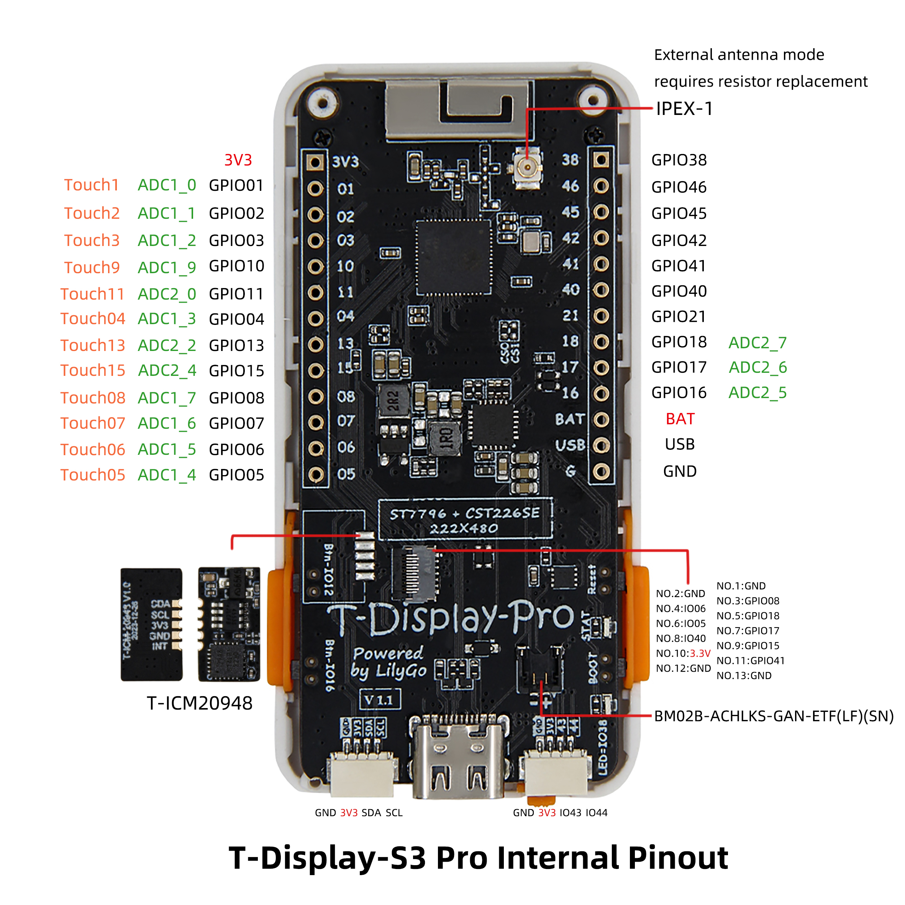
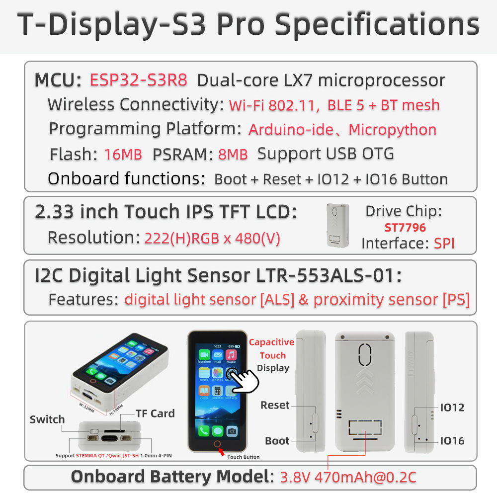

  

  <a target="_blank" style="margin: 1em; color: white; font-size: 0.9em; border-radius: 0.3em; padding: 0.5em 2em; background-color: rgb(103, 175, 8)" href="https://www.lilygo.cc/products/t-display-s3-pro">Official Store</a>

## 🚀 Product Overview

**T-Display S3 Pro** is a high‑performance development board based on the ESP32‑S3, featuring a 2.2‑inch 222×480 full‑color IPS display, capacitive touch, camera expansion, USB OTG, and a variety of peripherals. It integrates the SY6970 power management IC, supporting Li‑ion battery charging and power path management. Onboard peripherals include a TF card slot, ambient light sensor, and motion sensor, making it suitable for smart home applications, portable devices, multimedia projects, and more. The latest V1.1 version uses a constant‑current backlight driver for improved display stability.

### Key Features

- ✅ **High‑Performance MCU**: ESP32‑S3R8 dual‑core LX7 processor, 16MB Flash + 8MB OPI PSRAM
- ✅ **Bright IPS Display**: 2.2‑inch, 222×480 resolution, wide viewing angle
- ✅ **Capacitive Touch**: CST816S touch controller, gesture recognition supported
- ✅ **Rich Peripherals**: Camera interface, TF card slot, ambient light sensor, motion sensor (MPU9250 / MPU6050)
- ✅ **Power Management**: SY6970 with 1.5A charging current, power path management, and OTG output
- ✅ **Expansion Interfaces**: 2×13 dual‑row header, STEMMA QT / QWIIC I²C connector
- ✅ **Wireless Connectivity**: 2.4GHz Wi‑Fi & Bluetooth 5 (LE)

---

## 📊 Hardware Specifications

| Item | Specification |
| :-- | :-- |
| MCU | ESP32‑S3R8 (dual‑core LX7, 240MHz) |
| Flash | 16MB |
| PSRAM | 8MB (OPI PSRAM) |
| Display | 2.2‑inch IPS, resolution 222×480, driver ST7789V2 |
| Touch | Capacitive touch CST816S (I²C address 0x15) |
| Power Management | SY6970 (1.5A charging, power path, OTG output) |
| Sensors | LTR553 ambient light / proximity sensor (I²C address 0x23) |
| Motion Sensor | Optional MPU9250 / MPU6050 |
| Storage Expansion | TF card slot (SPI) |
| Wireless | 2.4GHz Wi‑Fi 802.11 b/g/n + Bluetooth 5 (LE) |
| USB | 1 × USB‑C (OTG capable) |
| Expansion Interfaces | 2×13 dual‑row header, camera connector (DVP), STEMMA QT / QWIIC (I²C) |
| Buttons | RESET + BOOT |
| Mounting Holes | 4 × 2mm |
| Dimensions | 56.5 × 56.5 × 9.6 mm |

---

## 🔄 Version History

| Version | Release Date | Description |
| :--: | :--: | :-- |
| T-Display-S3-Pro V1.0 | 2023‑08‑01 | Initial version, PWM backlight |
| T-Display-S3-Pro V1.1 | 2023‑11‑01 | Upgraded to constant‑current backlight driver, USB‑C port marked V1.1 |

---

## 🧩 Module Details

### 1. Main Controller (MCU)
- **Chip**: ESP32‑S3R8
- **Flash**: 16MB
- **PSRAM**: 8MB (OPI PSRAM)
- More information: [Espressif ESP32‑S3 Datasheet](https://www.espressif.com.cn/sites/default/files/documentation/esp32-s3_datasheet_en.pdf)

### 2. Display
- **Size**: 2.2‑inch
- **Resolution**: 222×480
- **Type**: IPS
- **Driver**: ST7789V2 (compatible)
- **Interface**: SPI
- **Compatible Libraries**: TFT_eSPI, Arduino_GFX

### 3. Touch
- **Type**: Capacitive touch
- **Controller**: CST816S
- **Interface**: I²C (address 0x15)

### 4. Power Management
- **IC**: SY6970
- **Charge Current**: Up to 1.5A
- **Battery Type**: Single‑cell Li‑ion (3.7V~4.2V)
- **Features**: Power path management, OTG output, physical switch to disconnect battery

### 5. Sensors
- **Ambient Light / Proximity**: LTR553 (I²C address 0x23)
- **Motion**: MPU9250 / MPU6050 (optional, depends on version)

### 6. Expansion Interfaces
- **Camera**: DVP interface (supports OV2640 / OV5640)
- **TF Card**: SPI interface
- **USB‑C**: Supports OTG (5V 500mA output)
- **GPIO**: 2×13 dual‑row header
- **I²C**: STEMMA QT / QWIIC connector

---

## 🔌 Pinout Diagrams

  
  

---

## 🚀 Quick Start

### Supported Development Environments
- [PlatformIO](https://platformio.org/)
- [Arduino IDE](https://www.arduino.cc/en/software)
- [ESP‑IDF](https://docs.espressif.com/projects/esp-idf/en/latest/esp32s3/)
- [MicroPython](https://micropython.org/) (community support)

### Example Programs

| Example | PlatformIO | Arduino | Description |
| :--- | :---: | :---: | :--- |
| [Factory](https://github.com/Xinyuan-LilyGO/T-Display-S3-Pro/tree/main/examples/factory) | ✓ | ✓ | Factory comprehensive test |
| [TFT_eSPI_Simple](https://github.com/Xinyuan-LilyGO/T-Display-S3-Pro/tree/main/examples/TFT_eSPI_Simple) | ✓ | ✓ | Basic TFT_eSPI graphics |
| [AdjustBacklight](https://github.com/Xinyuan-LilyGO/T-Display-S3-Pro/tree/main/examples/AdjustBacklight) | ✓ | ✓ | Backlight adjustment (V1.0 vs V1.1) |
| [PMU_Example](https://github.com/Xinyuan-LilyGO/T-Display-S3-Pro/tree/main/examples/PMU_Example) | ✓ | ✓ | Power management configuration & battery info |
| [USB_HID_Example](https://github.com/Xinyuan-LilyGO/T-Display-S3-Pro/tree/main/examples/USB_HID_Example) | ✓ | ✓ | USB HID and OTG functionality |
| [CameraShield](https://github.com/Xinyuan-LilyGO/T-Display-S3-Pro/tree/main/examples/CameraShield) | ✓ | ✓ | Using camera expansion board |
| [Cellphone](https://github.com/Xinyuan-LilyGO/T-Display-S3-Pro/tree/main/examples/Cellphone) | ✓ | ✓ | Camera & gallery (requires TF card) |

> More examples can be found in the [GitHub repository](https://github.com/Xinyuan-LilyGO/T-Display-S3-Pro/tree/main/examples).

### PlatformIO Quick Start
1. Install [Visual Studio Code](https://code.visualstudio.com/Download) and open it.
2. In the Extensions view, search for “PlatformIO IDE” and install it.
3. Clone the project: `git clone https://github.com/Xinyuan-LilyGO/T-Display-S3-Pro.git`
4. Open the project folder in VS Code.
5. Open `platformio.ini` and under `[platformio]` uncomment the desired environment (e.g. `default_envs = t-display-s3-pro`).
6. Click the `✔` icon at the bottom left to compile, `→` to upload, and the plug icon to open the serial monitor.

### Arduino IDE Quick Start
1. Install [Arduino IDE](https://www.arduino.cc/en/software).
2. Add ESP32 board support:  
   Go to “File” → “Preferences” → “Additional Boards Manager URLs” and add  
   `https://raw.githubusercontent.com/espressif/arduino-esp32/gh-pages/package_esp32_index.json`  
   Then open “Tools” → “Board” → “Boards Manager”, search for and install **ESP32**.
3. Copy all libraries from the project’s `lib` folder to your Arduino library folder (e.g. `C:\Users\YourName\Documents\Arduino\libraries`).
4. Open an example file (e.g. `examples/TFT_eSPI_Simple/TFT_eSPI_Simple.ino`).
5. In the “Tools” menu, select the following settings:

| Setting | Value |
| :--- | :--- |
| Board | ESP32S3 Dev Module |
| Upload Speed | 921600 |
| USB CDC On Boot | Enabled |
| USB DFU On Boot | Disabled |
| CPU Frequency | 240MHz (WiFi) |
| Flash Mode | QIO 80MHz |
| Flash Size | 16MB (128Mb) |
| Partition Scheme | 16M Flash (3MB APP/9.9MB FATFS) |
| PSRAM | OPI PSRAM |

6. Select the correct port and click Upload.

---

## 📊 Performance Tests (Reference)

| Test Item | Result | Remarks |
| :--- | :---: | :--- |
| Backlight Power (max) | ≈120mA | V1.1 constant‑current driver |
| Charge Current | 1.5A | SY6970 max |
| Touch Response | Normal | Gesture supported |
| Camera Compatibility | OV2640 / OV5640 | Requires expansion board |
| USB OTG Output | 5V 500mA | Needs PMU enable |

---

## ❓ Frequently Asked Questions

**Q1. I still can’t set up the programming environment after reading the tutorials. What should I do?**  
A. Please refer to the [LilyGo-Document](https://github.com/Xinyuan-LilyGO/LilyGo-Document) for more detailed instructions.

**Q2. Why does my board keep failing to upload?**  
A. Hold the **BOOT** button, press the **RST** button once, release RST while still holding BOOT, then start the upload. This forces the board into download mode.

**Q3. How do I distinguish between V1.0 and V1.1 versions?**  
A. Look for “V1.1” printed near the USB‑C port. V1.1 uses a constant‑current backlight driver, so the backlight control method differs; use the corresponding example.

**Q4. When no battery is connected, the device reboots repeatedly or the LED flashes?**  
A. Without a battery, charging should be disabled, otherwise the power supply may become unstable. Call `PMU.disableCharge()` during initialisation or refer to the `PMU_Example`.

**Q5. Can’t detect USB OTG peripherals?**  
A. Enable OTG output in your code. Note that while OTG is active, the USB input does not charge the battery.

**Q6. The screen stays black or backlight is abnormal?**  
A. Check that the backlight driver configuration matches your board version (V1.0 uses PWM, V1.1 uses constant‑current). Also ensure the PMU is powered correctly.

---

## 📁 Projects & Resources

### Related Projects
- [T-Display-S3-Pro Schematic](https://github.com/Xinyuan-LilyGO/T-Display-S3-Pro/blob/main/schematic/T-Display-S3-Pro.pdf)
- [T-Display-S3-Pro Back Cover Design Files](https://github.com/Xinyuan-LilyGO/T-Display-S3-Pro/tree/main/dimensions/BackCover)
- [T-Display-S3-Pro-MVSRBoard Expansion](https://github.com/Xinyuan-LilyGO/T-Display-S3-Pro-MVSRBoard)
- [T-Display-S3-Pro-MVSRLora Expansion](https://github.com/Xinyuan-LilyGO/T-Display-S3-Pro-MVSRLora)

### Official Resources
- [ESP32‑S3 Datasheet](https://www.espressif.com.cn/sites/default/files/documentation/esp32-s3_datasheet_en.pdf)
- [SY6970 Datasheet](https://www.semtech.com/products/analog-front-end/sy6970)
- [TFT_eSPI Library Documentation](https://github.com/Bodmer/TFT_eSPI)
- [LILYGO Documentation Hub](https://docs.lilygo.cc/)

### Dependent Libraries
- [TFT_eSPI](https://github.com/Bodmer/TFT_eSPI)
- [Arduino_GFX](https://github.com/moononournation/Arduino_GFX)
- [XPowersLib](https://github.com/lewisxhe/XPowersLib) (power management)
- [SensorLib](https://github.com/lewisxhe/SensorLib) (sensors)
- [TouchLib](https://github.com/mmMicky/TouchLib) (touch)
- [lvgl](https://github.com/lvgl/lvgl) (graphics library, optional)
- [JPEGDEC](https://github.com/bitbank2/JPEGDEC) (JPEG decoding)
- [ESP32_USB_Stream](https://github.com/esp-arduino-libs/ESP32_USB_Stream) (USB audio streaming)
- [ESP32‑audioI2S](https://github.com/schreibfaul1/ESP32-audioI2S) (audio playback)