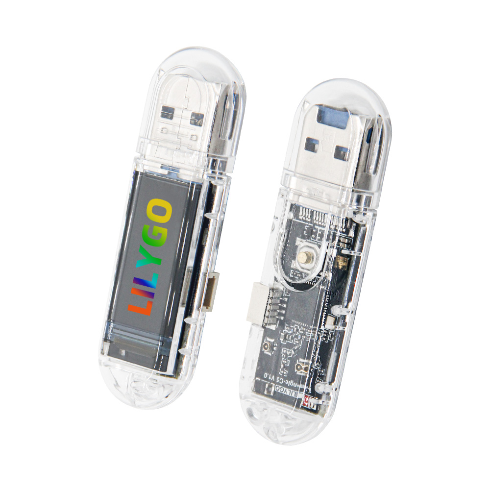
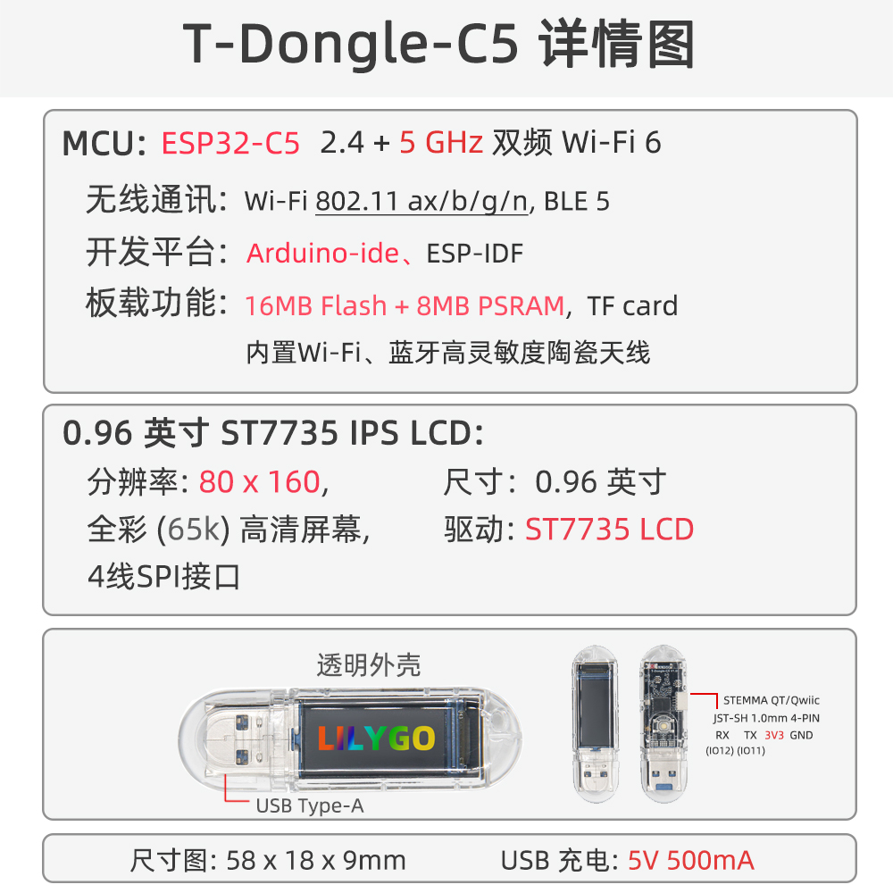

    <a target="_blank" style="margin: 1em;color: white; font-size: 0.9em; border-radius: 0.3em; padding: 0.5em 2em; background-color:rgb(103, 175, 8)" href="https://lilygo.cc/">Official Store</a>

## Version History

| Version | Update date | Update description |
| :-----: | :---------: | :---------------- |
| T-Dongle-C5_V1.0 | 2025-01-01 | Initial version |

## Purchase Links

| Product | SOC | FLASH | PSRAM | Link |
| :-----: | :--: | :---: | :---: | :--: |
| T-Dongle-C5 | ESP32-C5HR8 | 16MB | 8MB | [LILYGO Mall](https://lilygo.cc/) |

## Table of Contents
- [Description](#description)
- [Preview](#preview)
- [Modules](#modules)
- [Quick Start](#quick-start)
- [Pin Overview](#pin-overview)
- [Related Tests](#related-tests)
- [FAQ](#faq)
- [Projects](#projects)
- [Resources](#resources)
- [Dependent Libraries](#dependent-libraries)

## Description

The LILYGO T-Dongle-C5 is a highly integrated USB‑A development board based on the **ESP32-C5HR8**, supporting **WiFi 6 (802.11ax)** and **BLE 5.0**, with 16MB Flash and 8MB PSRAM. It features a 0.96‑inch ST7735 display (80×160 resolution), SD card storage expansion, an APA102 RGB LED, and a Boot button. The USB‑A plug‑and‑play design makes it easy to connect directly to a computer, charger, or USB hub. It is suitable for IoT nodes, portable test tools, smart home controllers, and other scenarios.

## Preview

### Physical Image

### Pin Diagram

## Modules

### MCU

- Chip: ESP32-C5HR8 RISC-V single-core processor (supports WiFi 6 + BLE 5.0)
- PSRAM: 8MB
- FLASH: 16MB
- Additional Information: [Espressif ESP32-C5 Datasheet](https://www.espressif.com/sites/default/files/documentation/esp32-c5_datasheet_en.pdf)

### Display

- Size: 0.96 inch
- Resolution: 80×160 pixels
- Driver Chip: ST7735S
- Communication Protocol: SPI
- Compatible Libraries: TFT_eSPI, Arduino_GFX

### Storage

- TF card slot (MicroSD), SPI mode
- Chip select pin: GPIO_23 (SD_CS)

### LED

- Model: APA102 (addressable RGB LED)
- Pins: LED_CI (GPIO_4), LED_DI (GPIO_5)
- Features: High brightness and full‑color display

### Button

- BOOT button: GPIO_28, can be used for download mode or user-defined functions

### Overview

| Component | Description |
| :--: | :--: |
| MCU | ESP32-C5HR8 RISC-V, WiFi 6, BLE 5.0 |
| FLASH | 16MB |
| PSRAM | 8MB |
| Display | 0.96‑inch ST7735 (80×160) |
| Storage | TF card |
| LED | APA102 addressable RGB |
| Button | 1 × BOOT |
| USB | USB‑A male (plug‑and‑play) |
| Dimensions | approx. 55×25×12 mm (to be confirmed) |

## Quick Start

### Example Support

| Example | PlatformIO | Arduino | ESP-IDF | Description |
| :------ | :--------: | :-----: | :-----: | :---------- |
| [Factory](https://github.com/Xinyuan-LilyGO/T-Dongle-C5/tree/main/Examples/Factory) | ✓ | ✓ | | Factory comprehensive test |
| [SDCard](https://github.com/Xinyuan-LilyGO/T-Dongle-C5/tree/main/Examples/SDCard) | ✓ | ✓ | | SD card read/write example |
| [LCD](https://github.com/Xinyuan-LilyGO/T-Dongle-C5/tree/main/Examples/LCD) | ✓ | ✓ | | Display test |
| [LED](https://github.com/Xinyuan-LilyGO/T-Dongle-C5/tree/main/Examples/LED) | ✓ | ✓ | | APA102 RGB control |
| [wifi_serial](https://github.com/Xinyuan-LilyGO/T-Dongle-C5/tree/main/Examples/wifi_serial) | ✓ | ✓ | | WiFi serial passthrough |

> More examples can be found in the GitHub repository.

### PlatformIO

1. Install [Visual Studio Code](https://code.visualstudio.com/) and [Python](https://www.python.org/).
2. Search for **PlatformIO IDE** in the VS Code extensions and install it.
3. Clone or download the project: `git clone https://github.com/Xinyuan-LilyGO/T-Dongle-C5.git`.
4. Open the project folder in VS Code.
5. Open `platformio.ini`, under `[platformio]` uncomment the desired environment (e.g. `default_envs = t-dongle-c5`).
6. Click `√` at the bottom left to compile, `→` to upload, `🔌` to open the serial monitor.
7. If upload fails, manually enter download mode (hold BOOT while inserting USB).

### Arduino IDE

1. Install [Arduino IDE](https://www.arduino.cc/en/software).
2. Add ESP32-C5 board support (ESP32 Arduino core 3.3.0 or later required).
3. Copy all libraries from the project `lib` folder to your Arduino library folder (e.g. `C:\Users\YourName\Documents\Arduino\libraries`).
4. Open an example file (e.g. `Examples/Factory/Factory.ino`).
5. In the "Tools" menu, select the following settings:

| Setting                     | Value                        |
| --------------------------- | ---------------------------- |
| Board                       | ESP32C5 Dev Module           |
| Upload Speed                | 921600                       |
| USB CDC On Boot             | Enabled                      |
| CPU Frequency               | 240MHz                       |
| Flash Mode                  | QIO 80MHz                    |
| Flash Size                  | 16MB (128Mb)                 |
| Partition Scheme            | 16M Flash (3MB APP/9.9MB FATFS) |
| PSRAM                       | Enabled                      |

6. Select the correct port and click Upload. If upload fails, hold BOOT while inserting USB and try again.

### ESP-IDF

- Requires ESP-IDF **v5.5 or newer**.
- Refer to the [official manual](https://docs.espressif.com/projects/esp-idf/en/latest/esp32/get-started/index.html) for installation.
- After cloning the project, go to an example directory (e.g. `Examples/Factory`) and run `idf.py set-target esp32c5`, then `idf.py build flash monitor`.

### Development Platforms

- [PlatformIO](https://platformio.org/)
- [Arduino IDE](https://www.arduino.cc/en/software)
- [ESP-IDF](https://docs.espressif.com/projects/esp-idf/en/latest/esp32c5/)
- [MicroPython](https://micropython.org/) (community support pending)

## Pin Overview

| Function   | GPIO Pin | Remarks                            |
| :--------- | :------: | :--------------------------------- |
| LCD_MOSI   | 2        | LCD SPI data                       |
| LCD_MISO   | 7        | LCD SPI data (optional)            |
| LCD_SCK    | 6        | LCD SPI clock                      |
| LCD_CS     | 10       | LCD chip select                    |
| LCD_RS     | 3        | LCD command/data select            |
| LCD_BL     | 0        | Backlight control                  |
| LCD_RST    | 1        | LCD reset                          |
| LED_CI     | 4        | APA102 clock input                 |
| LED_DI     | 5        | APA102 data input                  |
| SD_CMD     | 2        | SD card command (shares LCD_MOSI)  |
| SD_D0      | 7        | SD card data 0 (shares LCD_MISO)   |
| SD_CLK     | 6        | SD card clock (shares LCD_SCK)     |
| SD_CS      | 23       | SD card chip select                |
| UART0_TX   | 11       | Serial 0 transmit                  |
| UART0_RX   | 12       | Serial 0 receive                   |
| USB_DN     | 13       | USB differential negative          |
| USB_DP     | 14       | USB differential positive          |
| BOOT       | 28       | Download / user button             |

> **Note:** The SPI bus is shared between the LCD and SD card. Control the respective CS pins accordingly.

## Related Tests

| Test Item                    | Result  | Remarks                        |
| :--------------------------- | :-----: | :----------------------------- |
| WiFi 6 throughput            | TBD     |                                |
| Display refresh rate         | ~30fps  | SPI driver                     |
| SD card read/write speed     | TBD     |                                |
| APA102 max brightness current| TBD     |                                |
| Power consumption (sleep)    | TBD     |                                |

## FAQ

- **Q. I still don't know how to set up the programming environment after reading the above tutorial. What should I do?**  
  A. Please refer to the [LilyGo-Document](https://github.com/Xinyuan-LilyGO/LilyGo-Document) for detailed instructions.

- **Q. Why does my board keep failing to upload?**  
  A. Hold the **BOOT** button, then insert the board into the USB port (or hold BOOT before connecting to the computer) to enter download mode. Then click upload. After upload completes, press RST or re‑plug the board to run the program (T-Dongle has no dedicated RST button; you may unplug and re‑plug).

- **Q. No display or abnormal display?**  
  A. Check the LCD initialisation sequence and ensure the backlight pin (GPIO_0) is pulled high. Refer to the initialisation code in the examples.

- **Q. SD card not recognised?**  
  A. Make sure the SD card CS pin is GPIO_23 and that the SPI bus is shared with the LCD. When accessing the SD card, either de‑assert the LCD CS or re‑initialise the SPI bus.

- **Q. APA102 LED not lighting?**  
  A. Verify the LED_CI and LED_DI connections. When using the FastLED or Adafruit_DotStar library, specify the correct pins and data order.

## Projects

- [T-Dongle-C5 Schematic](https://github.com/Xinyuan-LilyGO/T-Dongle-C5/blob/main/Hardware/T-Dongle-C5.pdf)
- [T-Dongle-C5 Hardware Design Files](https://github.com/Xinyuan-LilyGO/T-Dongle-C5/tree/main/Hardware)

## Resources

- [ESP32-C5 Datasheet](https://www.espressif.com/sites/default/files/documentation/esp32-c5_datasheet_en.pdf)
- [ST7735 Datasheet](https://cdn-shop.adafruit.com/datasheets/ST7735R_V0.2.pdf)
- [APA102 LED Datasheet](https://cpldcpu.files.wordpress.com/2014/08/apa102c.pdf)
- [LILYGO Documentation Hub](https://docs.lilygo.cc/)

## Dependent Libraries

- [TFT_eSPI](https://github.com/Bodmer/TFT_eSPI)
- [Arduino_GFX](https://github.com/moononournation/Arduino_GFX)
- [FastLED](https://github.com/FastLED/FastLED) (or Adafruit_DotStar)
- [SD](https://www.arduino.cc/en/Reference/SD) (ESP32 built‑in)
- [WiFi](https://github.com/espressif/arduino-esp32/tree/master/libraries/WiFi) (ESP32 Arduino core)