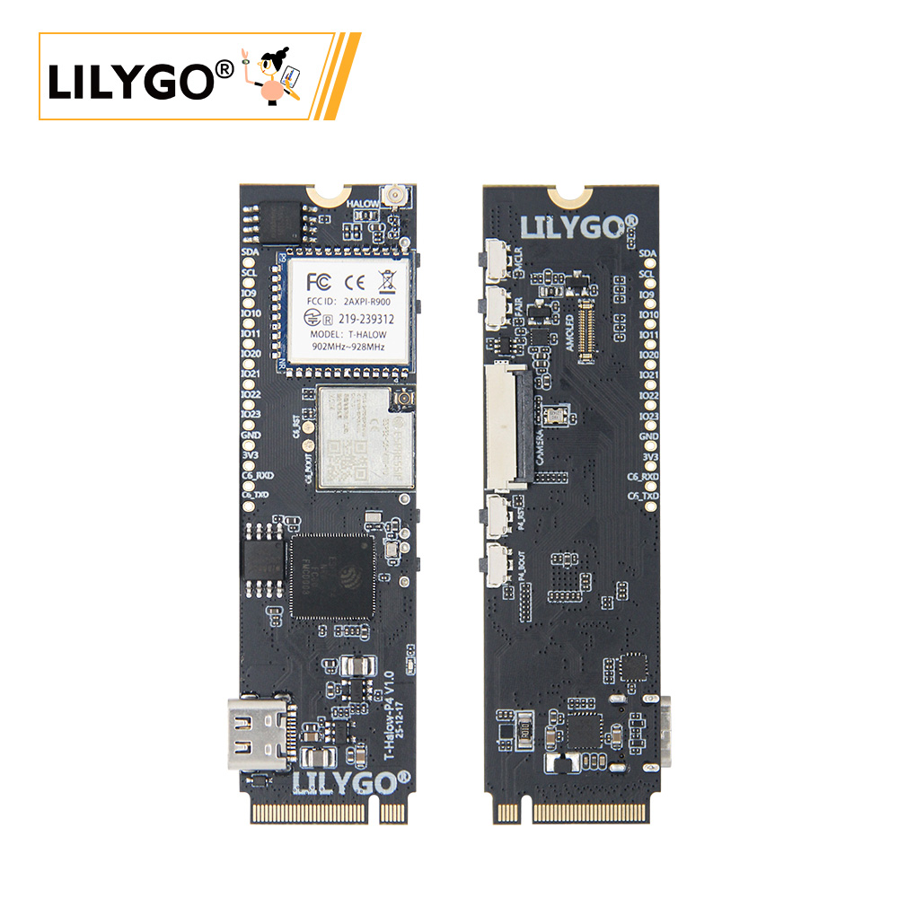
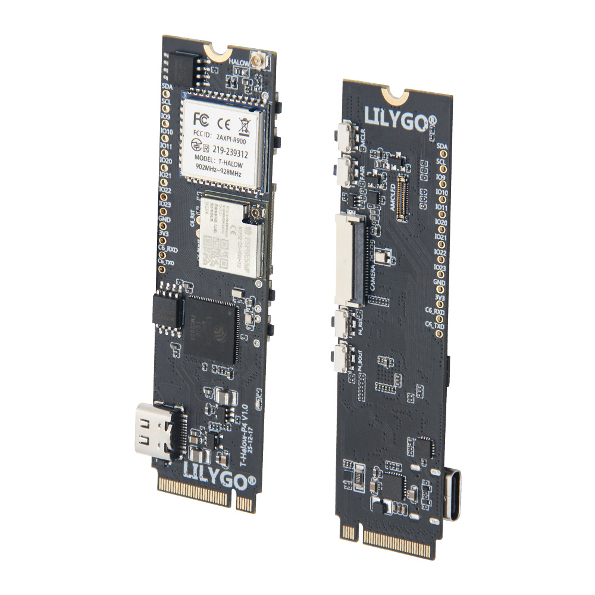
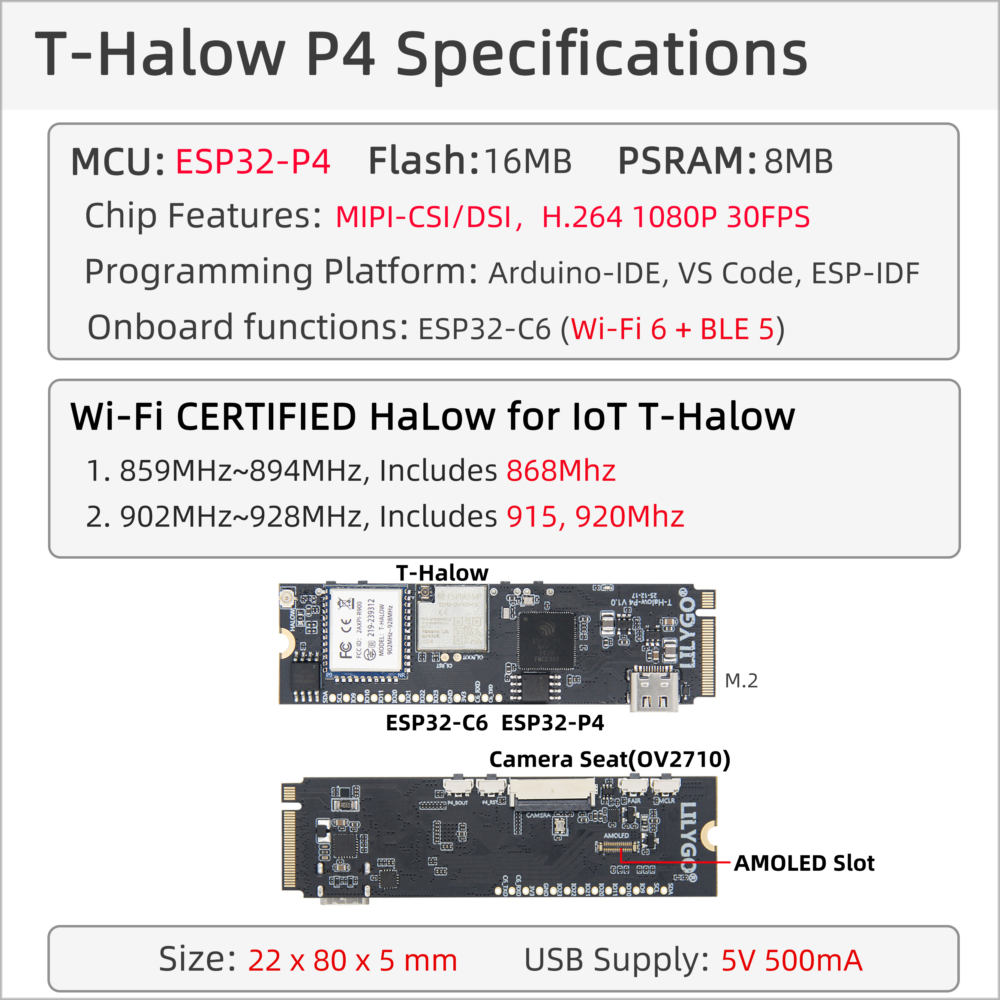

<div align="center">
  
</div>

<div style="padding: 1em 0; display: flex; justify-content: center">
  <a target="_blank" style="margin: 1em; color: white; font-size: 0.9em; border-radius: 0.3em; padding: 0.5em 2em; background-color: rgb(103, 175, 8)" href="https://lilygo.cc/products/t-halow-p4">Purchase on Official Store</a>
</div>

## 📦 Project Versions

T-Halow-P4 is a high-performance upgrade version of the T-Halow series, based on ESP32-P4 main controller, integrating ESP32-C6 auxiliary processor and T-Halow module. Please select the corresponding documentation based on your needs:

| Version | Release Date | Main Features | Documentation Link |
| :---: | :---: | :---: | :---: |
| T-Halow-P4 | 2025-12-04 | ESP32-P4 + ESP32-C6 + T-Halow Module | [GitHub Repository](https://github.com/Xinyuan-LilyGO/T-Halow-P4) |
| T-Halow | 2023-08-23 | ESP32-S3 + T-Halow Module | [T-Halow Documentation](../T-Halow/T-Halow.md) |

> **Note**: T-Halow-P4 and T-Halow use the same [AT Command Set](https://github.com/Xinyuan-LilyGO/T-Halow/blob/master/docs/AT_cmd.md).

Regarding the SDK for the TX-AH module, Taixin provides non-OS drivers, refer to: [taixin-nonos-driver](https://www.taixin-semi.com/upload/files/productFile/20251204/taixin-nonos-driver_20251204162053.zip)


## 🚀 Product Overview

<div align="center">
  
</div>

**LILYGO T-Halow-P4** is a high-performance IoT development board based on **ESP32-P4** main controller, integrating **ESP32-C6** auxiliary processor and **T-Halow** long-range communication module. Designed for scenarios requiring high-performance processing, long-range communication, and multimedia applications, suitable for intelligent security, industrial monitoring, remote inspection, and other professional applications.

### Core Features

- ✅ **High-Performance Processing**: ESP32-P4 main controller, supports complex graphics and video task processing
- ✅ **Dual-Core Collaboration**: ESP32-C6 auxiliary processor, supports Wi-Fi 6 and Bluetooth 5.3
- ✅ **Long-Range Communication**: T-Halow module supports Wi-Fi HaLow (802.11ah)
- ✅ **Multimedia Interfaces**: Onboard MIPI-DSI display interface and MIPI-CSI camera interface
- ✅ **Image Processing**: Supports JPEG image decoding (1080P 30fps), PPA, 2D DMA
- ✅ **Video Encoding**: Supports H264 encoding, JPEG encoding, 1080P video
- ✅ **Rich Peripherals**: Supports SPI, I2S, I2C, LED PWM, Ethernet, etc.


## 📊 Hardware Specifications



| Item | Parameter |
|------|------|
| Main Controller Chip | ESP32-P4 (High-Performance Processor) |
| Auxiliary Processor | ESP32-C6-MINI (Wi-Fi 6 + Bluetooth 5.3) |
| Flash Storage | 16MB Nor Flash (QSPI Interface) |
| PSRAM | 32MB (Package-Stacked) |
| Wireless Protocol | Wi-Fi 6 + Bluetooth 5.3 (ESP32-C6) |
| Wi-Fi HaLow | Supports 802.11ah Long-Range Communication |
| Display Interface | MIPI-DSI, Supports Touch |
| Camera Interface | MIPI-CSI, Supports 1080P Video |
| Image Processing | JPEG Decoding (1080P 30fps), PPA, 2D DMA |
| Video Encoding | H264 Encoding, JPEG Encoding |
| Peripheral Interfaces | SPI, I2S, I2C, LED PWM, Ethernet, etc. |
| Programming Platform | ESP-IDF v5.4.1+ |
| Development Environment | Visual Studio Code |

### Pin Definition (PINMAP)


**I2C Pins:**
- I2C_SCL: IO8
- I2C_SDA: IO7

**Halow Module Pins:**
- AH_CMD: IO44
- AH_CLK: IO43
- AH_D3: IO42
- AH_D2: IO41
- AH_D1: IO40
- AH_D0: IO39
- AH_TX: IO12
- AH_RX: IO13

**ESP32-C6 Pins:**
- ESP32C6_CMD: IO19
- ESP32C6_CLK: IO18
- ESP32C6_D3: IO17
- ESP32C6_D2: IO16
- ESP32C6_D1: IO15
- ESP32C6_D0: IO14
- ESP32C6_WAKEUP: IO6

**Camera/Display Pins:**
- TOUCH_SCL: IO8
- TOUCH_SDA: IO7
- TOUCH_INT: IO11
- TOUCH_RST: IO10
- MIPI_DSI_RST: IO9

```c
                                   GND                                                                   GND
                ┌────────────────────────────────────────────────┐             ┌─────────────────────────────────────────────────────────┐
                │                                                │             │                                                         │
                │                                                │             │                                                         │
                │                                                │             │                                                         │
                │                                                │             │                                                         │
                │                                                │             │                                                         │
                │                                                │             │                                                         │
                │                                                │             │                                                         │
                │                                                │             │                                                         │
                │                                ┌───────────────┴─────────────┴──────────────────┐                                      │
                │                                │                                                │                           ┌──────────┴───────────┐
                │                                │                                                │      DSI DATA 1P          │                      │
                │                                │                                                ├───────────────────────────┤                      │
    ┌───────────┴─────────┐ CSI DATA 1P          │                                                │                           │                      │
    │                     ├──────────────────────┤                                                │      DSI DATA 1N          │                      │
    │                     │                      │                                                ├───────────────────────────┤                      │
    │                     │ CSI DATA 1N          │                  ESP32-P4                      │                           │                      │
    │       Camera        ├──────────────────────┤                                                │      DSI CLK N            │      LCD Screen      │
    │                     │                      │                                                ├───────────────────────────┤                      │
    │                     │ CSI CLK N            │                                                │                           │                      │
    │                     ├──────────────────────┤                                                │      DSI CLK P            │                      │
    │                     │                      │                                                ├───────────────────────────┤                      │
    │                     │ CSI CLK P            │                                                │                           │                      │
    │                     ├──────────────────────┤                                                │      DSI DATA 0P          │                      │
    │                     │                      │                                                ├───────────────────────────┤                      │
    │                     │ CSI DATA 0P          │                                                │                           │                      │
    │                     ├──────────────────────┤                                                │      DSI DATA 0N          │                      │
    │                     │                      │                                                ├───────────────────────────┤                      │
    │                     │ CSI DATA 0N          │                                                │                           │                      │
    │                     ├──────────────────────┤                                                │                           └──────────────────────┘
    │                     │                      │                                                │
    └───────┬──┬──────────┘                      │                                                │
            │  │           I2C SCL               │                                                │
            │  └─────────────────────────────────┤                                                │
            │              I2C SDA               │                                                │
            └────────────────────────────────────┤                                                │
                                                 └────────────────────────────────────────────────┘

```


## 📡 Technical Features Introduction

### Wi-Fi HaLow (802.11ah)
Wi-Fi HaLow is a long-range, low-power Wi-Fi standard optimized for IoT. With the same transmission power, it offers longer transmission distance and stronger wall penetration capability compared to traditional 2.4GHz/5GHz Wi-Fi.

**T-Halow-P4 equipped with Taixin TX-AH module supports:**
- Operating frequency band: 730–950MHz
- Channel bandwidth: 1/2/4/8MHz adjustable
- Physical throughput: 150Kbps – 32.5Mbps
- Transmission distance: Up to several kilometers (depending on environment)

### ESP32-P4 High-Performance Processing
ESP32-P4 is a high-performance processor designed for complex graphics and video tasks:
- Supports JPEG image decoding (1080P 30fps)
- Pixel Processing Accelerator (PPA)
- 2D DMA image accelerator
- Supports H264 and JPEG video encoding

### ESP32-C6 Wireless Connectivity
ESP32-C6 provides advanced wireless connectivity capabilities:
- Supports Wi-Fi 6 (802.11ax)
- Bluetooth 5.3
- Uses esp-hosted-mcu solution
- Communicates with ESP32-P4 via SDIO


## 🔄 Quick Start

### Development Environment Setup
The project examples are compiled in ESP-IDF v5.4.1 environment. When using T-Halow-P4, ensure ESP-IDF version ≥ 5.4.1.

**Environment Setup Steps:**
1. Install ESP-IDF v5.4.1+ (refer to [official documentation](https://docs.espressif.com/projects/esp-idf/en/v5.5.2/esp32/get-started/index.html))
2. Clone T-Halow-P4 project repository
3. Enter examples directory and select example program

### Project Compilation and Flashing

**Compilation Steps:**
```bash
cd ~/examples/xxx
idf.py set-target esp32p4
idf.py build
```

**Download Mode Setup:**
1. Plug in USB, open serial port tool
2. Hold BOOT button without releasing
3. Press RST button and release immediately
4. Serial output "wait for download" indicates entering download mode
5. Release BOOT button, close serial port

**Program Flashing:**
```bash
idf.py -p PORT flash
```

### Halow Module Usage
Halow module connects to ESP32-P4 via SPI + UART:
- **SPI**: For data transmission, using Taixin official drivers
- **UART**: For sending/receiving AT commands and displaying runtime information

Data transmission link:
```
ESP32P4 -> SPI/SDIO -> Halow -> RF(AP) -> RF(STA) -> SPI/SDIO -> Halow -> ESP32P4
```


## 📚 Official Documentation (English)

For more information about the TX-AH module, please visit Taixin's official website: [Resources Download](https://en.taixin-semi.com/Product?prouctSubClass=33)

| Document Name | Link |
| :--- | :--- |
| Frequency Setting Instructions | [Download](https://github.com/Xinyuan-LilyGO/T-Halow/blob/master/hardware/TX_AH/泰芯802.11AH%20Frequency%20setting%20description_20231130110312.pdf) |
| TX-AH-Rx00P Series Module Technical Specification | [Download](https://github.com/Xinyuan-LilyGO/T-Halow/blob/master/hardware/TX_AH/泰芯802.11ahTX-AH-Rx00P%20Series%20module%20technical%20specification_20231116174457.pdf) |
| TX-AH-Rx00P Bridge Instructions | [Download](https://github.com/Xinyuan-LilyGO/T-Halow/blob/master/hardware/TX_AH/泰芯AH%20Bridge%20instructions_20230908122753.pdf) |
| AH Module AT Command Development Guide | [Download](https://github.com/Xinyuan-LilyGO/T-Halow/blob/master/hardware/TX_AH/泰芯AH%20Module%20AT%20instruction%20development%20guide_20230524100503.pdf) |
| AH Module Development Board Instructions | [Download](https://github.com/Xinyuan-LilyGO/T-Halow/blob/master/hardware/TX_AH/泰芯AH%20Module%20development%20board%20instructions_20230621205234.pdf) |
| AH Module Hardware Design Guide | [Download](https://github.com/Xinyuan-LilyGO/T-Halow/blob/master/hardware/TX_AH/泰芯AH%20Module%20hardware%20Design%20Guide_20230621170639.pdf) |
| AH Performance Test Method | [Download](https://github.com/Xinyuan-LilyGO/T-Halow/blob/master/hardware/TX_AH/泰芯AH%20Performance%20test%20method_20230908122816.pdf) |
| AH-RF EMC Certification Guide | [Download](https://github.com/Xinyuan-LilyGO/T-Halow/blob/master/hardware/TX_AH/泰芯AH-RF%20EMC%20Certification%20guide_20230720140052.pdf) |


## 📊 Wi-Fi HaLow Frequency Band Support

T-Halow-P4 supports the following Wi-Fi HaLow frequency bands:

| Band | Frequency Range |
| :---: | :---: | 
| 868MHz | 859-894MHz | 
| 915MHz | 902-928MHz | 

**Note:**
- Please select the appropriate frequency band according to regulatory requirements in your region
- Antenna design may vary for different frequency bands
- Refer to product technical specifications for specific certification information


## 🚀 Quick Start

🟢 **PlatformIO is recommended** as these examples were developed on PlatformIO. 🟢

### PlatformIO Development Environment

1. Install [Visual Studio Code](https://code.visualstudio.com/) and [Python](https://www.python.org/), clone or download this project;
2. Search for and install the `PlatformIO` extension in VSCode extensions;
3. Restart VSCode after installation;
4. Open this project, PlatformIO will automatically download required third-party libraries and dependencies, first-time process may take longer, please be patient;
5. After all dependencies are installed, open the `platformio.ini` configuration file, uncomment and select example programs in `example`, then press `Ctrl+S` to save;
6. Click ☑️ at the bottom of VSCode to compile the project, insert USB and select COM port in VSCode;
7. Finally click ➡️ button to download the program to Flash;

### Arduino IDE Development Environment

1. Install [Arduino IDE](https://www.arduino.cc/en/software)

2. Copy and paste all files from `this project/lib/` to Arduino library path (usually `C:\\Users\\username\\Documents\\Arduino\\libraries`);

3. Open Arduino IDE, click `File -> Open` in the upper left corner, open the example under `this project/example/xxx/xxx.ino`;

4. Configure Arduino as follows, then click the upper left button in Arduino to compile and download;


| Arduino IDE Setting                  | Value                             |
| ------------------------------------ | --------------------------------- |
| Board                                | **ESP32S3 Dev Module**            |
| Port                                 | Your port                         |
| USB CDC On Boot                      | Enable                            |
| CPU Frequency                        | 240MHZ(WiFi)                      |
| Core Debug Level                     | None                              |
| USB DFU On Boot                      | Disable                           |
| Erase All Flash Before Sketch Upload | Disable                           |
| Events Run On                        | Core1                             |
| Flash Mode                           | QIO 80MHZ                         |
| Flash Size                           | **16MB(128Mb)**                   |
| Arduino Runs On                      | Core1                             |
| USB Firmware MSC On Boot             | Disable                           |
| Partition Scheme                     | **16M Flash(3M APP/9.9MB FATFS)** |
| PSRAM                                | **OPI PSRAM**                     |
| Upload Mode                          | **UART0/Hardware CDC**            |
| Upload Speed                         | 921600                            |
| USB Mode                             | **CDC and JTAG**                  |


## 🧭 Application Scenarios

- 🏭 **Industrial Security Monitoring**: High-performance image processing + HaLow long-range communication
- 🌾 **Agricultural Environmental Monitoring**: Large-scale farmland sensor data collection and remote monitoring
- 🏗️ **Construction Site Inspection**: Long-range video inspection and equipment status monitoring
- 🔬 **Scientific Field Data Collection**: Long-range reliable data transmission and multimedia processing
- 📡 **IoT Gateway**: Connecting large numbers of low-power sensor nodes
- 🎥 **Smart Camera**: Remote monitoring system supporting H264 encoding

## ⚠️ Important Notes

❗ **For more TX-AH module resources, please refer to Taixin's official website**: [Resources Download Address](https://www.taixin-semi.com/Product?prouctSubClass=33)


## 📚 Resources Download

### Official Documentation
- [T-Halow-P4 GitHub Repository](https://github.com/Xinyuan-LilyGO/T-Halow-P4)
- [Taixin non-os WiFi Driver Development Guide](./hardware/泰芯non-os_WiFi驱动开发指南.pdf)
- [Taixin AH Module AT Command Development Guide](./hardware/泰芯AH模组AT指令开发指南.pdf)
- [AT Command Set Documentation](./doc/AT_cmd.md)

### Development Resources
- [ESP-IDF Official Documentation](https://docs.espressif.com/projects/esp-idf/en/v5.5.2/esp32/get-started/index.html)
- [Taixin Driver Download](https://www.taixin-semi.com/upload/files/productFile/20251204/taixin-nonos-driver_20251204162053.zip)
- [AH-V1.6-SDK Instructions](./AH-V1.6-SDK/readme_cn.md)

### Dependencies
- `espressif/esp_hosted^1.4.1`
- `espressif/esp_wifi_remote^0.8.5`
- `espressif/esp_lcd_ek79007^1.0.2`
- `lvgl/lvgl`