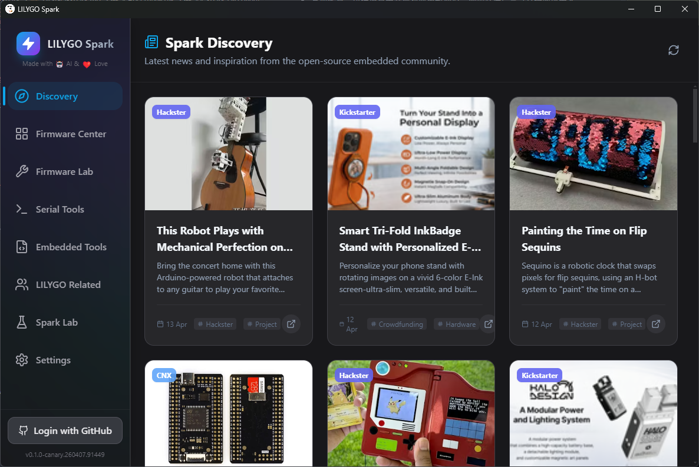
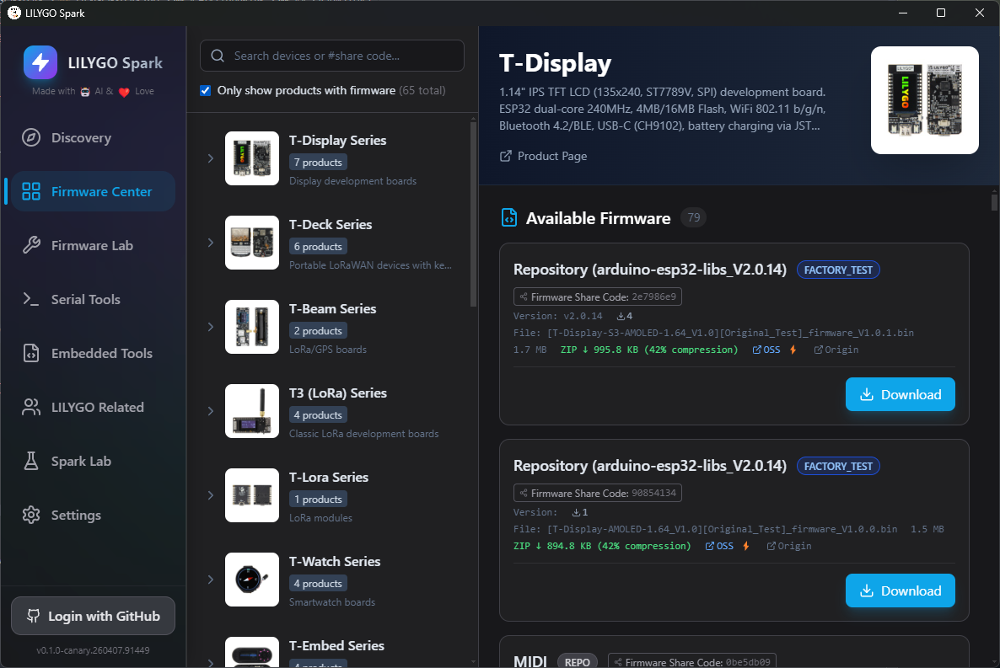
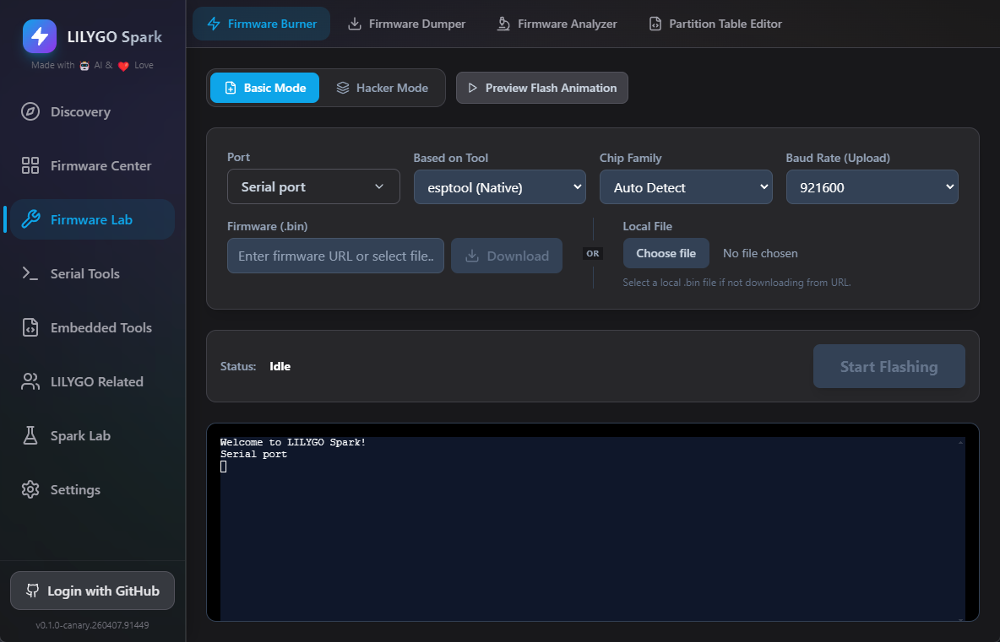
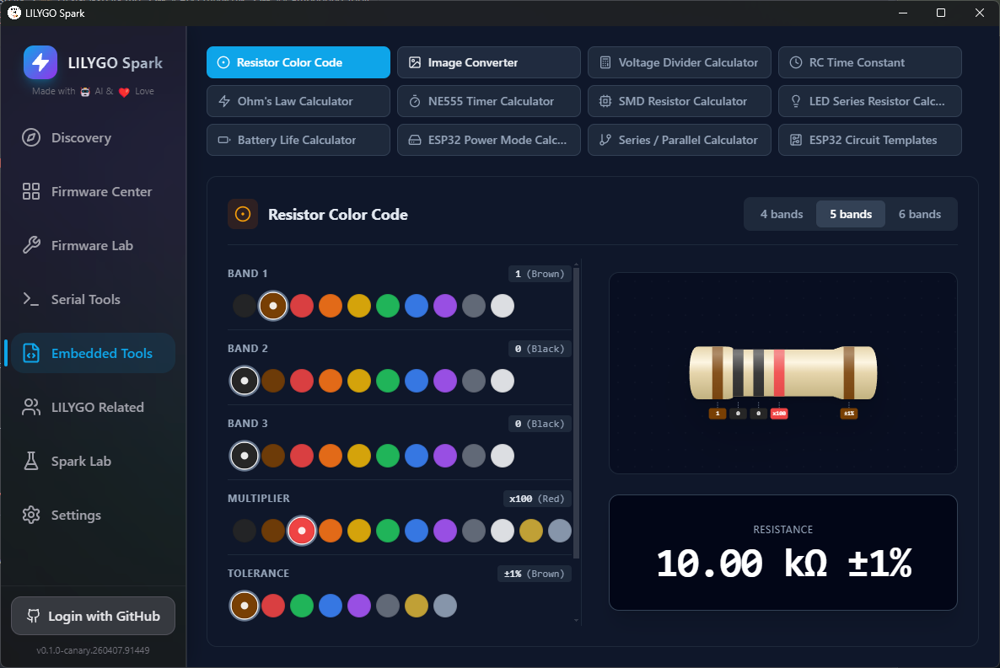
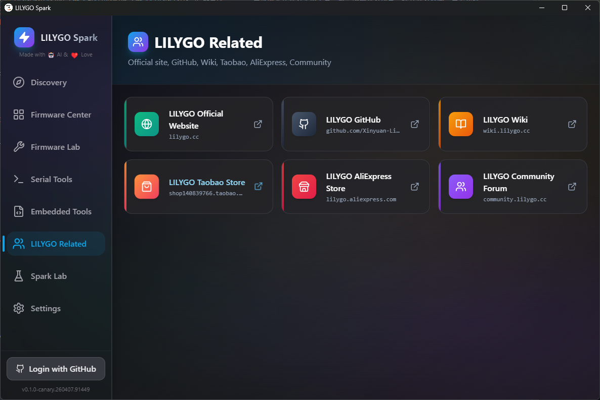
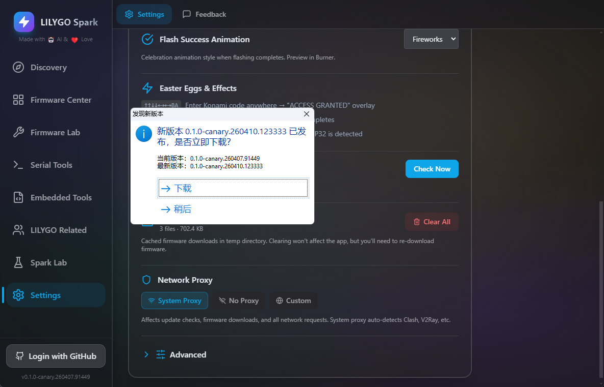
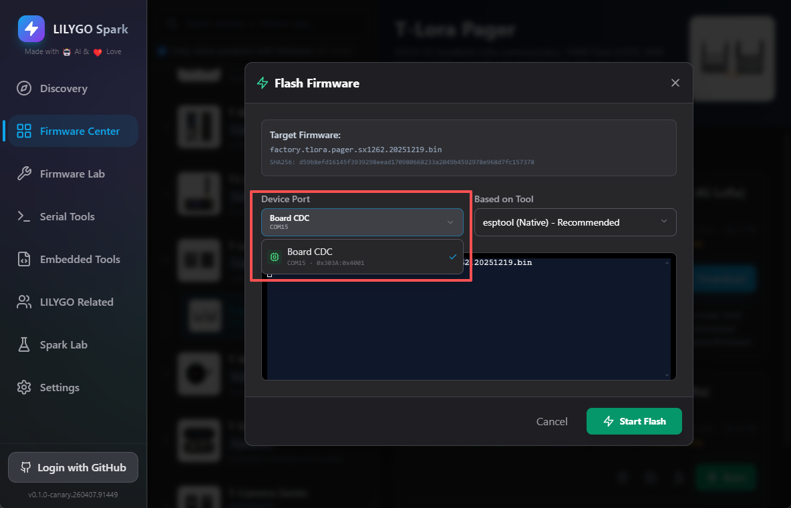
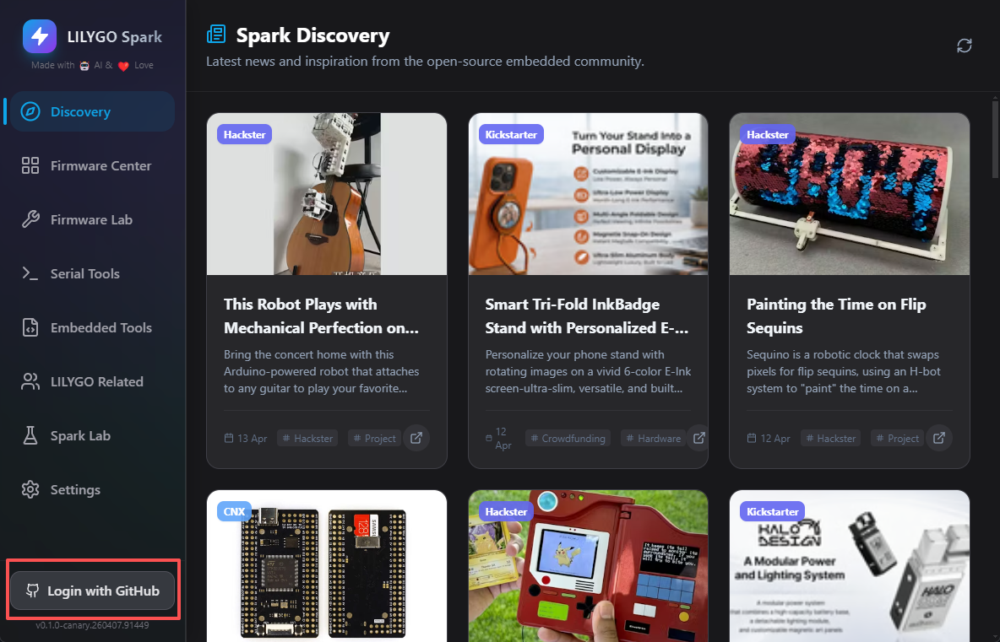
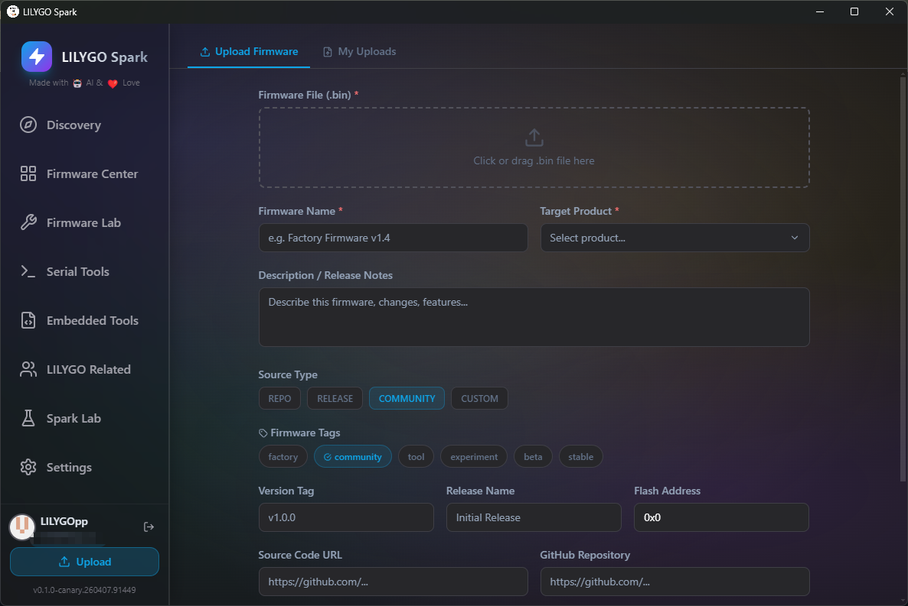

# LILYGO Spark User Guide

## Software Download

Click **"Download"** above to get the installer for your current platform, or click **"All Platforms"** to expand the full list of downloads for macOS, Windows, and Linux.

## Software Installation

### Windows

1. Locate the downloaded `.exe` file and double-click to start the installer;

2. If a SmartScreen security prompt appears, click `More info` → `Run anyway` to continue;

3. After installation, the software will start automatically.

### macOS

The macOS version has been **Apple Notarized**, so you can install it directly without any additional security settings.

1. Open the downloaded `.dmg` file and drag LILYGO Spark to the Applications folder;
2. On first launch, macOS will show a confirmation dialog — click `Open` to proceed;
3. No need to go to System Settings → Privacy & Security to allow the app, as it is already notarized by Apple.

## Software Function Overview

After the software starts, the interface contains several functional modules. Each module has clear functions and is easy to operate. Details are as follows:
      

### Basic Settings

Enter the 「Settings」 interface to personalize the software according to different usage needs:
      

- Theme Settings: Supports switching to dark theme and other styles to suit different usage scenarios and visual habits;

- Other Configurations: You can enable the corresponding update channel, adjust the software language (supports Simplified Chinese, English, Traditional Chinese, Japanese), and configure cache, custom firmware list, etc.

### GitHub Login

The software supports GitHub OAuth authorization login. After logging in, advanced functions such as firmware upload are unlocked. Operation process: Click the 「Login」 button on the interface and follow the web pop-up to complete authentication.
      

### Spark Discovery

This module is used to publish and display official news, announcements, etc. Users can use this module to keep up with the latest LILYGO updates, product information, and development-related content.

### Firmware Center

Aggregates factory firmware for all LILYGO product series, as well as third-party firmware resources shared by quality developers. It also supports developers uploading their own firmware and examples, jointly enriching the firmware ecosystem.

    

### Firmware Tools (Firmware Lab)

Built-in professional firmware processing tools. Core functions include:
Screenshot description: Screenshot showing the main interface of the Firmware Lab module, with red boxes marking the entry buttons for the four core functions: Firmware Flashing, Firmware Extraction, Firmware Analysis, and Partition Table Editing.

- Firmware Flashing: Write the downloaded firmware to ESP32 series devices;

- Firmware Extraction: Read and export firmware files from a connected device;

- Firmware Analysis: Parse .bin format firmware files, automatically identifying key content such as chip type, partition table, bootloader, application information, and file system image;
Screenshot description: Screenshot showing the firmware analysis interface, with a red box marking the .bin file selection entry and the analysis result display area (e.g., chip type, partition table information), clearly showing the analysed core data.

- Partition Table Editing: Provides visual editing of ESP32 partition tables, supporting import and export of partition tables.
        

### Serial Tool

Provides all the functions of a standard serial tool. Operation process: Select the target device's serial port and appropriate baud rate, click the 「Connect」 button to enable serial communication between the computer and the device, and view device log output.

### Embedded Tools

Integrates common tools for embedded development, covering various development scenarios to improve development efficiency. It mainly includes:

Resistor Color Code Calculator, SMD Resistor Calculator, LED Current Limiting Resistor Calculator, Ohm's Law Calculator, 555 Timer Calculator, Battery Life Calculator, ESP32 Power Estimator, Series/Parallel Resistor Calculator, Circuit Schematic Viewer, etc.

### LILYGO Community and Product Documentation

This module contains detailed technical documentation and user manuals for all LILYGO product series, as well as links to official purchase channels, making it easy for users to quickly query product information and obtain purchasing options.
      

### Spark Lab

Displays the function development roadmap and inspiration planning for LILYGO Spark software. The development team will continuously iterate and optimise software functions based on user feedback and industry technology trends, providing developers with a more convenient experience.
      

## Software Version Update

To ensure you have the latest software features and bug fixes, follow these steps to enable the update channel and check for updates:

Screenshot description: Screenshot showing the update-related area in the Settings interface, with red boxes marking the 「Check for Updates」 option and the update channel setting entry.

1. Launch the software and enter the 「Settings」 interface, scroll down to find the 「Advanced」 option, expand it and check 「Canary Channel」 to enable the beta update channel;
        

2. Click 「Check for Updates」 to detect and update to the latest LILYGO Spark version (Canary version, including the latest development features and optimisations).
        

      

## Firmware Download and Flashing (Taking T-Lora Pager as an Example)

### Firmware Download

1. Launch the software, click to enter the 「Firmware Center」 module, search and find the firmware resource corresponding to the T-Lora Pager in the firmware list;
        

2. According to the device model you are using, select the corresponding firmware version (e.g., SX1262 version) and click the 「Download Firmware」 button. Wait for the firmware download to complete;
Screenshot description: Screenshot showing the 「Download Firmware」 button (marked with a red box) for the firmware, and the progress bar during download, showing download progress and remaining time.

3. After the download is complete, click the 「Flash」 button. The system will automatically jump to the firmware flashing interface.

### Firmware Flashing

1. Connect the T-Lora Pager device to the computer via a data cable, and select the corresponding serial port for that device in the flashing interface;
        

      

2. It is recommended to switch the device to download mode. Operation method: Press and hold the Boot button on the device, simultaneously press the RST button, then release. The device will enter download mode (refer to LILYGO official YouTube video tutorial for detailed operation);

3. The flashing tool defaults to the built‑in esptool; no additional installation is required;

4. Click 「Start Download」 and wait for the flashing to complete (flashing time varies depending on the firmware size, please be patient);
        

5. When the interface displays the 「Firmware download complete」 message, the firmware has been successfully flashed.

## Firmware Upload

If a developer has created relevant firmware, they can upload it to the LILYGO Spark platform according to the following steps, sharing it with developers around the world:
      

1. Launch the LILYGO Spark software, click 「GitHub Login」 and follow the web pop-up to complete authentication (if you need to switch GitHub accounts, first switch the account on the web side, then perform the software login operation);
        

2. After successful login, find the 「Upload」 button on the interface and click to enter the firmware upload interface;

3. Select the firmware file to upload, and fill in the required firmware description information (including firmware name, function description, compatible devices, etc.);
       

      

4. After completing the information, click the 「Upload」 button to submit the firmware.
        

After the firmware upload is complete, you can contact the development team through LILYGO's official platforms to speed up firmware review and promotion, allowing your work to be known and used by more people.

## Additional Notes

- Cross‑platform Support: The software is compatible with Windows, macOS, and Linux operating systems; it can be installed and run normally.

- Download Acceleration: When users in mainland China download firmware, the software will automatically use the Alibaba Cloud OSS mirror acceleration to increase download speed and ensure download stability.
Screenshot description: Screenshot showing the acceleration prompt pop‑up during firmware download, with a red box marking the prompt message “Alibaba Cloud OSS mirror accelerating” and a comparison of download speeds.

- Hidden Features: The software has Easter egg functions (such as Konami code trigger, celebration animation after successful flashing, etc.) for users to discover.

- Feedback: If you encounter bugs or have feature suggestions during use, you can submit them through the software's 「Feedback」 function. The development team will handle and respond promptly.