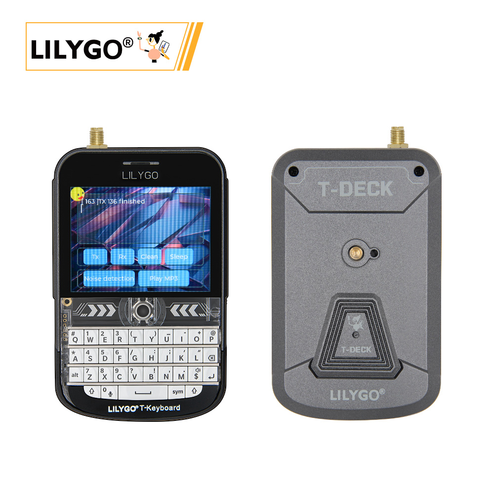
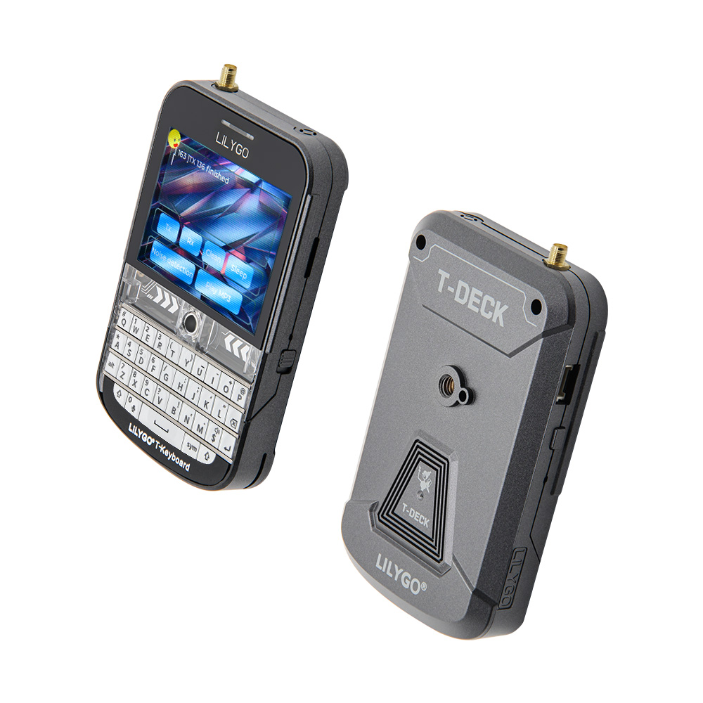
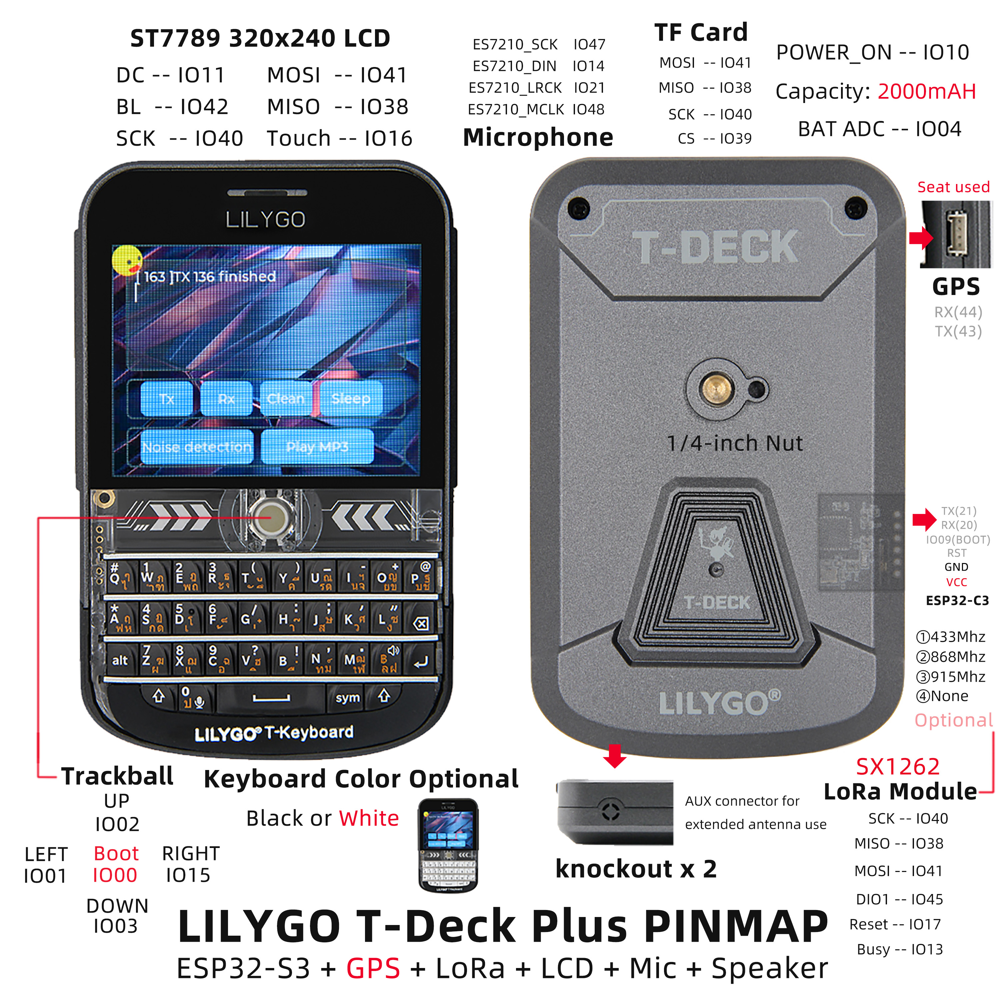
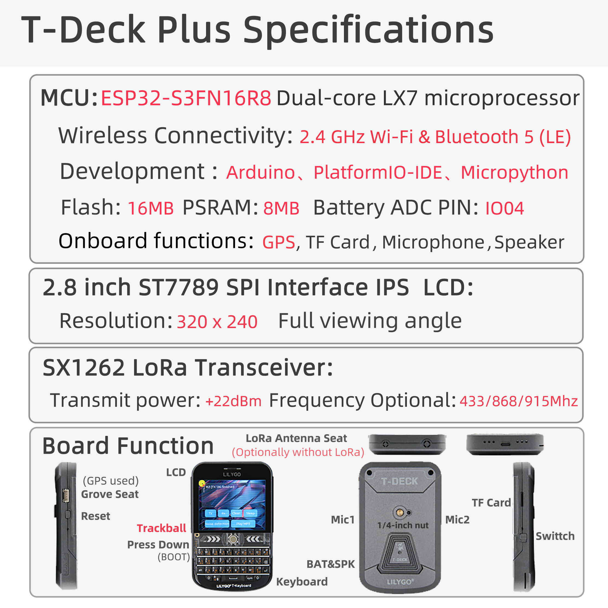

<div style="width:100%; display:flex;justify-content: center;">



</div>

<div style="padding: 1em 0 0 0; display: flex; justify-content: center">
    <a target="_blank" style="margin: 1em;color: white; font-size: 0.9em; border-radius: 0.3em; padding: 0.5em 2em; background-color:rgb(63, 201, 28)" href="https://lilygo.cc/products/t-deck">Official Store</a>
</div>

## Version History:
| Version | Update date | Update description |
| :-----: | :---------: | :---------------- |
|  |  |  |


1. T-Deck-Plus has allocated the pins on the **Grove** interface for the GPS module, so the **Grove** interface on the T-Deck-Plus cannot be used.
2. T-Deck updated the [TFT_eSPI ST7789 initialization sequence](https://github.com/Xinyuan-LilyGO/T-Deck/commit/6adb8884c689f174c29a6d7172a0daa367a582eb) on 2024-07-26. This change has not been pushed to the TFT_eSPI upstream branch. If you find that the screen display is incorrect when using it, please check whether the initialization sequence here is consistent with that in the repository.

## Purchase Links

| Product | SOC | FLASH | PSRAM | Link |
| :-----: | :--: | :---: | :---: | :--: |
| T-Deck | ESP32-S3FN16R8 | 16MB | 8MB | [LILYGO Mall](https://lilygo.cc/products/t-deck) |

## Table of Contents
- [Description](#description)
- [Preview](#preview)
- [Modules](#modules)
- [Quick Start](#quick-start)
- [Pin Overview](#pin-overview)
- [Related Tests](#related-tests)
- [FAQ](#faq)
- [Projects](#projects)
- [Resources](#resources)
- [Dependent Libraries](#dependent-libraries)

## Description

The LILYGO T-Deck is a highly integrated, multi-functional embedded development platform based on the ESP32-S3 main controller. It integrates a 2.8‑inch 320×240 ST7789 display, a trackball navigation module (including direction keys and BOOT button), a physical keyboard interface (I²C communication), a TF card slot for storage expansion, a LoRa wireless communication module (supporting SCK/MISO/MOSI and control pins), and an ES7210 microphone array (for audio input). The pin layout covers display drive (DC/BL/SPI), touch control, sensor interaction (SDA/SCL/INT), power management (BAT ADC), and modular expansion (SPI/I²C/UART), enabling rapid development of IoT terminals, portable interactive devices, or low‑power wireless communication projects.

## Preview

### Physical Image

<div style="width:100%; display:flex;justify-content: center;">



</div>

### Pin Diagram



## Modules

### MCU

* Chip: ESP32-S3FN16R8 Dual-core LX7 microprocessor
* PSRAM: 8MB
* FLASH: 16MB
* Wireless: Wi-Fi 802.11 b/g/n; Bluetooth 5.0 (LE)
* Additional Information: More information available at [Espressif Official ESP32-S3 Datasheet](https://www.espressif.com/sites/default/files/documentation/esp32-s3_datasheet_en.pdf)

### Communication Modules

* LoRa: SX1262 chip, supports 433MHz~915MHz bands (optional)
* GPS: MIA-M10Q GNSS module
* Wireless: 2.4GHz Wi-Fi & Bluetooth 5.0 (LE)

### Display & Input

* Screen: 2.8‑inch ST7789 LCD
* Resolution: 320×240 pixels
* Control Method: Trackball navigation module (replaces touch screen)
* Keyboard: Physical keyboard interface (I²C communication)

### Audio System

* Microphone: MSM381A3729H9CP microphone array
* Audio Codec: ES7210 audio codec

### Power Management

* Battery: 2000mAh Li‑Polymer battery
* Switch: Power switch
* USB Power: Type‑C interface

### Overview


> The T-Deck version has no touch screen; a trackball navigation module is used instead.

| Component | Description |
| :--: | :--: |
| MCU | ESP32-S3FN16R8 Dual-core LX7 microprocessor |
| FLASH | 16MB |
| PSRAM | 8MB |
| LoRa | SX1262 (433MHz~915MHz optional) |
| GPS | MIA-M10Q GNSS module |
| Screen | 2.8‑inch ST7789 LCD (320×240) |
| Control Method | Trackball navigation module |
| Input | Physical keyboard (I²C interface) |
| Audio | ES7210 audio codec |
| Microphone | MSM381A3729H9CP microphone array |
| Battery | 2000mAh Li‑Polymer battery |
| Storage | TF card expansion |
| Wireless | 2.4 GHz Wi-Fi & Bluetooth 5 (LE) |
| USB | 1 × Type‑C interface |
| IO Expansion | 2mm pitch 6‑pin expansion interface |
| Expansion Interfaces | GPS expansion interface + 2 × JST GH 1.25mm + 1 × 4‑pin expansion interface |
| Buttons | 1 x RST button + 1 x BOOT button (trackball) |
| Switch | Power switch |
| Mounting Holes | 2mm positioning holes |
| Dimensions | **10×6.8×1.1 cm** |

## Quick Start

### Example Support

````
examples 
├─Keyboard_ESP32C3       # ESP32C3 keyboard I2C slave
├─Keyboard_T_Deck_Master # T-Deck read from keyboard
├─Microphone             # Noise detection  
├─Touchpad               # Read touch coordinates 
├─GPSShield              # GPS Shield example
└─UnitTest               # Factory hardware unit testing           

````


1. If the microphone is enabled, the button in the middle of the board (GPIO0) is not available.
2. If you cannot upload a sketch, press and hold the trackball (BOOT), then insert the USB cable to put the chip into download mode, and then click upload. After upload is complete, press RST to exit download mode.
3. The programming/flashing interface for the ESP32C3 is the 6‑pin header on the side of the RST button. Starting from above the RST button, the pins are: 3V3, GND, RST, BOOT, RX, TX.

### PlatformIO

1. Install [Visual Studio Code](https://code.visualstudio.com/) and [Python](https://www.python.org/)
2. Search for the `PlatformIO` plugin in `Visual Studio Code` extensions and install it.
3. After installation, restart `Visual Studio Code`.
4. After restarting, select `File` -> `Open Folder` in the upper left corner, then select the `T-Deck` directory.
5. Click on the `platformio.ini` file, and under the `platformio` section uncomment the example line you want to use. Make sure only one line is active.
6. Click the (✔) symbol at the bottom left to compile.
7. Connect the board to the computer via USB.
8. Click (→) to upload the firmware.
9. Click (plug symbol) to monitor the serial output.

### Arduino IDE

1. Install [Arduino IDE](https://www.arduino.cc/en/software).
2. Copy all folders inside `T-Deck/lib` to `<C:\Users\UserName\Documents\Arduino\libraries>`. If the `libraries` folder does not exist, create it. Note: do not copy the `lib` folder itself, but the folders inside it.
3. Open Arduino IDE -> Tools 
   - Board -> ESP32S3 Dev Module
   - USB CDC On Boot -> Enable   # Note: when the board is not connected via USB, you should change this to Disable so that USB CDC does not block the board startup.
   - CPU Frequency -> 240MHz
   - USB DFU On Boot -> Disable
   - Flash Mode -> QIO 80MHz
   - Flash Size -> 16MB(128Mb)
   - USB Firmware MSC On Boot -> Disable
   - PSRAM -> OPI PSRAM
   - Partition Scheme -> 16M Flash(3MB APP/9.9MB FATFS)
   - USB Mode -> Hardware CDC and JTAG
   - Upload Mode -> UART0/Hardware CDC
   - Upload Speed -> 921600
4. Insert the USB cable to the PC, click Upload. (If upload fails, hold down the BOOT button, press RST once, then click Upload. After upload completes, press RST to exit download mode.)
5. Select the correct settings in the "Tools" menu as shown in the table below.

### Development Platforms
1. [VS Code](https://code.visualstudio.com/)
2. [Arduino IDE](https://www.arduino.cc/en/software)
3. [Platform IO](https://platformio.org/)
4. [Micropython](https://micropython.org/)

## Pin Overview
~~~c

    //! The board peripheral power control pin needs to be set to HIGH when using the peripheral
    #define BOARD_POWERON       10

    #define BOARD_I2S_WS        5
    #define BOARD_I2S_BCK       7
    #define BOARD_I2S_DOUT      6

    #define BOARD_I2C_SDA       18
    #define BOARD_I2C_SCL       8

    #define BOARD_BAT_ADC       4

    #define BOARD_TOUCH_INT     16
    #define BOARD_KEYBOARD_INT  46

    #define BOARD_SDCARD_CS     39
    #define BOARD_TFT_CS        12
    #define RADIO_CS_PIN        9

    #define BOARD_TFT_DC        11
    #define BOARD_TFT_BACKLIGHT 42

    #define BOARD_SPI_MOSI      41
    #define BOARD_SPI_MISO      38
    #define BOARD_SPI_SCK       40

    #define BOARD_TBOX_G02      2
    #define BOARD_TBOX_G01      3
    #define BOARD_TBOX_G04      1
    #define BOARD_TBOX_G03      15

    #define BOARD_ES7210_MCLK   48
    #define BOARD_ES7210_LRCK   21
    #define BOARD_ES7210_SCK    47
    #define BOARD_ES7210_DIN    14

    #define RADIO_BUSY_PIN      13
    #define RADIO_RST_PIN       17
    #define RADIO_DIO1_PIN      45

    #define BOARD_BOOT_PIN      0

    #define BOARD_BL_PIN        42


    #define BOARD_GPS_TX_PIN                 43
    #define BOARD_GPS_RX_PIN                 44


    #ifndef RADIO_FREQ
    #ifdef  JAPAN_MIC
    #define RADIO_FREQ           920.0
    #else
    #define RADIO_FREQ           868.0
    #endif
    #endif

    #ifndef RADIO_BANDWIDTH
    #define RADIO_BANDWIDTH      125.0
    #endif

    #ifndef RADIO_SF
    #define RADIO_SF             10
    #endif

    #ifndef RADIO_CR
    #define RADIO_CR             6
    #endif

    #ifndef RADIO_TX_POWER
    #define RADIO_TX_POWER       22
    #endif

    #define DEFAULT_OPA          100

~~~

## Related Tests


## FAQ

* **Q. I still don't know how to set up the programming environment after reading the above tutorial. What should I do?**  
  A. If you still don't understand how to set up the environment after reading the above tutorial, you can refer to the [LilyGo-Document](https://github.com/Xinyuan-LilyGO/LilyGo-Document) documentation for setup instructions.

* **Q. Why does Arduino IDE prompt me to update library files when I open it? Should I update or not?**  
  A. Choose not to update library files. Different versions of library files may not be compatible with each other, so it is not recommended to update library files.

* **Q. Does the T-Deck have a touch screen?**  
  A. The T-Deck version has no touch screen; a trackball navigation module is used instead of touch operation.

* **Q. Why does my board keep failing to upload programs?**  
  A. Please hold down the "BOOT" button and try uploading the program again.

## Projects
* [T-Deck Schematic](https://github.com/Xinyuan-LilyGO/T-Deck/blob/master/schematic/schematic.pdf)

## Resources
* [ESP32-S3 Datasheet](https://www.espressif.com/sites/default/files/documentation/esp32-s3_datasheet_en.pdf)
* [T-Deck ANT 868-915MHz](https://github.com/Xinyuan-LilyGO/T-Deck/blob/master/datasheet/T-Deck%20ANT%20868-915MHZ.pdf.pdf)
* [T-Deck ANT 433MHz](https://github.com/Xinyuan-LilyGO/T-Deck/blob/master/datasheet/T-Deck%20ANT%20433MHZ.pdf)

## Dependent Libraries
* [AceButton](https://github.com/bxparks/AceButton)
* [Arduino_GFX](https://github.com/moononournation/Arduino_GFX)
* [ESP32-audioI2S](https://github.com/schreibfaul1/ESP32-audioI2S)
* [RadioLib](https://github.com/jgromes/RadioLib)
* [SensorsLib](https://github.com/lewisxhe/SensorsLib)
* [TFT_eSPI](https://github.com/Bodmer/TFT_eSPI)
* [TinyGPSPlus](https://github.com/mikalhart/TinyGPSPlus)
* [TouchLib](https://github.com/mmMicky/TouchLib)
* [LVGL](https://github.com/lvgl/lvgl/tree/v8.4.0)
```