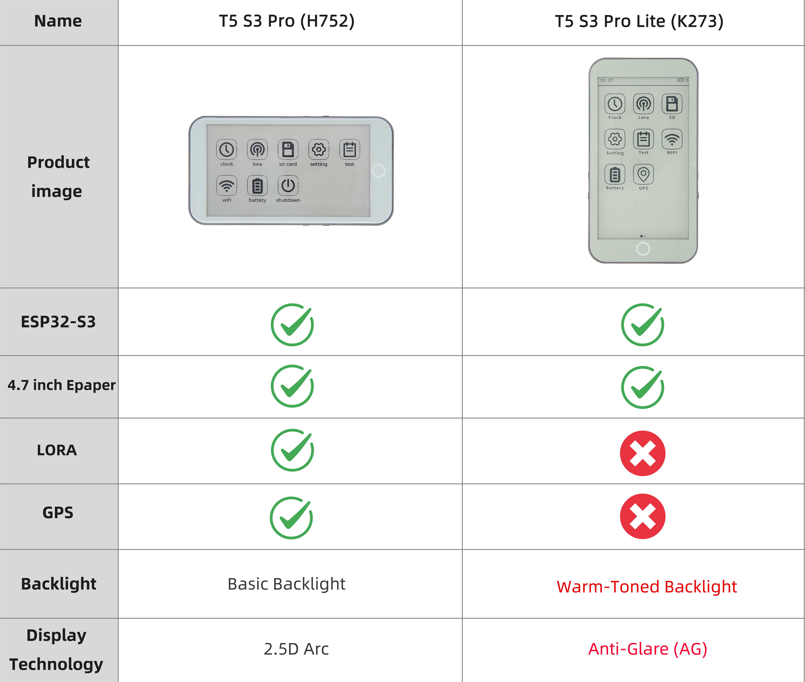
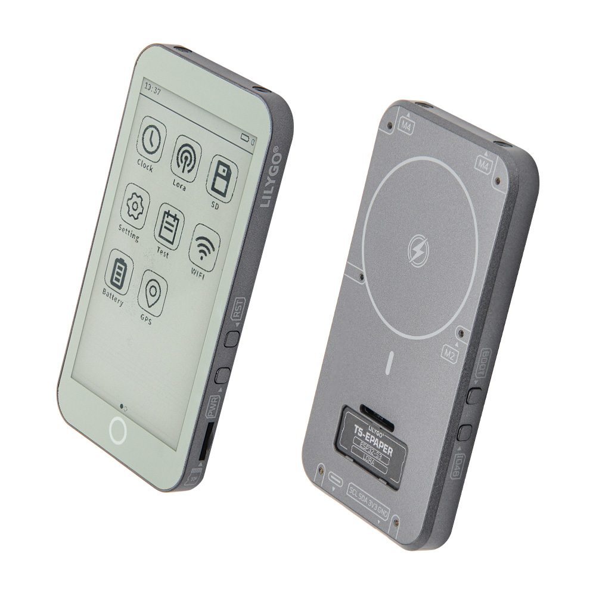
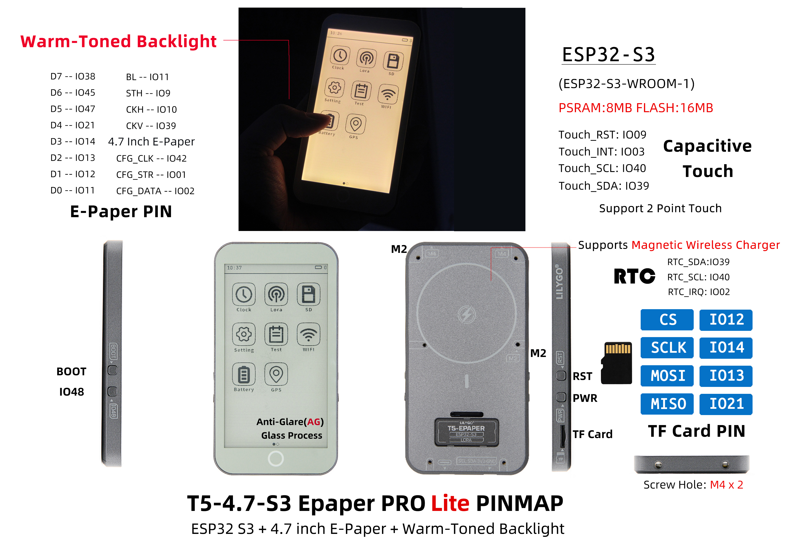

<div style="width:100%; display:flex;justify-content: center;">


</div>

<div style="padding: 1em 0 0 0; display: flex; justify-content: center">
    <a target="_blank" style="margin: 1em;color: white; font-size: 0.9em; border-radius: 0.3em; padding: 0.5em 2em; background-color:rgb(63, 201, 28)" href="#">Purchase on Official Store</a>
</div>

## Version History:
| Version | Update date | Update description |
| :-----: | :---------: | :---------------- |
| T5-ePaper-S3-V2.4 |  | Current version (Pro edition) |
| T5-ePaper-S3-Lite |  | New Lite edition (GPS/LoRa removed, AG glass + warm backlight) |

## Purchase Links

| Product | SOC | FLASH | PSRAM | Link |
| :-----: | :--: | :---: | :---: | :--: |
| T5-4.7-S3 Pro | ESP32-S3-WROOM-1-N16R8 | 16MB | 8MB | [LILYGO Mall](#) |
| T5-4.7-S3 Lite | ESP32-S3-WROOM-1-N16R8 | 16MB | 8MB | [LILYGO Mall](#) |

## Table of Contents
- [Description](#description)
- [Version Differences](#version-differences)
- [Preview](#preview)
- [Modules](#modules)
- [Quick Start](#quick-start)
- [Pin Overview](#pin-overview)
- [Related Tests](#related-tests)
- [FAQ](#faq)
- [Projects](#projects)
- [Resources](#resources)
- [Libraries](#libraries)

## Description

The LILYGO T5-4.7-S3 series is a 4.7-inch e‑paper development solution based on the ESP32-S3-WROOM-1-N16R8 chip (with 8MB PSRAM and 16MB Flash). It is available in two models: **Pro edition** and **Lite edition**.

### Pro Edition
Integrates capacitive touch (supporting two‑point touch), a PCF8563 real‑time clock, a Type‑C USB port, and a Li‑Po battery connector (JST‑PH 2.0mm). It also features battery voltage monitoring (Bat ADC), a 40‑pin GPIO expansion header compatible with Raspberry Pi, an onboard TF card slot, dedicated screen control signals (STV/LE), and an SPI interface (CS/SCLK/MOSI/MISO). The 2.5D curved design makes it suitable for full‑featured low‑power e‑paper application development.

### Lite Edition
**Optimized for cost‑sensitive e‑paper applications**. The GPS and LoRa modules have been removed, significantly reducing hardware cost and making it ideal for pure display applications such as e‑books, digital photo frames, and weather stations. Key upgrades:
- Screen uses **AG (anti‑glare) glass** for dramatically improved outdoor visibility.
- Backlight changed to **warm tone**, providing a more comfortable reading experience during extended use.
- Retains the core ESP32‑S3 performance, e‑paper display, touch, RTC, and other essential functions.

## Version Differences



| Feature | T5-4.7-S3 Pro | T5-4.7-S3 Lite |
| :--: | :---: | :---: |
| Core Chip | ESP32-S3-WROOM-1-N16R8 | ESP32-S3-WROOM-1-N16R8 |
| Flash/PSRAM | 16MB/8MB | 16MB/8MB |
| E‑Paper Display | 4.7‑inch EDO47TC1 (540×960) | 4.7‑inch EDO47TC1 (540×960) |
| Touch Function | GT911 two‑point capacitive touch | GT911 two‑point capacitive touch |
| RTC Clock | PCF8563 | PCF8563 |
| GPS/LoRa Module | ✅ Supported | ❌ Removed |
| Glass Process | Standard glass | AG anti‑glare glass |
| Backlight | Standard white | Warm‑tone backlight |
| Use Case | Full‑featured IoT terminal | Pure display applications (e‑books, photo frames, weather stations) |
| Cost | Higher | Significantly reduced |

## Preview

### Physical Photos

<div style="width:100%; display:flex;justify-content: center;">




</div>

### Pinout Diagram



### Product Info Graphic

<div style="width:100%; display:flex;justify-content: center; gap: 1em; flex-wrap: wrap;">
  
</div>

## Modules

### MCU

* Chip: ESP32-S3-WROOM-1-N16R8
* PSRAM: 8MB
* FLASH: 16MB
* Wireless: Wi‑Fi 802.11 b/g/n; Bluetooth 5.0 (BLE)
* Additional Information: For more details, please refer to the [Espressif official ESP32-S3 datasheet](https://www.espressif.com.cn/sites/default/files/documentation/esp32-s3_datasheet_en.pdf)

### E‑Paper Display

* Model: EDO47TC1
* Size: 4.7 inches
* Resolution: 540×960 pixels
* Type: Low‑power e‑paper display
* Interface: SPI + dedicated control signals (STV/LE)
* Lite Edition Upgrade: AG anti‑glare glass + warm backlight

### Touch Screen

* Chip: GT911
* Type: Capacitive touch screen
* Support: Two‑point touch
* Interface: I²C

### Real‑Time Clock

* Chip: PCF8563
* Function: Real‑time clock, timekeeping
* Interface: I²C

### Power Management

* Battery Connector: JST‑PH 2.0mm Li‑Po battery connector
* Voltage Monitoring: Battery voltage ADC monitoring
* USB Power: Type‑C interface

### Overview

| Component | Pro Edition Description | Lite Edition Description |
| :--: | :--: | :--: |
| MCU | ESP32-S3-WROOM-1-N16R8 | ESP32-S3-WROOM-1-N16R8 |
| FLASH | 16MB | 16MB |
| PSRAM | 8MB | 8MB |
| Display | EDO47TC1 4.7‑inch e‑paper (540×960) | EDO47TC1 4.7‑inch e‑paper (540×960) + AG glass + warm backlight |
| Touch | GT911 capacitive touch (two‑point) | GT911 capacitive touch (two‑point) |
| Clock | PCF8563 RTC | PCF8563 RTC |
| GPS/LoRa | ✅ Supported | ❌ Removed |
| Storage | TF card slot | TF card slot |
| Wireless | 2.4 GHz Wi‑Fi & Bluetooth 5 (LE) | 2.4 GHz Wi‑Fi & Bluetooth 5 (LE) |
| USB | 1 × USB port and OTG (Type‑C) | 1 × USB port and OTG (Type‑C) |
| I/O Expansion | 2 × 20‑pin expansion headers (compatible with Raspberry Pi 40‑pin) | 2 × 20‑pin expansion headers (compatible with Raspberry Pi 40‑pin) |
| Expansion Connectors | 1 × JST‑PH 2.0mm battery connector + 2 × 4‑pin Molex connectors | 1 × JST‑PH 2.0mm battery connector |
| Buttons | 1 × RST button + 1 × SIR_io0 button + 1 × io21 button | 1 × RST button + 1 × SIR_io0 button + 1 × io21 button |
| Mounting Holes | 6 × 3.8mm mounting holes | 6 × 3.8mm mounting holes |
| Dimensions | **121×67×12mm** | **121×67×12mm** |
| Design | 2.5D curved design | 2.5D curved design |

## Quick Start

### Example Support

```txt
examples/
├── button              ; Keystroke example
├── demo                ; Comprehensive test example including sleep current test
├── drawExample         ; Simple examples of drawing lines and circles
├── drawImages          ; Show image example
├── grayscale_test      ; Grayscale example
├── screen_repair       ; Full screen refresh example
├── spi_driver          ; Display as slave device
├── touch               ; Touch example
└── wifi_sync           ; WiFi Comprehensive Example
```

### PlatformIO
1. Install [Visual Studio Code](https://code.visualstudio.com/Download), choosing the version for your operating system.
2. Open the "Extensions" sidebar in VSCode (or press <kbd>Ctrl</kbd>+<kbd>Shift</kbd>+<kbd>X</kbd>), search for the "PlatformIO IDE" extension and install it.
3. While the extension is installing, you can download the project code from GitHub. You can download the main branch by clicking the green "<> Code" button, or download a release version from the "Releases" section.
4. After the extension is installed, open the Explorer sidebar (or press <kbd>Ctrl</kbd>+<kbd>Shift</kbd>+<kbd>E</kbd>), click "Open Folder", select the project folder you just downloaded, and click "Add". The project will now be in your workspace.
5. Open the "platformio.ini" file in the project folder (PlatformIO will automatically open it after adding the folder). Under the "[platformio]" section, uncomment the example you want to burn (look for "default_envs = xxx"), then click the "<kbd>√</kbd>" button in the bottom left to compile. If compilation succeeds, connect the board to your computer, and click the "<kbd>→</kbd>" button to upload.

### Arduino
1. Install [Arduino IDE](https://www.arduino.cc/en/software), choosing the version for your operating system.
2. Open the "`example`" folder inside the project directory, select the example project folder, and open the file ending with ".ino" to launch the Arduino IDE workspace.
3. Open the "`Tools`" menu, select "`Board`" -> "`Boards Manager`". Search for "`esp32`" and install the board package by "`Espressif Systems`". Then go back to "Board" and choose the appropriate board under "`ESP32 Arduino`".
4. Open the "File" menu -> "Preferences". Locate the "Sketchbook location" field. Copy all the library folders from the project's "`libraries`" folder and paste them into the "`libraries`" folder inside the sketchbook location.
5. In the "`Tools`" menu, select the correct settings as shown in the table below.

#### ESP32-S3
| Setting | Value |
| :-----: | :---: |
| Board | ESP32S3 Dev Module |
| Upload Speed | 921600 |
| USB Mode | Hardware CDC and JTAG |
| USB CDC On Boot | Enabled |
| USB Firmware MSC On Boot | Disabled |
| USB DFU On Boot | Disabled |
| CPU Frequency | 240MHz (WiFi) |
| Flash Mode | QIO 80MHz |
| Flash Size | 16MB (128Mb) |
| Core Debug Level | None |
| Partition Scheme | 16M Flash (3MB APP/9.9MB FATFS) |
| PSRAM | OPI PSRAM |
| Arduino Runs On | Core 1 |
| Events Run On | Core 1 |

6. Select the correct port.
7. Click the "<kbd>√</kbd>" button in the top left to compile. If compilation succeeds, connect the board to your computer and click the "<kbd>→</kbd>" button to upload.

### Development Platforms
1. [ESP-IDF](https://www.espressif.com/zh-hans/products/sdks/esp-idf)
2. [Arduino IDE](https://www.arduino.cc/en/software)
3. [VS Code](https://code.visualstudio.com/)
4. [Micropython](https://micropython.org/)

## Pin Overview

| ESP32S3 GPIO | Connect To          | Free |
| ------------ | ------------------- | ---- |
| 13           | 74HCT4094D CFG_DATA | ❌    |
| 12           | 74HCT4094D CFG_CLK  | ❌    |
| 0            | 74HCT4094D CFG_STR  | ❌    |
| 38           | E-paper CKV         | ❌    |
| 40           | E-paper STH         | ❌    |
| 41           | E-paper CKH         | ❌    |
| 8            | E-paper D0          | ❌    |
| 1            | E-paper D1          | ❌    |
| 2            | E-paper D2          | ❌    |
| 3            | E-paper D3          | ❌    |
| 4            | E-paper D4          | ❌    |
| 5            | E-paper D5          | ❌    |
| 6            | E-paper D6          | ❌    |
| 7            | E-paper D7          | ❌    |
| 21           | Button              | ❌    |
| 14           | Battery ADC         | ❌    |
| 16           | SD MISO             | ❌*   |
| 15           | SD MOSI             | ❌*   |
| 11           | SD  SCK             | ❌*   |
| 42           | SD  CS              | ❌*   |
| 18           | SDA                 | ❌    |
| 17           | SCL                 | ❌    |
| 47           | TouchPanel IRQ      | ❌    |
| 45           | No Connect any      | ✅    |
| 10           | No Connect any      | ✅    |
| 48           | No Connect any      | ✅    |
| 39           | No Connect any      | ✅    |

- GPIOs marked ✅ are free to use. GPIO10 can be used for analog input but not for other purposes.
- SD pins: if you are not using the SD card, these GPIOs (16, 15, 11, 42) can be used freely.
- In the design, RTC_GPIO is not connected to the touch interrupt, so the ESP cannot be woken up by touch. However, GPIO10 can be connected to GPIO47 to enable touch wake‑up. For details, see [issues/93](https://github.com/Xinyuan-LilyGO/LilyGo-EPD47/issues/93#issuecomment-2488500117)

## Related Tests


## FAQ

* **Q. I still don't know how to set up the programming environment after reading the above tutorials. What should I do?**  
  A. If you still have trouble setting up the environment, you can refer to the [LilyGo-Document](https://github.com/Xinyuan-LilyGO/LilyGo-Document) for setup instructions.

* **Q. Why does Arduino IDE prompt me to update library files when I open it? Should I update or not?**  
  A. Choose **not** to update. Different versions of libraries may not be compatible with each other, so updating is not recommended.

* **Q. What is the refresh rate of the e‑paper display?**  
  A. E‑paper displays have very low power consumption but relatively slow refresh rates, making them suitable for static or infrequently updated content.

* **Q. Why does my board keep failing to upload the program?**  
  A. Please hold the "BOOT" button and try uploading again.

* **Q. Are the codes for the Lite and Pro editions interchangeable?**  
  A. Core display, touch, RTC, and other basic functions are fully compatible.

* **Q. What are the benefits of AG glass and warm backlight?**  
  A. AG (anti‑glare) glass significantly reduces screen reflections, greatly improving outdoor visibility. The warm backlight provides a more paper‑like reading experience, reducing eye strain during long reading sessions – ideal for e‑books and reading devices.

## Projects

* [T5-ePaper-S3-V2.4](https://github.com/Xinyuan-LilyGO/LilyGo-EPD47/blob/esp32s3/schematic/T5-ePaper-S3-V2.4.pdf)

## Resources
* [ESP32-S3 Datasheet](https://www.espressif.com.cn/sites/default/files/documentation/esp32-s3_datasheet_en.pdf)
* [ED047TC1 Screen Datasheet](https://github.com/Xinyuan-LilyGO/LilyGo-EPD47/blob/esp32s3/datasheet/ED047TC1.pdf)

## Libraries
* [Button2](https://github.com/LennartHennigs/Button2)
* [SensorLib@0.19](https://github.com/lewisxhe/SensorsLib)
* [GxEPD2](https://github.com/ZinggJM/GxEPD2)
* [Adafruit_GFX](https://github.com/adafruit/Adafruit-GFX-Library)