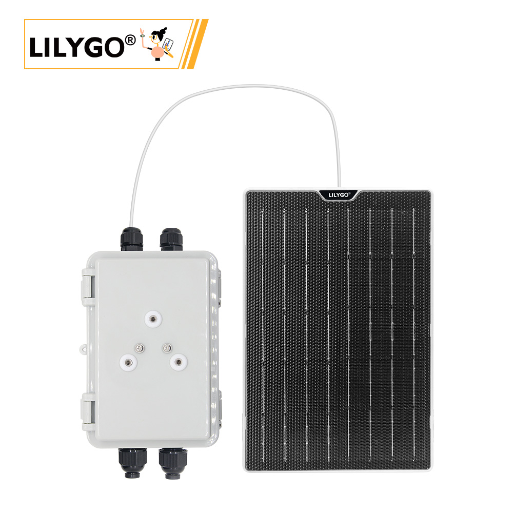

<!-- **[English](README.MD) | 中文** -->

  

  <a target="_blank" style="margin: 1em;color: white; font-size: 0.9em; border-radius: 0.3em; padding: 0.5em 2em; background-color:rgb(103, 175, 8)" href="https://lilygo.cc/products/t-solar-kit">Purchase on Official Store</a>

## 🚀 Product Overview

The **T-Solar Kit** is a solar charging expansion solution specifically designed for outdoor IoT devices. It provides stable and reliable off-grid power for various low-power outdoor devices (such as environmental sensors, agricultural monitoring stations, field positioning terminals, etc.), enabling your devices to operate stably for extended periods even in environments without grid power.

### Core Features

- ✅ **Intelligent Charge Management**: Supports 4.4-6V wide voltage input, compatible with solar panels up to 5.4W peak power.
- ✅ **Plug and Play**: Standard JST2.0 interface, simple and quick installation.
- ✅ **Complete Accessory Kit**: Includes all mounting screws, washers, and adapters, ready to use out of the box.
- ✅ **Robust and Durable**: SUS304 stainless steel accessories, suitable for harsh outdoor environments.
- ✅ **Wide Compatibility**: Supports mainstream IoT mainboards such as T3, T-Beam, T-Echo Lite, and more.

## 📦 Product Specifications

### Solar Panel Parameters

| Parameter | Value |
|-----------|-------|
| Peak Power (Pmax) | 5.4W |
| Peak Voltage (Vmp) | 5.7V |
| Peak Current (Imp) | 947mA |
| Open Circuit Voltage (Voc) | 6.9V |
| Short Circuit Current (Isc) | 994mA |

### Kit Contents

- T-Solar Charging Expansion Board ×1
- Solar Panel Connection Cable (JST2.0 interface)
- M4×8×7 Machine Screws ×2
- M5×10 Flat Head Self-Tapping Screws ×2
- SUS304 Stainless Steel Washers ×2
- IPEX Adapter (M12/M16 optional)

## 🔧 Installation and Usage

### Connection Diagram

### Quick Installation Steps

1. **Connect Solar Panel**: Connect the solar panel's JST2.0 interface to the expansion board.
2. **Secure Expansion Board**: Use the provided M4/M5 screws to secure the expansion board to your device.
3. **Connect Mainboard**: Connect the expansion board's output to a compatible mainboard.
4. **Deploy and Test**: Position the solar panel facing sunlight and check the charging status.

> 📹 **Video Tutorial**: [T-Solar Kit Installation Video](YouTube Link)

### Antenna Installation Options

- **M12 Interface**:

- **M16 Interface**:

## 🎯 Application Scenarios

### 🌾 Smart Agriculture

- Soil moisture monitoring stations
- Meteorological data collection terminals
- Irrigation system controllers

### 🌳 Environmental Monitoring

- Air quality sensor networks
- Water quality monitoring buoys
- Forest fire warning devices

### 📡 IoT Applications

- Remote asset trackers
- Smart street light controllers
- Field research data collection stations

## Frequently Asked Questions

**Q1: Can I connect a solar panel with higher power?**  
A: This product is designed for 5.4W peak input. Using solar panels exceeding 6W is not recommended.

**Q2: Can it work on cloudy or rainy days?**  
A: The expansion board supports 4.4V low voltage input, allowing it to continue charging in low-light environments, although efficiency will be reduced.

**Q3: What types of batteries are supported?**  
A: It supports 3.7V Lithium-ion/Lithium-polymer batteries, with built-in intelligent charging protection circuitry.

**Q4: Are special tools required for installation?**  
A: The kit includes all necessary accessories. You only need a Phillips screwdriver to complete the installation.