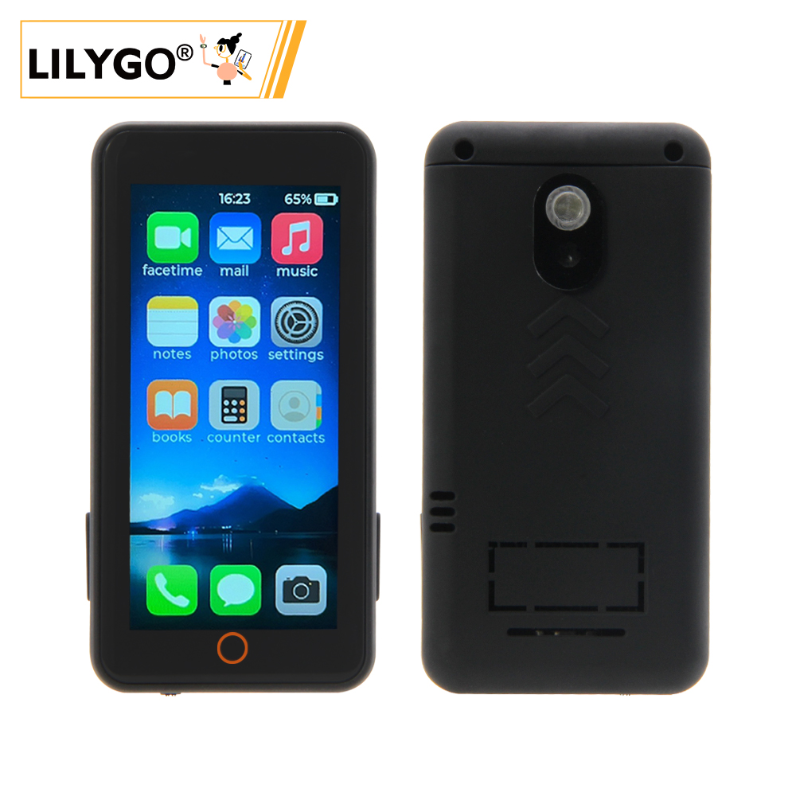

  

  <a target="_blank" style="margin: 1em; color: white; font-size: 0.9em; border-radius: 0.3em; padding: 0.5em 2em; background-color: rgb(103, 175, 8)" href="https://www.lilygo.cc/products/t-display-s3-pro">官网购买</a>

## 🚀 产品概述

**T-Display S3 Pro** 是一款基于 ESP32-S3 的高性能开发板，配备 2.2 英寸 222×480 全彩 IPS 显示屏，支持电容触摸、摄像头扩展、USB OTG 及多种外设。内置 SY6970 电源管理芯片，支持锂电池充电和电源路径管理。板载 TF 卡槽、环境光传感器、姿态传感器等，适用于智能家居、便携设备、多媒体应用等场景。最新 V1.1 版本采用恒流背光驱动，提升显示稳定性。

### 核心特性

- ✅ **高性能主控**：ESP32-S3R8 双核 LX7 处理器，16MB Flash + 8MB OPI PSRAM
- ✅ **高亮 IPS 屏**：2.2 英寸 222×480 分辨率，全视角显示
- ✅ **电容触摸**：CST816S 触摸芯片，支持手势识别
- ✅ **丰富外设**：摄像头接口、TF 卡槽、环境光传感器、姿态传感器（MPU9250/MPU6050）
- ✅ **电源管理**：SY6970 支持 1.5A 充电电流，带电源路径管理和 OTG 输出
- ✅ **扩展接口**：2×13 双排排针、STEMMA QT / QWIIC I2C 接口
- ✅ **无线连接**：2.4GHz Wi-Fi & Bluetooth 5 (LE)

---

## 📊 硬件规格

| 项目 | 参数 |
| :-- | :-- |
| MCU | ESP32-S3R8 (双核 LX7, 240MHz) |
| Flash | 16MB |
| PSRAM | 8MB (OPI PSRAM) |
| 显示屏 | 2.2 英寸 IPS，分辨率 222×480，驱动 ST7789V2 |
| 触摸 | 电容触摸 CST816S (I2C 地址 0x15) |
| 电源管理 | SY6970 (支持 1.5A 充电，电源路径管理，OTG 输出) |
| 传感器 | LTR553 环境光/接近传感器 (I2C 地址 0x23) |
| 姿态传感器 | 可选 MPU9250 / MPU6050 |
| 存储扩展 | TF 卡槽 (SPI) |
| 无线 | 2.4GHz Wi-Fi 802.11 b/g/n + Bluetooth 5 (LE) |
| USB | 1 × USB-C (支持 OTG) |
| 扩展接口 | 2×13 双排排针，摄像头接口 (DVP)，STEMMA QT / QWIIC (I2C) |
| 按键 | RESET + BOOT |
| 定位孔 | 4 × 2mm |
| 尺寸 | 56.5 × 56.5 × 9.6 mm |

---

## 🔄 版本迭代

| 版本 | 发布日期 | 更新说明 |
| :--: | :--: | :-- |
| T-Display-S3-Pro V1.0 | 2023-08-01 | 初始版本，PWM 背光 |
| T-Display-S3-Pro V1.1 | 2023-11-01 | 升级为恒流背光驱动，USB-C 接口标记 V1.1 |

---

## 🧩 模块详解

### 1. 主控 (MCU)
- **芯片**：ESP32-S3R8
- **Flash**：16MB
- **PSRAM**：8MB (OPI PSRAM)
- 更多资料请参考 [乐鑫 ESP32-S3 数据手册](https://www.espressif.com.cn/sites/default/files/documentation/esp32-s3_datasheet_en.pdf)

### 2. 显示屏
- **尺寸**：2.2 英寸
- **分辨率**：222×480
- **类型**：IPS
- **驱动**：ST7789V2（兼容）
- **通信接口**：SPI
- **兼容库**：TFT_eSPI、Arduino_GFX

### 3. 触摸
- **类型**：电容触摸
- **芯片**：CST816S
- **接口**：I2C (地址 0x15)

### 4. 电源管理
- **芯片**：SY6970
- **充电电流**：最大 1.5A
- **电池类型**：单节锂电池 (3.7V~4.2V)
- **特色功能**：电源路径管理、OTG 输出、物理开关切断电池

### 5. 传感器
- **环境光/接近**：LTR553 (I2C 地址 0x23)
- **姿态**：MPU9250 / MPU6050 (部分版本可选)

### 6. 扩展接口
- **摄像头**：DVP 接口 (支持 OV2640/OV5640)
- **TF 卡**：SPI 接口
- **USB-C**：支持 OTG (5V 500mA 输出)
- **GPIO**：2×13 双排排针
- **I2C**：STEMMA QT / QWIIC 接口

---

## 🔌 引脚图

  
  

---

## 🚀 快速开始

### 开发环境支持
- [PlatformIO](https://platformio.org/)
- [Arduino IDE](https://www.arduino.cc/en/software)
- [ESP-IDF](https://docs.espressif.com/projects/esp-idf/en/latest/esp32s3/)
- [MicroPython](https://micropython.org/)（社区支持）

### 示例程序

| 示例 | PlatformIO | Arduino | 说明 |
| :--- | :---: | :---: | :--- |
| [Factory](https://github.com/Xinyuan-LilyGO/T-Display-S3-Pro/tree/main/examples/factory) | ✓ | ✓ | 出厂综合测试 |
| [TFT_eSPI_Simple](https://github.com/Xinyuan-LilyGO/T-Display-S3-Pro/tree/main/examples/TFT_eSPI_Simple) | ✓ | ✓ | TFT_eSPI 绘图基础 |
| [AdjustBacklight](https://github.com/Xinyuan-LilyGO/T-Display-S3-Pro/tree/main/examples/AdjustBacklight) | ✓ | ✓ | 背光调节（区分 V1.0/V1.1） |
| [PMU_Example](https://github.com/Xinyuan-LilyGO/T-Display-S3-Pro/tree/main/examples/PMU_Example) | ✓ | ✓ | 电源管理配置与电池信息 |
| [USB_HID_Example](https://github.com/Xinyuan-LilyGO/T-Display-S3-Pro/tree/main/examples/USB_HID_Example) | ✓ | ✓ | USB HID 和 OTG 功能 |
| [CameraShield](https://github.com/Xinyuan-LilyGO/T-Display-S3-Pro/tree/main/examples/CameraShield) | ✓ | ✓ | 摄像头扩展板使用 |
| [Cellphone](https://github.com/Xinyuan-LilyGO/T-Display-S3-Pro/tree/main/examples/Cellphone) | ✓ | ✓ | 拍照及相册（需 TF 卡） |

> 更多示例请访问 [GitHub 仓库](https://github.com/Xinyuan-LilyGO/T-Display-S3-Pro/tree/main/examples)。

### PlatformIO 使用步骤
1. 安装 [Visual Studio Code](https://code.visualstudio.com/Download) 并打开。
2. 在扩展中搜索 “PlatformIO IDE” 并安装。
3. 克隆项目：`git clone https://github.com/Xinyuan-LilyGO/T-Display-S3-Pro.git`
4. 用 VS Code 打开项目文件夹。
5. 打开 `platformio.ini`，在 `[platformio]` 下取消注释所需环境（如 `default_envs = t-display-s3-pro`）。
6. 点击左下角 `√` 编译，`→` 上传，`🔌` 打开串口监视器。

### Arduino IDE 使用步骤
1. 安装 [Arduino IDE](https://www.arduino.cc/en/software)。
2. 添加 ESP32 开发板支持：  
   “文件” → “首选项” → “附加开发板管理器网址” 添加  
   `https://raw.githubusercontent.com/espressif/arduino-esp32/gh-pages/package_esp32_index.json`  
   然后在 “工具” → “开发板” → “开发板管理器” 中搜索并安装 **ESP32**。
3. 将项目 `lib` 文件夹下的所有库复制到 Arduino 库目录（如 `C:\Users\YourName\Documents\Arduino\libraries`）。
4. 打开示例文件（如 `examples/TFT_eSPI_Simple/TFT_eSPI_Simple.ino`）。
5. 在 “工具” 菜单中选择如下配置：

| 设置项 | 推荐值 |
| :--- | :--- |
| Board | ESP32S3 Dev Module |
| Upload Speed | 921600 |
| USB CDC On Boot | Enabled |
| USB DFU On Boot | Disabled |
| CPU Frequency | 240MHz (WiFi) |
| Flash Mode | QIO 80MHz |
| Flash Size | 16MB (128Mb) |
| Partition Scheme | 16M Flash (3MB APP/9.9MB FATFS) |
| PSRAM | OPI PSRAM |

6. 选择正确的端口，点击上传。

---

## 📊 性能测试（参考）

| 测试项 | 结果 | 备注 |
| :--- | :---: | :--- |
| 背光功耗（最大） | ≈120mA | V1.1 恒流驱动 |
| 充电电流 | 1.5A | SY6970 最大 |
| 触摸响应 | 正常 | 支持手势 |
| 摄像头兼容性 | OV2640/OV5640 | 需扩展板 |
| USB OTG 供电 | 5V 500mA | 需 PMU 启用 |

---

## ❓ 常见问题

**Q1. 看了以上教程我还是不会搭建编程环境怎么办？**  
A. 可参考 [LilyGo-Document](https://github.com/Xinyuan-LilyGO/LilyGo-Document) 文档说明。

**Q2. 为什么我的板子一直烧录失败？**  
A. 按住 **BOOT** 键，再按一下 **RST** 键，然后点击烧录，即可进入下载模式。

**Q3. 如何区分 V1.0 和 V1.1 版本？**  
A. 查看 USB-C 接口旁边是否标注 “V1.1”；若无则为 V1.0。V1.1 使用恒流背光，调节方式不同，请使用对应示例。

**Q4. 未连接电池时，上电后设备反复重启或指示灯闪烁？**  
A. 未接电池时需要关闭充电功能，否则会导致供电不稳定。可在初始化 PMU 时调用 `PMU.disableCharge()` 或参考 `PMU_Example`。

**Q5. 使用 OTG 外设时无法识别？**  
A. 需在代码中启用 OTG 输出功能，同时注意此时 USB 输入不会对电池充电。

**Q6. 屏幕不亮或背光异常？**  
A. 检查背光驱动方式是否与版本匹配（V1.0 用 PWM，V1.1 用恒流），并确保 PMU 正常供电。

---

## 📁 项目与资料

### 相关项目
- [T-Display-S3-Pro 原理图](https://github.com/Xinyuan-LilyGO/T-Display-S3-Pro/blob/main/schematic/T-Display-S3-Pro.pdf)
- [T-Display-S3-Pro 背板设计文件](https://github.com/Xinyuan-LilyGO/T-Display-S3-Pro/tree/main/dimensions/BackCover)
- [T-Display-S3-Pro-MVSRBoard 扩展板](https://github.com/Xinyuan-LilyGO/T-Display-S3-Pro-MVSRBoard)
- [T-Display-S3-Pro-MVSRLora 扩展板](https://github.com/Xinyuan-LilyGO/T-Display-S3-Pro-MVSRLora)

### 官方资料
- [ESP32-S3 数据手册](https://www.espressif.com.cn/sites/default/files/documentation/esp32-s3_datasheet_en.pdf)
- [SY6970 数据手册](https://www.semtech.com/products/analog-front-end/sy6970)
- [TFT_eSPI 库文档](https://github.com/Bodmer/TFT_eSPI)
- [LILYGO 官方文档中心](https://docs.lilygo.cc/)

### 依赖库
- [TFT_eSPI](https://github.com/Bodmer/TFT_eSPI)
- [Arduino_GFX](https://github.com/moononournation/Arduino_GFX)
- [XPowersLib](https://github.com/lewisxhe/XPowersLib)（电源管理）
- [SensorLib](https://github.com/lewisxhe/SensorLib)（传感器）
- [TouchLib](https://github.com/mmMicky/TouchLib)（触摸）
- [lvgl](https://github.com/lvgl/lvgl)（图形库，可选）
- [JPEGDEC](https://github.com/bitbank2/JPEGDEC)（JPEG 解码）
- [ESP32_USB_Stream](https://github.com/esp-arduino-libs/ESP32_USB_Stream)（USB 音频流）
- [ESP32-audioI2S](https://github.com/schreibfaul1/ESP32-audioI2S)（音频播放）

