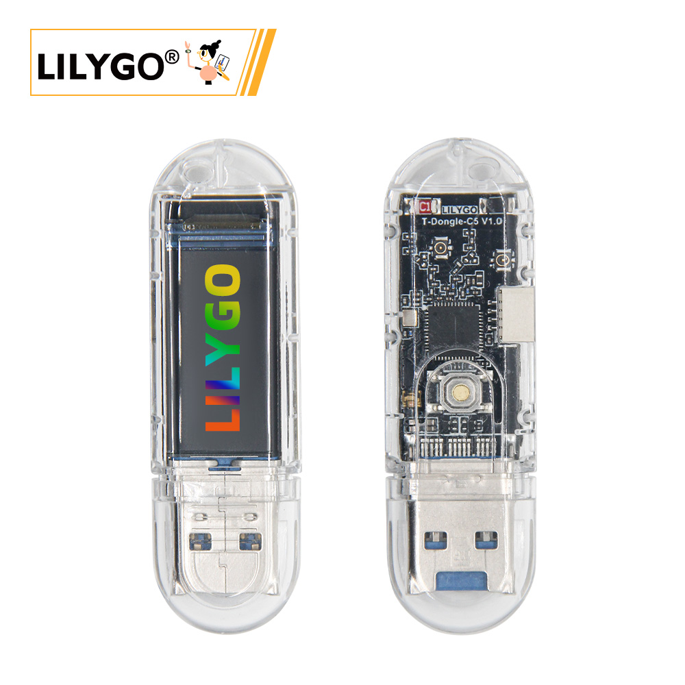
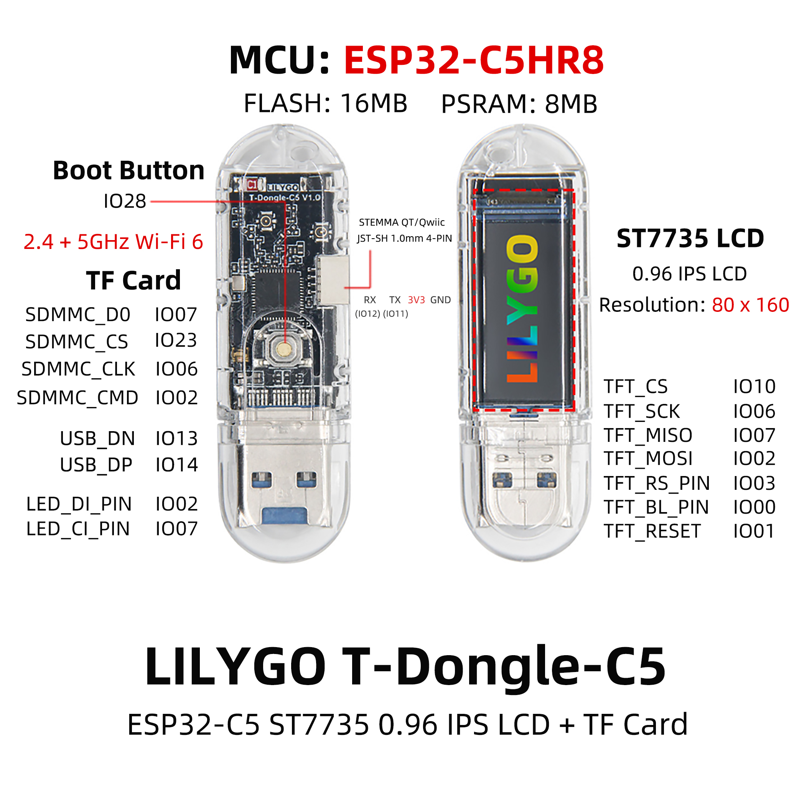
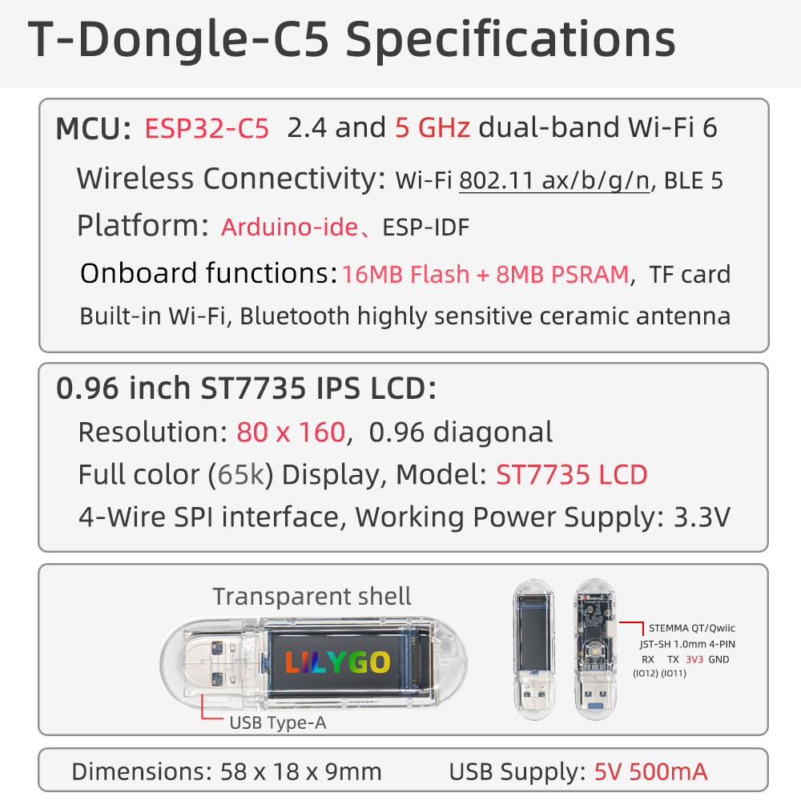

    <a target="_blank" style="margin: 1em;color: white; font-size: 0.9em; border-radius: 0.3em; padding: 0.5em 2em; background-color:rgb(103, 175, 8)" href="https://lilygo.cc/">官网购买</a>

## 版本迭代

| Version | Update date | Update description |
| :-----: | :---------: | :---------------- |
| T-Dongle-C5_V1.0 | 2025-01-01 | 初始版本 |

## 购买链接

| Product | SOC | FLASH | PSRAM | Link |
| :-----: | :--: | :---: | :---: | :--: |
| T-Dongle-C5 | ESP32-C5HR8 | 16MB | 8MB | [LILYGO Mall](https://lilygo.cc/) |

## 目录
- [描述](#描述)
- [预览](#预览)
- [模块](#模块)
- [快速开始](#快速开始)
- [引脚总览](#引脚总览)
- [相关测试](#相关测试)
- [常见问题](#常见问题)
- [项目](#项目)
- [资料](#资料)
- [依赖库](#依赖库)

## 描述

LILYGO T-Dongle-C5 是一款基于 **ESP32-C5HR8** 的高集成度 USB-A 开发板，支持 **WiFi 6 (802.11ax)** 和 **BLE 5.0**，具备 16MB Flash 和 8MB PSRAM。板载 0.96 英寸 ST7735 显示屏（80×160 分辨率），支持 SD 卡存储扩展，集成 APA102 RGB LED 和 Boot 按键。采用 USB-A 直插设计，方便直接连接电脑、充电器或 USB 集线器，适用于物联网节点、便携式测试工具、智能家居控制器等场景。

## 预览

### 实物图

### 引脚图

## 模块

### MCU

- 芯片：ESP32-C5HR8 RISC-V 单核处理器（支持 WiFi 6 + BLE 5.0）
- PSRAM：8MB
- FLASH：16MB
- 其他说明：更多资料请访问[乐鑫官方 ESP32-C5 数据手册](https://www.espressif.com/sites/default/files/documentation/esp32-c5_datasheet_en.pdf)

### 屏幕

- 尺寸：0.96 英寸
- 分辨率：80×160 像素
- 驱动芯片：ST7735S
- 通信协议：SPI
- 兼容库：TFT_eSPI, Arduino_GFX

### 存储

- TF 卡槽（MicroSD），支持 SPI 模式
- 片选引脚：GPIO_23（SD_CS）

### LED

- 型号：APA102（可寻址 RGB LED）
- 引脚：LED_CI (GPIO_4)、LED_DI (GPIO_5)
- 特点：支持高亮度和全彩显示

### 按键

- BOOT 按键：GPIO_28，可用于下载模式或用户自定义

### 概述

| 组件 | 描述 |
| :--: | :--: |
| MCU | ESP32-C5HR8 RISC-V，WiFi 6，BLE 5.0 |
| FLASH | 16MB |
| PSRAM | 8MB |
| 屏幕 | 0.96 英寸 ST7735 (80×160) |
| 存储 | TF 卡 |
| LED | APA102 可寻址 RGB |
| 按键 | 1 × BOOT |
| USB | USB-A 公头（直插） |
| 尺寸 | 约 55×25×12 mm（待补充） |

## 快速开始

### 示例支持

| Example | PlatformIO | Arduino | ESP-IDF | Description |
| :------ | :--------: | :-----: | :-----: | :---------- |
| [Factory](https://github.com/Xinyuan-LilyGO/T-Dongle-C5/tree/main/Examples/Factory) | ✓ | ✓ | | 出厂综合测试 |
| [SDCard](https://github.com/Xinyuan-LilyGO/T-Dongle-C5/tree/main/Examples/SDCard) | ✓ | ✓ | | SD 卡读写示例 |
| [LCD](https://github.com/Xinyuan-LilyGO/T-Dongle-C5/tree/main/Examples/LCD) | ✓ | ✓ | | 屏幕显示测试 |
| [LED](https://github.com/Xinyuan-LilyGO/T-Dongle-C5/tree/main/Examples/LED) | ✓ | ✓ | | APA102 RGB 控制 |
| [wifi_serial](https://github.com/Xinyuan-LilyGO/T-Dongle-C5/tree/main/Examples/wifi_serial) | ✓ | ✓ | | WiFi 串口透传 |

> 更多示例请参考 GitHub 仓库。

### PlatformIO

1. 安装 [Visual Studio Code](https://code.visualstudio.com/) 和 [Python](https://www.python.org/)。
2. 在 VS Code 扩展中搜索 **PlatformIO IDE** 并安装。
3. 克隆或下载项目：`git clone https://github.com/Xinyuan-LilyGO/T-Dongle-C5.git`。
4. 用 VS Code 打开项目文件夹。
5. 打开 `platformio.ini`，在 `[platformio]` 下取消注释所需环境（如 `default_envs = t-dongle-c5`）。
6. 点击左下角 `√` 编译，`→` 上传，`🔌` 打开串口监视器。
7. 如果无法上传，请手动进入下载模式（按住 BOOT 键后插入 USB）。

### Arduino IDE

1. 安装 [Arduino IDE](https://www.arduino.cc/en/software)。
2. 添加 ESP32-C5 开发板支持（需安装 ESP32 Arduino 核心 3.3.0 及以上版本）。
3. 将项目 `lib` 文件夹下的所有库复制到 Arduino 库目录（如 `C:\Users\YourName\Documents\Arduino\libraries`）。
4. 打开示例文件（如 `Examples/Factory/Factory.ino`）。
5. 在“工具”菜单中选择如下配置：

| Setting                     | Value                        |
| --------------------------- | ---------------------------- |
| Board                       | ESP32C5 Dev Module           |
| Upload Speed                | 921600                       |
| USB CDC On Boot             | Enabled                      |
| CPU Frequency               | 240MHz                       |
| Flash Mode                  | QIO 80MHz                    |
| Flash Size                  | 16MB (128Mb)                 |
| Partition Scheme            | 16M Flash (3MB APP/9.9MB FATFS) |
| PSRAM                       | Enabled                      |

6. 选择正确的端口，点击上传。若无法上传，按 BOOT 键后插入 USB 再尝试。

### ESP-IDF

- 支持 ESP-IDF **v5.5 或更高版本**。
- 安装方法请参考 [官方手册](https://docs.espressif.com/projects/esp-idf/en/latest/esp32/get-started/index.html)。
- 克隆项目后，进入示例目录（如 `Examples/Factory`），运行 `idf.py set-target esp32c5`，然后 `idf.py build flash monitor`。

### 开发平台

- [PlatformIO](https://platformio.org/)
- [Arduino IDE](https://www.arduino.cc/en/software)
- [ESP-IDF](https://docs.espressif.com/projects/esp-idf/en/latest/esp32c5/)
- [MicroPython](https://micropython.org/)（待社区支持）

## 引脚总览

| 功能 | GPIO 引脚 | 备注 |
| :--- | :-------: | :--- |
| LCD_MOSI | 2 | 屏幕 SPI 数据 |
| LCD_MISO | 7 | 屏幕 SPI 数据（可选） |
| LCD_SCK  | 6 | 屏幕 SPI 时钟 |
| LCD_CS   | 10 | 屏幕片选 |
| LCD_RS   | 3 | 屏幕命令/数据选择 |
| LCD_BL   | 0 | 背光控制 |
| LCD_RST  | 1 | 屏幕复位 |
| LED_CI   | 4 | APA102 时钟输入 |
| LED_DI   | 5 | APA102 数据输入 |
| SD_CMD   | 2 | SD 卡命令（与 LCD_MOSI 复用） |
| SD_D0    | 7 | SD 卡数据 0（与 LCD_MISO 复用） |
| SD_CLK   | 6 | SD 卡时钟（与 LCD_SCK 复用） |
| SD_CS    | 23 | SD 卡片选 |
| UART0_TX | 11 | 串口 0 发送 |
| UART0_RX | 12 | 串口 0 接收 |
| USB_DN   | 13 | USB 差分负 |
| USB_DP   | 14 | USB 差分正 |
| BOOT     | 28 | 下载/用户按键 |

> **注意**：SPI 总线为 LCD 和 SD 卡共享，使用时需分别控制 CS 引脚。

## 相关测试

| 测试项 | 结果 | 备注 |
| :---- | :--: | :--- |
| WiFi 6 吞吐量 | 待补充 | |
| 屏幕刷新率 | 约 30fps | SPI 驱动 |
| SD 卡读写速度 | 待补充 | |
| APA102 最大亮度工作电流 | 待补充 | |
| 功耗（休眠模式） | 待补充 | |

## 常见问题

- **Q. 看了以上教程我还是不会搭建编程环境怎么办？**  
  A. 可以参考 [LilyGo-Document](https://github.com/Xinyuan-LilyGO/LilyGo-Document) 文档说明来搭建。

- **Q. 为什么我的板子一直烧录失败？**  
  A. 请按住 **BOOT** 按键，然后将板子插入 USB 接口（或者先按住 BOOT 再连接电脑），此时芯片进入下载模式，然后点击上传。上传完毕后需按 RST 或重新插拔运行程序（T-Dongle 没有独立 RST 键，可拔出再插入）。

- **Q. 屏幕不显示或显示异常？**  
  A. 检查 LCD 初始化序列是否正确，并确保背光引脚 GPIO_0 已拉高。可参考示例中的初始化代码。

- **Q. SD 卡无法识别？**  
  A. 确保 SD 卡的 CS 引脚为 GPIO_23，且 SPI 总线与 LCD 共享，操作时需先释放 LCD 的 CS 或重新初始化 SPI。

- **Q. APA102 LED 不亮？**  
  A. 检查 LED_CI 和 LED_DI 接线是否正确，使用 FastLED 或 Adafruit_DotStar 库时需指定正确的引脚和数据顺序。

## 项目

- [T-Dongle-C5 原理图](https://github.com/Xinyuan-LilyGO/T-Dongle-C5/blob/main/Hardware/T-Dongle-C5.pdf)
- [T-Dongle-C5 硬件设计文件](https://github.com/Xinyuan-LilyGO/T-Dongle-C5/tree/main/Hardware)

## 资料

- [ESP32-C5 数据手册](https://www.espressif.com/sites/default/files/documentation/esp32-c5_datasheet_en.pdf)
- [ST7735 数据手册](https://cdn-shop.adafruit.com/datasheets/ST7735R_V0.2.pdf)
- [APA102 LED 数据手册](https://cpldcpu.files.wordpress.com/2014/08/apa102c.pdf)
- [LILYGO 官方文档中心](https://docs.lilygo.cc/)

## 依赖库

- [TFT_eSPI](https://github.com/Bodmer/TFT_eSPI)
- [Arduino_GFX](https://github.com/moononournation/Arduino_GFX)
- [FastLED](https://github.com/FastLED/FastLED)（或 Adafruit_DotStar）
- [SD](https://www.arduino.cc/en/Reference/SD)（ESP32 内置）
- [WiFi](https://github.com/espressif/arduino-esp32/tree/master/libraries/WiFi)（ESP32 Arduino 核心）