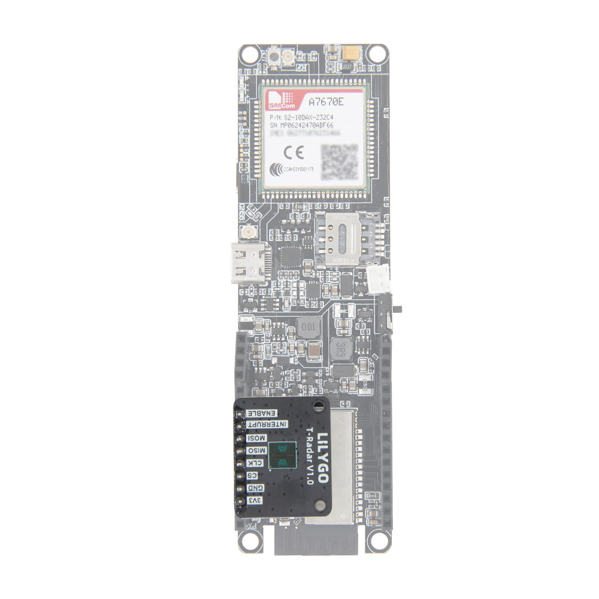

<!-- **[English](README.MD) | 中文** -->

  

  <a target="_blank" style="margin: 1em;color: white; font-size: 0.9em; border-radius: 0.3em; padding: 0.5em 2em; background-color:rgb(103, 175, 8)" href="https://lilygo.cc/products/t-radar">官网购买</a>

## 🚀 产品概述

**LILYGO T‑Radar V1.0** 是一款基于 **60GHz A121 雷达芯片**的高精度接近检测扩展板，采用**脉冲相干雷达（PCR）技术**，可实现**最远20米**的距离测量，并具备**毫米级绝对精度**与**微米级相对精度**，适用于高精度运动感知、材质识别、物体追踪及生命体征检测等多元场景。

### 核心特性

- ✅ **高精度测距**：绝对精度达毫米级，相对精度达微米级
- ✅ **远距探测**：最大测量范围20米
- ✅ **多功能雷达**：支持运动检测、材质分类、物体追踪、呼吸与心率监测
- ✅ **即插即用**：兼容多种LILYGO主板（需充足外部IO）
- ✅ **工业级设计**：适用于科研、医疗、运动与工程测量

## 📊 技术规格

| 项目 | 参数 |
|------|------|
| 雷达芯片 | A121 60GHz 脉冲相干雷达（PCR） |
| 最大测量距离 | 20 米 |
| 绝对精度 | 毫米级（mm） |
| 相对精度 | 微米级（µm） |
| 接口类型 | 标准扩展板接口 |
| 供电电压 | 3.3V / 5V（依主板而定） |
| 通信接口 | I²C / SPI（可通过跳线配置） |
| 适用场景 | 运动感知、材质识别、工程测量、医疗检测 |

### 引脚图

### 套件内容清单

- T‑Radar V1.0 扩展板 ×1
- 排针（可选焊接） ×1 套
- 螺丝与固定配件 ×1 套
- 快速使用指南 ×1

## 🛠️ 安装与使用

### 连接示意图

### 使用步骤

1. **硬件连接**
   - 将 T‑Radar 通过排针接口连接到兼容的 LILYGO 主板（如 T3、T‑Beam 等）
   - 确保主板提供足够的 IO 口和电源（3.3V/5V）

2. **软件配置**
   - 下载并安装雷达驱动库
   - 通过 I²C 或 SPI 接口初始化雷达模块
   - 配置测量模式（距离、运动、生命体征等）

3. **数据获取**
   - 读取雷达返回的距离、速度或生命体征数据
   - 可根据需求进行数据滤波与算法处理

## 🧭 应用场景

### 🏃 运动与体育
- 运动员动作捕捉与分析
- 健身器械运动轨迹跟踪

### 🧱 材料与工业
- 材质分类与识别
- 表面形变检测

### ⚙️ 工程与测量
- 高精度物体距离跟踪
- 机械设备振动监测

### 🏥 医疗与健康
- 非接触式呼吸检测
- 心率监测（静息状态）

### 🏠 智能家居与物联网
- 人员存在检测
- 手势识别交互

## ❓ 常见问题

**Q1: T‑Radar 是否可以在室外使用？**  
A: 可以，60GHz 雷达受天气影响较小，但强雨雪可能对信号有轻微衰减。

**Q2: 是否支持多目标检测？**  
A: 当前版本主要用于单目标高精度测距与跟踪，多目标识别需结合算法处理。

**Q3: 最大刷新率是多少？**  
A: 取决于主控芯片与通信接口，通常可支持 100Hz 以上的数据更新率。

**Q4: 能否检测玻璃或墙壁后的物体？**  
A: 雷达可穿透非金属薄层，但金属材质会完全阻挡信号。

## 📚 资源下载

- [docs.acconeer](https://docs.acconeer.com/en/latest/detectors/a121/index.html)
- [developer.acconeer](https://developer.acconeer.com/home/a121-docs-software/)

