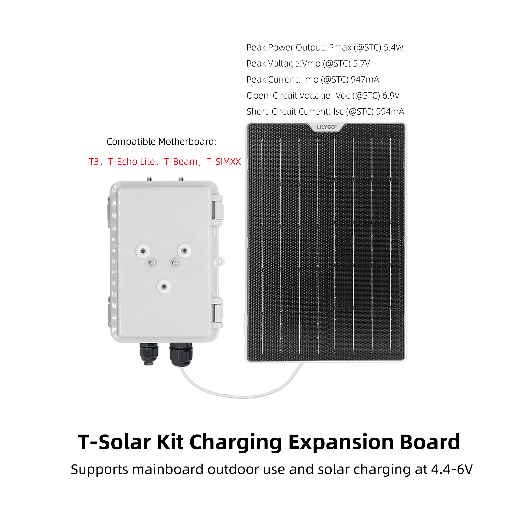
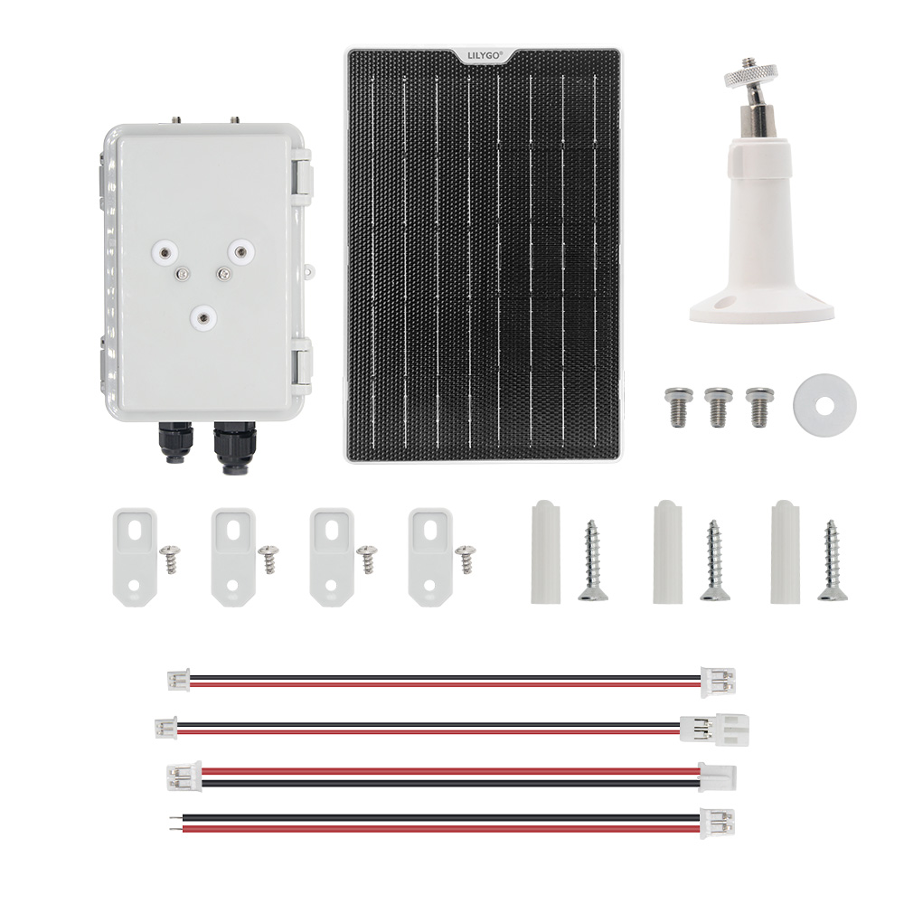

<!-- **[English](README.MD) | 中文** -->

  

  <a target="_blank" style="margin: 1em;color: white; font-size: 0.9em; border-radius: 0.3em; padding: 0.5em 2em; background-color:rgb(103, 175, 8)" href="https://lilygo.cc/products/t-solar-kit">官网购买</a>

## 🚀 产品概述

**T-Solar Kit** 是一款专为户外物联网设备设计的太阳能充电扩展解决方案。它能为各类低功耗户外设备（如环境传感器、农业监测站、野外定位终端等）提供稳定可靠的离网供电，让您的设备在无市电环境下也能长期稳定运行。

### 核心特性

- ✅ **智能充电管理**：支持4.4-6V宽电压输入，兼容峰值功率5.4W的太阳能板
- ✅ **即插即用**：标准JST2.0接口，安装简单快捷
- ✅ **全配件套件**：包含所有安装螺丝、垫圈和转接头，开箱即用
- ✅ **坚固耐用**：SUS304不锈钢配件，适合户外恶劣环境
- ✅ **广泛兼容**：支持T3、T-Beam、T-Echo Lite等主流IoT主板

## 📦 产品规格

### 太阳能板参数 

| 参数 | 数值 |
|------|------|
| 峰值功率 (Pmax) | 5.4W |
| 峰值电压 (Vmp) | 5.7V |
| 峰值电流 (Imp) | 947mA |
| 开路电压 (Voc) | 6.9V |
| 短路电流 (Isc) | 994mA |

### 套件内容清单

- T-Solar 充电扩展板 ×1
- 太阳能板连接线 (JST2.0接口)
- M4×8×7机器螺丝 ×2
- M5×10平头自攻螺丝 ×2
- SUS304不锈钢垫圈 ×2
- IPEX转接头 (M12/M16可选)

## 🔧 安装与使用

### 连接示意图

### 快速安装步骤

1. **连接太阳能板**：将太阳能板的JST2.0接口连接到扩展板
2. **固定扩展板**：使用附赠的M4/M5螺丝将扩展板固定在设备上
3. **连接主板**：将扩展板的输出端连接到兼容主板
4. **部署测试**：将太阳能板朝向阳光，检查充电状态

> 📹 **视频教程**：[T-Solar Kit 安装视频](YouTube链接)

### 天线安装选项

- **M12接口**：

- **M16接口**：

## 🎯 应用场景

### 🌾 智慧农业

- 土壤湿度监测站
- 气象数据采集终端
- 灌溉系统控制器

### 🌳 环境监测

- 空气质量传感器网络
- 水质监测浮标
- 森林防火预警设备

### 📡 物联网应用

- 远程资产追踪器
- 智能路灯控制器
- 野外科研数据采集站

## 常见问题

**Q1: 可以连接更大功率的太阳能板吗？**  
A: 本产品设计为5.4W峰值输入，不建议使用功率超过6W的太阳能板。

**Q2: 在阴雨天能否正常工作？**  
A: 扩展板支持4.4V低压输入，在弱光环境下仍能保持充电，但效率会降低。

**Q3: 支持哪些类型的电池？**  
A: 支持3.7V锂离子/锂聚合物电池，内置智能充电保护电路。

**Q4: 安装需要特殊工具吗？**  
A: 套件包含所有必需配件，只需准备一把十字螺丝刀即可完成安装。

