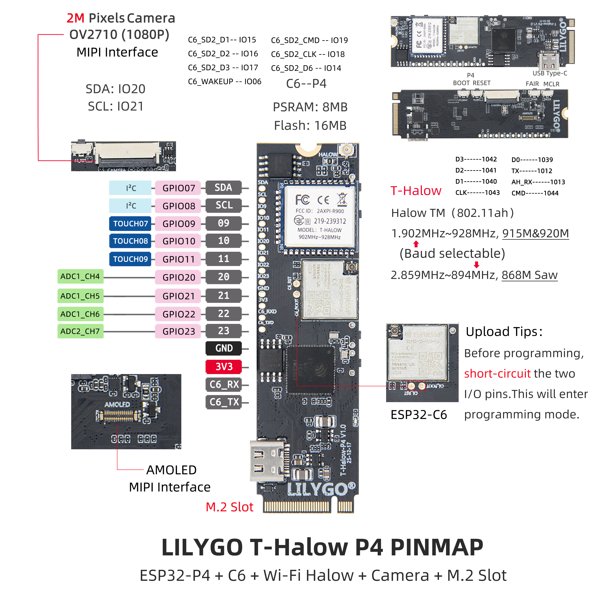

<div align="center">
  
</div>

<div style="padding: 1em 0; display: flex; justify-content: center">
  <a target="_blank" style="margin: 1em; color: white; font-size: 0.9em; border-radius: 0.3em; padding: 0.5em 2em; background-color: rgb(103, 175, 8)" href="https://lilygo.cc/products/t-halow-p4">官网购买</a>
</div>

## 📦 项目版本

T-Halow-P4 是 T-Halow 系列的高性能升级版本，基于 ESP32-P4 主控，集成 ESP32-C6 辅助处理器和 T-Halow 模块。请根据您的需求选择相应的文档：

| 版本 | 发布时间 | 主要特性 | 文档链接 |
| :---: | :---: | :---: | :---: |
| T-Halow-P4 | 2025-12-04 | ESP32-P4 + ESP32-C6 + T-Halow 模块 | [GitHub 仓库](https://github.com/Xinyuan-LilyGO/T-Halow-P4) |
| T-Halow | 2023-08-23 | ESP32-S3 + T-Halow 模块 | [T-Halow 文档](../T-Halow/T-Halow.md) |

> **注意**：T-Halow-P4 与 T-Halow 使用相同的 [AT 指令集](https://github.com/Xinyuan-LilyGO/T-Halow/blob/master/docs/AT_cmd.md)。

关于 TX-AH 模块的 SDK，泰芯提供了非操作系统驱动程序，参考：[taixin-nonos-driver](https://www.taixin-semi.com/upload/files/productFile/20251204/taixin-nonos-driver_20251204162053.zip)


## 🚀 产品概述

<div align="center">
  
</div>

**LILYGO T-Halow-P4** 是一款高性能物联网开发板，基于 **ESP32-P4** 主控，集成 **ESP32-C6** 辅助处理器和 **T-Halow** 远距离通信模块。专为需要高性能处理、远距离通信和多媒体应用的场景设计，适用于智能安防、工业监控、远程巡检等专业应用。

### 核心特性

- ✅ **高性能处理**：ESP32-P4 主控，支持复杂图形与视频任务处理
- ✅ **双核协同**：ESP32-C6 辅助处理器，支持 Wi-Fi 6 与蓝牙 5.3
- ✅ **远距离通信**：T-Halow 模块支持 Wi-Fi HaLow (802.11ah)
- ✅ **多媒体接口**：板载 MIPI-DSI 显示屏接口和 MIPI-CSI 摄像头接口
- ✅ **图像处理**：支持 JPEG 图像解码 (1080P 30fps)，PPA，2D DMA
- ✅ **视频编码**：支持 H264 编码，JPEG 编码，1080P 画面
- ✅ **丰富外设**：支持 SPI、I2S、I2C、LED PWM、以太网等


## 📊 硬件规格


| 项目 | 参数 |
|------|------|
| 主控芯片 | ESP32-P4 (高性能处理器) |
| 辅助处理器 | ESP32-C6-MINI (Wi-Fi 6 + 蓝牙 5.3) |
| Flash 存储 | 16MB Nor Flash (QSPI接口) |
| PSRAM | 32MB (封装内叠封) |
| 无线协议 | Wi-Fi 6 + 蓝牙 5.3 (ESP32-C6) |
| Wi-Fi HaLow | 支持 802.11ah 远距离通信 |
| 显示屏接口 | MIPI-DSI，支持触控 |
| 摄像头接口 | MIPI-CSI，支持 1080P 画面 |
| 图像处理 | JPEG 解码 (1080P 30fps)，PPA，2D DMA |
| 视频编码 | H264 编码，JPEG 编码 |
| 外设接口 | SPI、I2S、I2C、LED PWM、以太网等 |
| 编程平台 | ESP-IDF v5.4.1+ |
| 开发环境 | Visual Studio Code |

### 引脚定义 (PINMAP)



**I2C 引脚：**
- I2C_SCL: IO8
- I2C_SDA: IO7

**Halow 模块引脚：**
- AH_CMD: IO44
- AH_CLK: IO43
- AH_D3: IO42
- AH_D2: IO41
- AH_D1: IO40
- AH_D0: IO39
- AH_TX: IO12
- AH_RX: IO13

**ESP32-C6 引脚：**
- ESP32C6_CMD: IO19
- ESP32C6_CLK: IO18
- ESP32C6_D3: IO17
- ESP32C6_D2: IO16
- ESP32C6_D1: IO15
- ESP32C6_D0: IO14
- ESP32C6_WAKEUP: IO6

**摄像头/显示屏引脚：**
- TOUCH_SCL: IO8
- TOUCH_SDA: IO7
- TOUCH_INT: IO11
- TOUCH_RST: IO10
- MIPI_DSI_RST: IO9

```c
                                   GND                                                                   GND
                ┌────────────────────────────────────────────────┐             ┌─────────────────────────────────────────────────────────┐
                │                                                │             │                                                         │
                │                                                │             │                                                         │
                │                                                │             │                                                         │
                │                                                │             │                                                         │
                │                                                │             │                                                         │
                │                                                │             │                                                         │
                │                                                │             │                                                         │
                │                                                │             │                                                         │
                │                                ┌───────────────┴─────────────┴──────────────────┐                                      │
                │                                │                                                │                           ┌──────────┴───────────┐
                │                                │                                                │      DSI DATA 1P          │                      │
                │                                │                                                ├───────────────────────────┤                      │
    ┌───────────┴─────────┐ CSI DATA 1P          │                                                │                           │                      │
    │                     ├──────────────────────┤                                                │      DSI DATA 1N          │                      │
    │                     │                      │                                                ├───────────────────────────┤                      │
    │                     │ CSI DATA 1N          │                  ESP32-P4                      │                           │                      │
    │       Camera        ├──────────────────────┤                                                │      DSI CLK N            │      LCD Screen      │
    │                     │                      │                                                ├───────────────────────────┤                      │
    │                     │ CSI CLK N            │                                                │                           │                      │
    │                     ├──────────────────────┤                                                │      DSI CLK P            │                      │
    │                     │                      │                                                ├───────────────────────────┤                      │
    │                     │ CSI CLK P            │                                                │                           │                      │
    │                     ├──────────────────────┤                                                │      DSI DATA 0P          │                      │
    │                     │                      │                                                ├───────────────────────────┤                      │
    │                     │ CSI DATA 0P          │                                                │                           │                      │
    │                     ├──────────────────────┤                                                │      DSI DATA 0N          │                      │
    │                     │                      │                                                ├───────────────────────────┤                      │
    │                     │ CSI DATA 0N          │                                                │                           │                      │
    │                     ├──────────────────────┤                                                │                           └──────────────────────┘
    │                     │                      │                                                │
    └───────┬──┬──────────┘                      │                                                │
            │  │           I2C SCL               │                                                │
            │  └─────────────────────────────────┤                                                │
            │              I2C SDA               │                                                │
            └────────────────────────────────────┤                                                │
                                                 └────────────────────────────────────────────────┘

```


## 📡 技术特性介绍

### Wi-Fi HaLow (802.11ah)
Wi-Fi HaLow 是专为物联网优化的远距离、低功耗 Wi-Fi 标准。在相同发射功率下，比传统 2.4GHz/5GHz Wi-Fi 拥有更远的传输距离与更强的穿墙能力。

**T-Halow-P4 搭载泰芯 TX-AH 模组，支持：**
- 工作频段：730–950MHz
- 信道带宽：1/2/4/8MHz 可调
- 物理吞吐量：150Kbps – 32.5Mbps
- 传输距离：可达数公里（视环境）

### ESP32-P4 高性能处理
ESP32-P4 是高性能处理器，专为复杂图形和视频任务设计：
- 支持 JPEG 图像解码 (1080P 30fps)
- 像素处理加速器 (PPA)
- 2D DMA 图像加速器
- 支持 H264 和 JPEG 视频编码

### ESP32-C6 无线连接
ESP32-C6 提供先进的无线连接能力：
- 支持 Wi-Fi 6 (802.11ax)
- 蓝牙 5.3
- 使用 esp-hosted-mcu 方案
- 通过 SDIO 与 ESP32-P4 通信


## 🔄 快速开始

### 开发环境搭建
项目的例程都是在 ESP-IDF v5.4.1 环境下编译，使用 T-Halow-P4 时需要保证 ESP-IDF 版本 ≥ 5.4.1。

**环境搭建步骤：**
1. 安装 ESP-IDF v5.4.1+（参考[官方文档](https://docs.espressif.com/projects/esp-idf/en/v5.5.2/esp32/get-started/index.html)）
2. 克隆 T-Halow-P4 项目仓库
3. 进入 examples 目录选择示例程序

### 项目编译与烧录

**编译步骤：**
```bash
cd ~/examples/xxx
idf.py set-target esp32p4
idf.py build
```

**下载模式设置：**
1. 插上 USB，打开串口工具
2. 按住 BOOT 键不松手
3. 按下 RST 键后马上松手
4. 串口输出 "wait for download" 表示进入下载模式
5. 松开 BOOT 键，关闭串口

**烧录程序：**
```bash
idf.py -p PORT flash
```

### Halow 模块使用
Halow 模块通过 SPI + UART 与 ESP32-P4 连接：
- **SPI**：用于数据传输，使用泰芯官方驱动程序
- **UART**：用于收发 AT 命令和显示运行信息

数据传输链路：
```
ESP32P4 -> SPI/SDIO -> Halow -> RF(AP) -> RF(STA) -> SPI/SDIO -> Halow -> ESP32P4
```


## 📚 官方文档（英文）

更多 TX-AH 模块信息请访问泰芯官方网站：[资料下载](https://en.taixin-semi.com/Product?prouctSubClass=33)

| 文档名称 | 链接 |
| :--- | :--- |
| 频率设置说明 | [下载](https://github.com/Xinyuan-LilyGO/T-Halow/blob/master/hardware/TX_AH/泰芯802.11AH%20Frequency%20setting%20description_20231130110312.pdf) |
| TX-AH-Rx00P 系列模块技术规格书 | [下载](https://github.com/Xinyuan-LilyGO/T-Halow/blob/master/hardware/TX_AH/泰芯802.11ahTX-AH-Rx00P%20Series%20module%20technical%20specification_20231116174457.pdf) |
| TX-AH-Rx00P 桥接说明 | [下载](https://github.com/Xinyuan-LilyGO/T-Halow/blob/master/hardware/TX_AH/泰芯AH%20Bridge%20instructions_20230908122753.pdf) |
| AH 模块 AT 指令开发指南 | [下载](https://github.com/Xinyuan-LilyGO/T-Halow/blob/master/hardware/TX_AH/泰芯AH%20Module%20AT%20instruction%20development%20guide_20230524100503.pdf) |
| AH 模块开发板说明 | [下载](https://github.com/Xinyuan-LilyGO/T-Halow/blob/master/hardware/TX_AH/泰芯AH%20Module%20development%20board%20instructions_20230621205234.pdf) |
| AH 模块硬件设计指南 | [下载](https://github.com/Xinyuan-LilyGO/T-Halow/blob/master/hardware/TX_AH/泰芯AH%20Module%20hardware%20Design%20Guide_20230621170639.pdf) |
| AH 性能测试方法 | [下载](https://github.com/Xinyuan-LilyGO/T-Halow/blob/master/hardware/TX_AH/泰芯AH%20Performance%20test%20method_20230908122816.pdf) |
| AH-RF EMC 认证指南 | [下载](https://github.com/Xinyuan-LilyGO/T-Halow/blob/master/hardware/TX_AH/泰芯AH-RF%20EMC%20Certification%20guide_20230720140052.pdf) |


## 📊 Wi-Fi HaLow 频段支持

T-Halow-P4 支持以下 Wi-Fi HaLow 频段：

| 频段 | 频率范围 |  
| :---: | :---: | 
| 868MHz | 859-894MHz | 
| 915MHz | 902-928MHz | 

**注意：**
- 请根据您所在地区的法规要求选择相应的频段
- 不同频段的天线设计可能有所不同
- 具体认证信息请参考产品技术规格书


## 🚀 快速开始

🟢 **推荐使用 PlatformIO**，因为这些示例是在 PlatformIO 上开发的。🟢

### PlatformIO 开发环境

1. 安装 [Visual Studio Code](https://code.visualstudio.com/) 和 [Python](https://www.python.org/)，克隆或下载本项目；
2. 在 VSCode 扩展中搜索并安装 `PlatformIO` 插件；
3. 安装完成后重启 VSCode；
4. 打开本项目，PlatformIO 会自动下载所需的三方库和依赖，首次过程较长，请耐心等待；
5. 所有依赖安装完成后，打开 `platformio.ini` 配置文件，在 `example` 中取消注释选择示例程序，然后按 `Ctrl+S` 保存；
6. 点击 VSCode 下方的 ☑️ 编译项目，插入 USB 并在 VSCode 中选择 COM 口；
7. 最后点击 ➡️ 按钮将程序下载到 Flash；

### Arduino IDE 开发环境

1. 安装 [Arduino IDE](https://www.arduino.cc/en/software)

2. 将 `本项目/lib/` 下的所有文件复制并粘贴到 Arduino 库路径（一般为 `C:\Users\用户名\Documents\Arduino\libraries`）；

3. 打开 Arduino IDE，点击左上角 `文件 -> 打开`，打开 `本项目/example/xxx/xxx.ino` 下的示例；

4. 按以下方式配置 Arduino，完成后可点击 Arduino 左上角按钮编译和下载；


| Arduino IDE Setting                  | Value                             |
| ------------------------------------ | --------------------------------- |
| Board                                | **ESP32S3 Dev Module**            |
| Port                                 | Your port                         |
| USB CDC On Boot                      | Enable                            |
| CPU Frequency                        | 240MHZ(WiFi)                      |
| Core Debug Level                     | None                              |
| USB DFU On Boot                      | Disable                           |
| Erase All Flash Before Sketch Upload | Disable                           |
| Events Run On                        | Core1                             |
| Flash Mode                           | QIO 80MHZ                         |
| Flash Size                           | **16MB(128Mb)**                   |
| Arduino Runs On                      | Core1                             |
| USB Firmware MSC On Boot             | Disable                           |
| Partition Scheme                     | **16M Flash(3M APP/9.9MB FATFS)** |
| PSRAM                                | **OPI PSRAM**                     |
| Upload Mode                          | **UART0/Hardware CDC**            |
| Upload Speed                         | 921600                            |
| USB Mode                             | **CDC and JTAG**                  |


## 🧭 应用场景

- 🏭 **工业安防监控**：高性能图像处理 + HaLow 远距离通信
- 🌾 **农业环境监测**：大范围农田传感器数据收集与远程监控
- 🏗️ **工地巡检**：远距离视频巡检与设备状态监控
- 🔬 **科研野外数据采集**：长距离可靠数据传输与多媒体处理
- 📡 **物联网网关**：连接大量低功耗传感器节点
- 🎥 **智能摄像头**：支持 H264 编码的远程监控系统

## ⚠️ 重要提示

❗ **更多 TX-AH 模块资料请参考泰芯官网**：[资料下载地址](https://www.taixin-semi.com/Product?prouctSubClass=33)


## 📚 资源下载

### 官方文档
- [T-Halow-P4 GitHub 仓库](https://github.com/Xinyuan-LilyGO/T-Halow-P4)
- [泰芯 non-os WiFi 驱动开发指南](./hardware/泰芯non-os_WiFi驱动开发指南.pdf)
- [泰芯 AH 模块 AT 指令开发指南](./hardware/泰芯AH模组AT指令开发指南.pdf)
- [AT 指令集文档](./doc/AT_cmd.md)

### 开发资源
- [ESP-IDF 官方文档](https://docs.espressif.com/projects/esp-idf/en/v5.5.2/esp32/get-started/index.html)
- [泰芯驱动程序下载](https://www.taixin-semi.com/upload/files/productFile/20251204/taixin-nonos-driver_20251204162053.zip)
- [AH-V1.6-SDK 说明](./AH-V1.6-SDK/readme_cn.md)

### 依赖库
- `espressif/esp_hosted^1.4.1`
- `espressif/esp_wifi_remote^0.8.5`
- `espressif/esp_lcd_ek79007^1.0.2`
- `lvgl/lvgl`