# LILYGO Spark 使用指南

## 软件下载

点击上方 **「下载」** 按钮获取当前平台的安装包，或点击 **「All Platforms」** 展开查看 macOS、Windows、Linux 全部下载选项。

## 软件安装

### Windows

1. 找到下载完成的 `.exe` 安装包，双击启动安装程序；

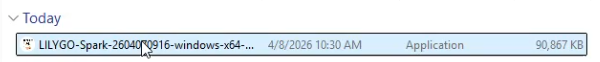

2. 若出现 SmartScreen 安全提示，点击 `更多信息` → `仍要运行` 继续安装；

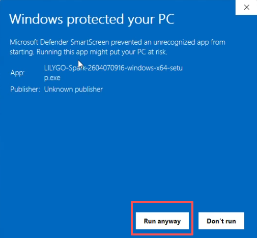

3. 安装完成后，软件将自动启动。

### macOS

macOS 版本已通过 **Apple 公证（Notarized）**，可直接安装使用，无需额外的安全设置。

1. 打开下载的 `.dmg` 文件，将 LILYGO Spark 拖入「应用程序」文件夹；
2. 首次启动时，macOS 会弹出确认对话框，点击「打开」即可；
3. 由于已经过 Apple 公证，无需前往「系统设置 → 隐私与安全性」中手动允许。

## 软件功能概述

软件启动后，界面包含多个功能模块，各模块功能明确、操作便捷，具体说明如下：
      
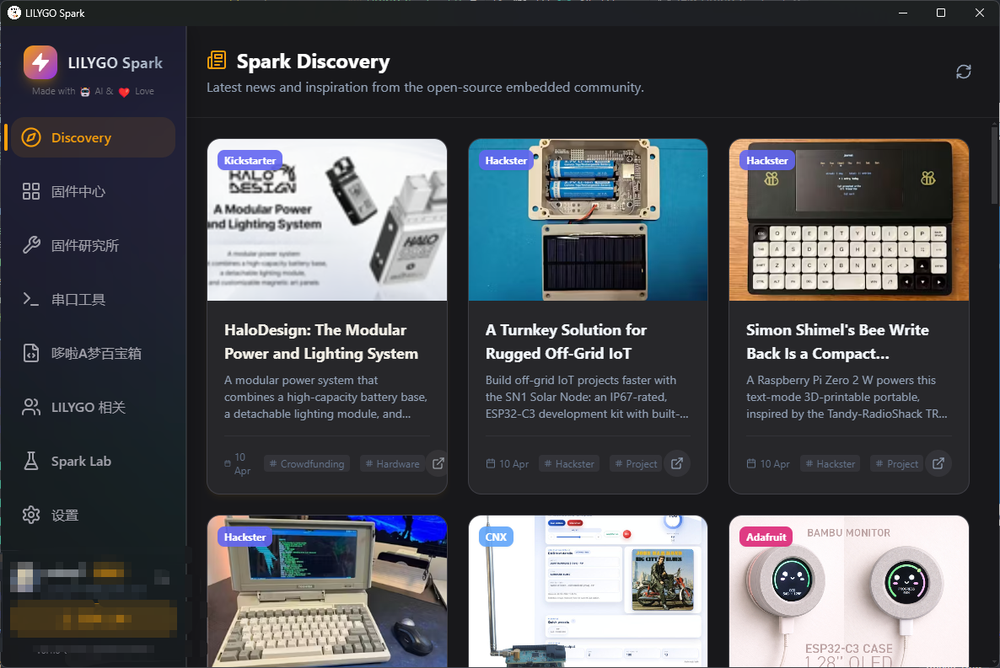

###  基础设置

进入「设置」界面，可对软件进行个性化配置，满足不同使用需求：
      
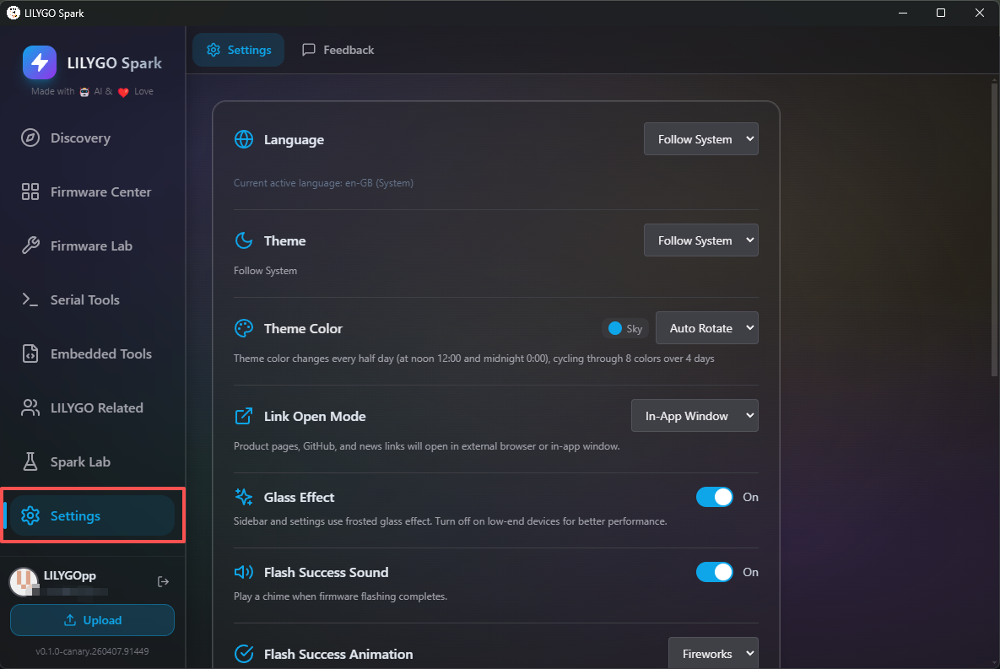

- 主题设置：支持切换黑色主题等多种风格，适配不同使用场景及视觉习惯；

- 其他配置：可在设置中开启对应更新通道、调整软件语言（支持简体中文、英文、繁体中文、日文），以及配置缓存、自定义固件清单等。

### GitHub 登录

软件支持 GitHub OAuth 授权登录，登录后可解锁固件上传等进阶功能。操作流程：点击界面「登录」按钮，跟随网页弹窗完成身份验证即可。
      
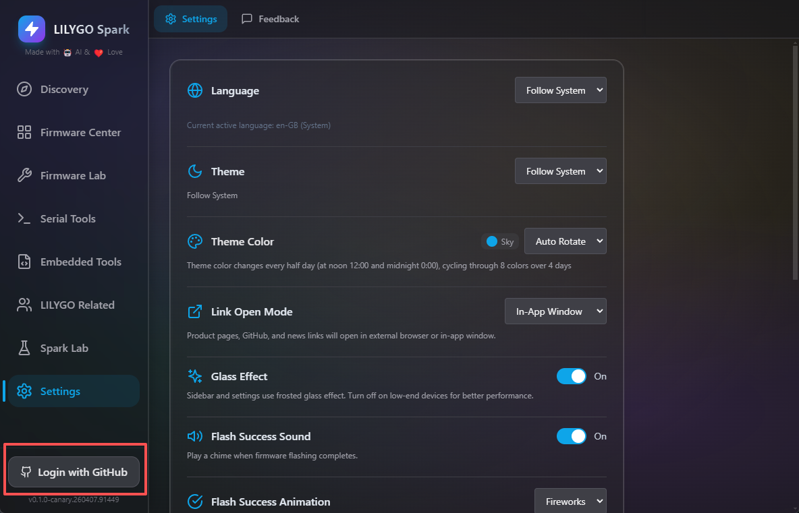

### Spark Discovery

该模块用于发布及展示官方资讯、公告等内容，用户可通过此模块及时了解 LILYGO 最新动态、产品资讯及开发相关内容。

### 固件中心

汇总 LILYGO 全系列产品的出厂固件，以及优质开发者分享的第三方固件资源。同时支持开发者上传自有研发的固件及示例，共同丰富固件生态。

    

### 固件工具（固件研究所）

内置专业固件处理工具，核心功能包括：
截图说明：截图展示固件研究所模块主界面，红框分别标注固件烧录、固件提取、固件分析、分区表编辑四个核心功能的入口按钮。

- 固件烧录：将下载完成的固件写入 ESP32 系列设备；

- 固件提取：从已连接的设备中读取并导出固件文件；

- 固件分析：解析 .bin 格式固件文件，自动识别芯片类型、分区表、引导程序、应用信息及文件系统镜像等关键内容；
截图说明：截图展示固件分析界面，红框标注.bin文件选择入口及分析结果展示区域（如芯片类型、分区表信息），清晰显示分析后的核心数据。

- 分区表编辑：提供 ESP32 分区表可视化编辑功能，支持分区表的导入与导出操作。
        

### 串口工具

具备标准串口工具的全部功能，操作流程：选择目标设备对应的串口及合适的波特率，点击「连接」按钮，即可实现电脑与设备的串口通信，并查看设备日志输出。

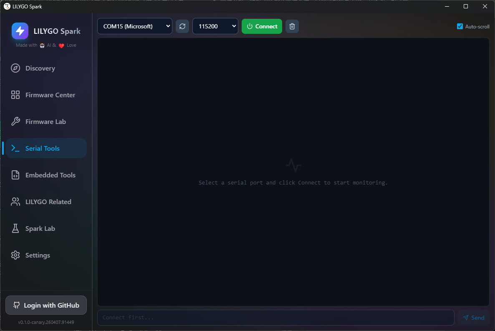

### Embedded Tools

集成嵌入式开发常用工具，覆盖多种开发场景，提升开发效率，主要包括：

电阻色环计算器、贴片电阻计算器、LED 限流电阻计算器、欧姆定律计算器、555定时器计算器、电池续航计算器、ESP32 功耗估算器、串/并联电阻计算器、电路原理图查看器等。

### LILYGO 社区与产品资料

模块内包含 LILYGO 全系列产品的详细技术资料、使用手册，以及官方购买渠道链接，方便用户快速查询产品信息、获取购买路径。
      

### Spark Lab

展示 LILYGO Spark 软件的功能开发路线图及灵感规划，开发团队将结合用户反馈及行业技术趋势，持续迭代优化软件功能，为开发者提供更便捷的使用体验。
      
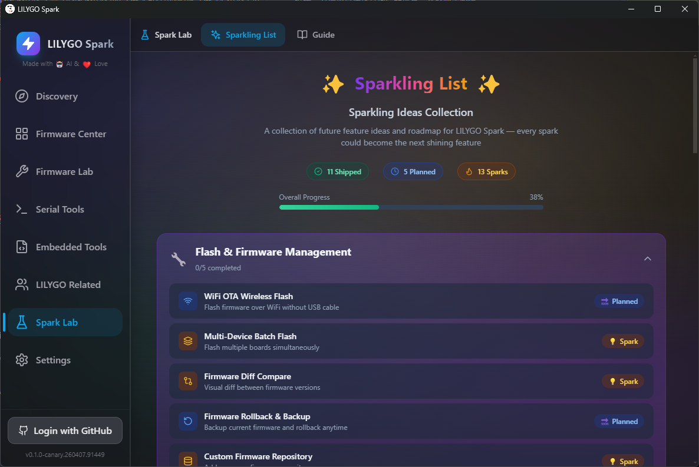

## 软件版本更新

为确保使用到软件最新功能及 bug 修复，可按以下步骤开启更新通道并检查更新：

截图说明：截图展示设置界面中「更新」相关区域的入口，红框标注「检查更新」选项及更新通道设置入口。
   

1. 启动软件并进入「设置」界面、下拉页面找到「Advanced（高级）」选项，展开后勾选「Canary Channel（金丝雀频道）」，开启测试版更新通道；
        
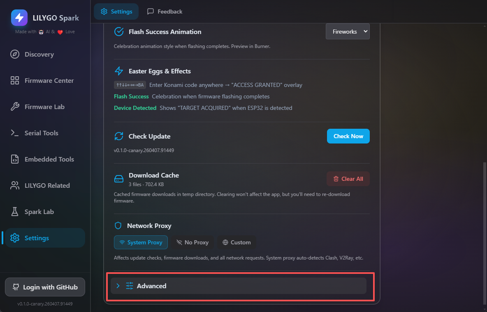

4. 点击「检查更新」，即可检测并更新至 LILYGO Spark 最新版本（金丝雀版，包含最新开发功能及优化）。
        

      

## 固件下载与烧录（以 T-Lora Pager 为例）

### 固件下载

1. 启动软件，点击进入「固件中心」模块在固件列表中检索并找到 T-Lora Pager 对应的固件资源；
        
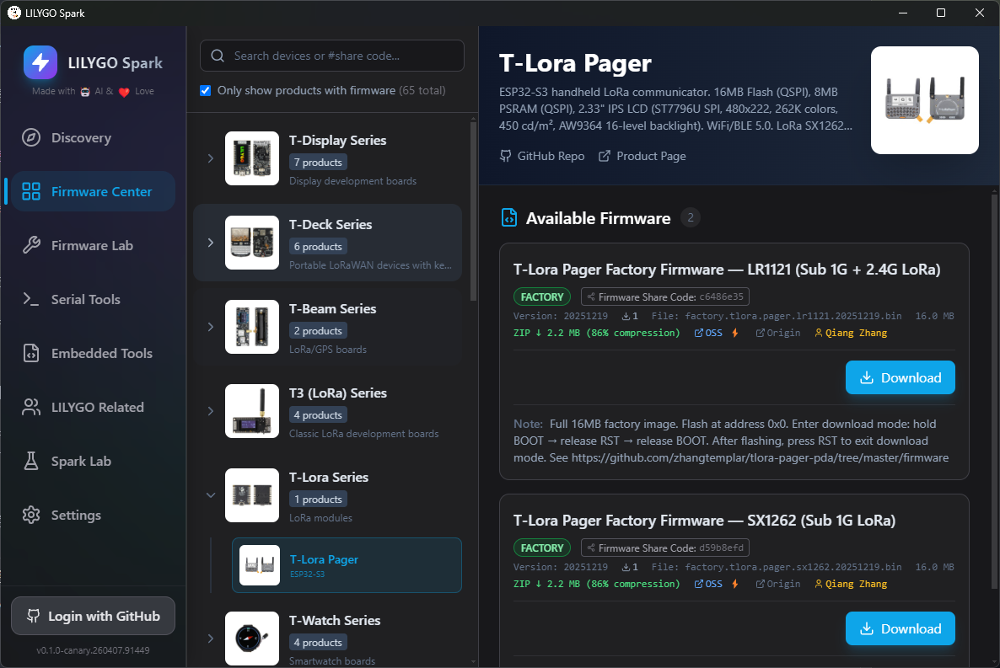

2. 根据自身使用的设备型号，选择对应版本的固件（如 SX1262 版本）点击「下载固件」按钮，等待固件下载完成；
截图说明：截图展示固件对应的「下载固件」按钮（红框标注），以及下载过程中的进度条，显示下载进度及剩余时间。

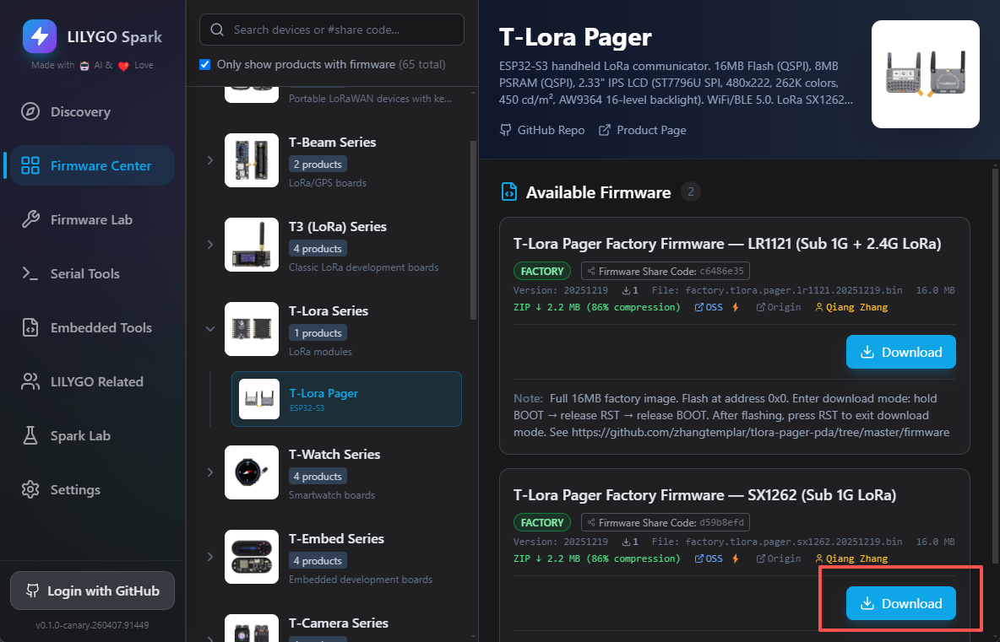

3. 下载完成后，点击「烧录」按钮，系统将自动跳转至固件烧录界面。

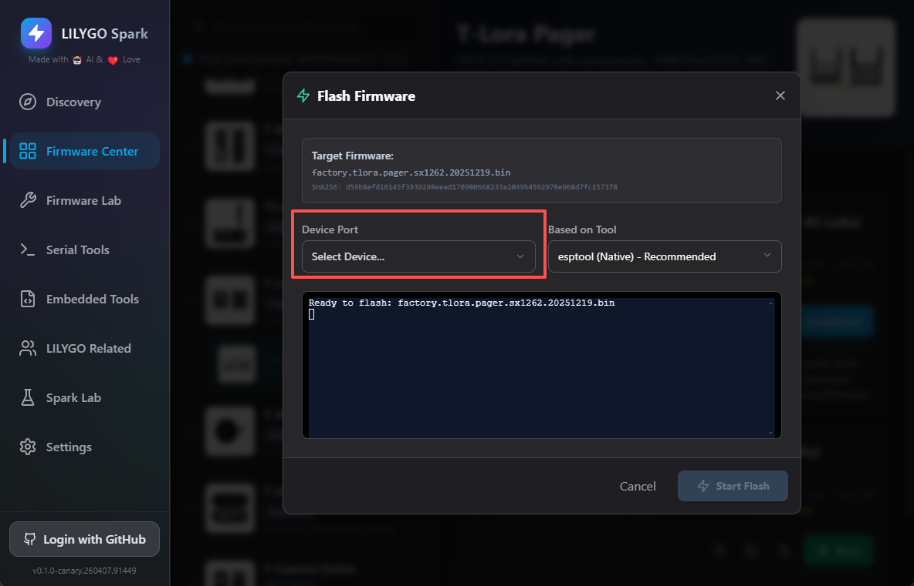

###  固件烧录

1. 将 T-Lora Pager 设备通过数据线与电脑连接，在烧录界面选择该设备对应的串口；
        

      

2. 建议将设备切换至下载模式，操作方法：按住设备上的 Boot 按键，同时按下 RST 按键，松开后即可进入下载模式（具体操作可参考 LILYGO 官方 YouTube 视频教程）；

3. 烧录工具默认选择软件内置的 esptool，无需额外安装；

4. 点击「开始下载」，等待烧录完成（烧录时长根据固件大小有所差异，请耐心等待）；
        
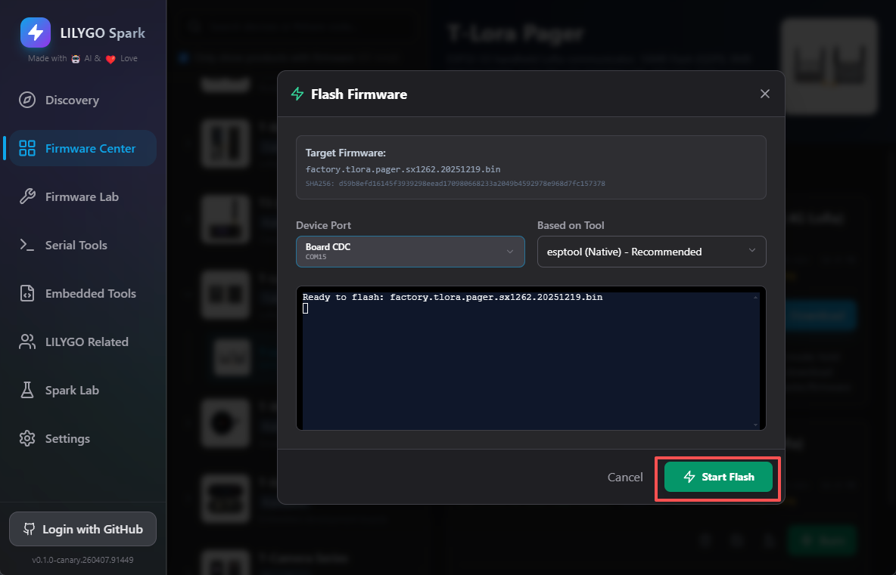

5. 当界面显示「固件下载完成」提示时，即表示固件烧录成功。

## 固件上传

若开发者研发了相关固件，可按以下步骤上传至 LILYGO Spark 平台，分享给全球开发者使用：
      

1. 启动 LILYGO Spark 软件，点击「GitHub 登录」，跟随网页弹窗完成身份验证（若需切换 GitHub 账号，需先在网页端切换账号，再进行软件登录操作）；
        
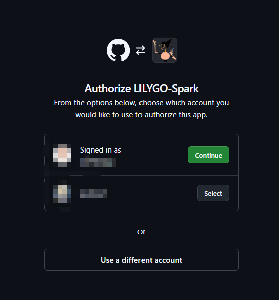

2. 登录成功后，找到界面中的「上传（Upload）」按钮，点击进入固件上传界面；
        

3. 选择需要上传的固件文件，按要求填写固件相关说明信息（包括固件名称、功能介绍、适配设备等）；
       

      

4. 填写完成后，点击「上传」按钮，即可完成固件提交。
        

固件上传完成后，可通过 LILYGO 官方各平台联系开发团队，加快固件审核及推广流程，让作品更快被大众知晓和使用。

## 补充说明

- 跨平台支持：软件兼容 Windows、macOS、Linux 三种操作系统，可正常安装并运行；

- 下载加速：中国大陆用户下载固件时，软件将自动调用阿里云 OSS 镜像加速，提升下载速度，保障下载稳定性；
截图说明：截图展示固件下载时的加速提示弹窗，红框标注“阿里云OSS镜像加速中”的提示信息，以及下载速度的对比展示。

- 隐藏功能：软件内置彩蛋功能（如 Konami 代码触发、烧录成功庆祝动画等），用户可自行探索体验；

- 问题反馈：使用过程中若遇到 Bug 或有功能建议，可通过软件「反馈」功能提交，开发团队将及时处理并回复。
