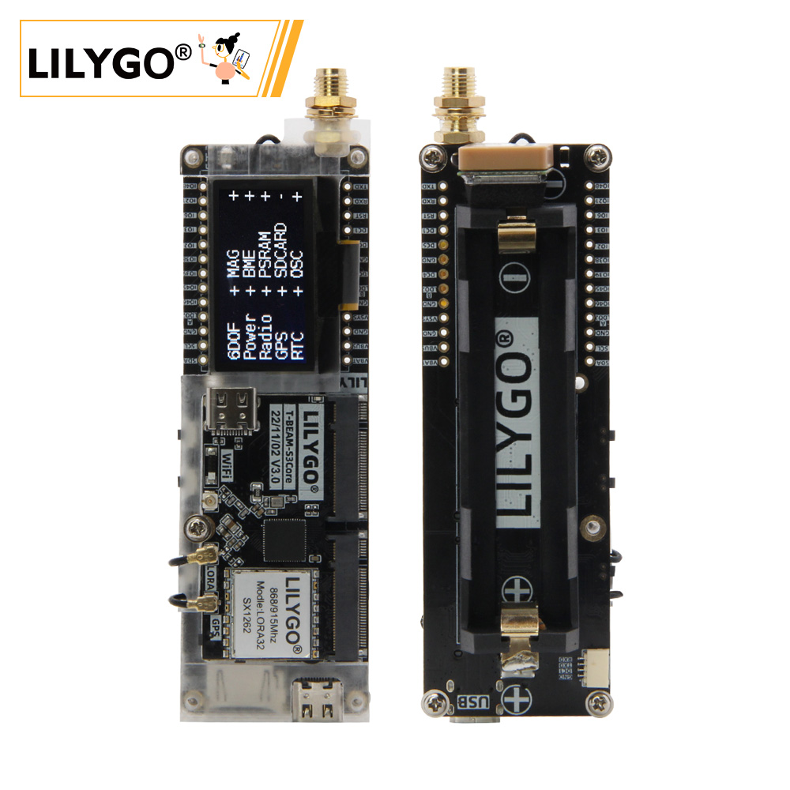
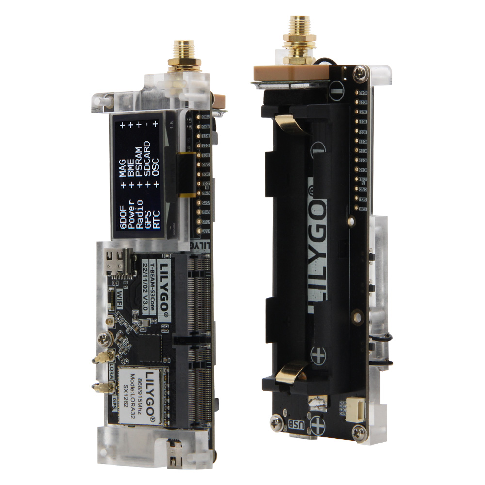
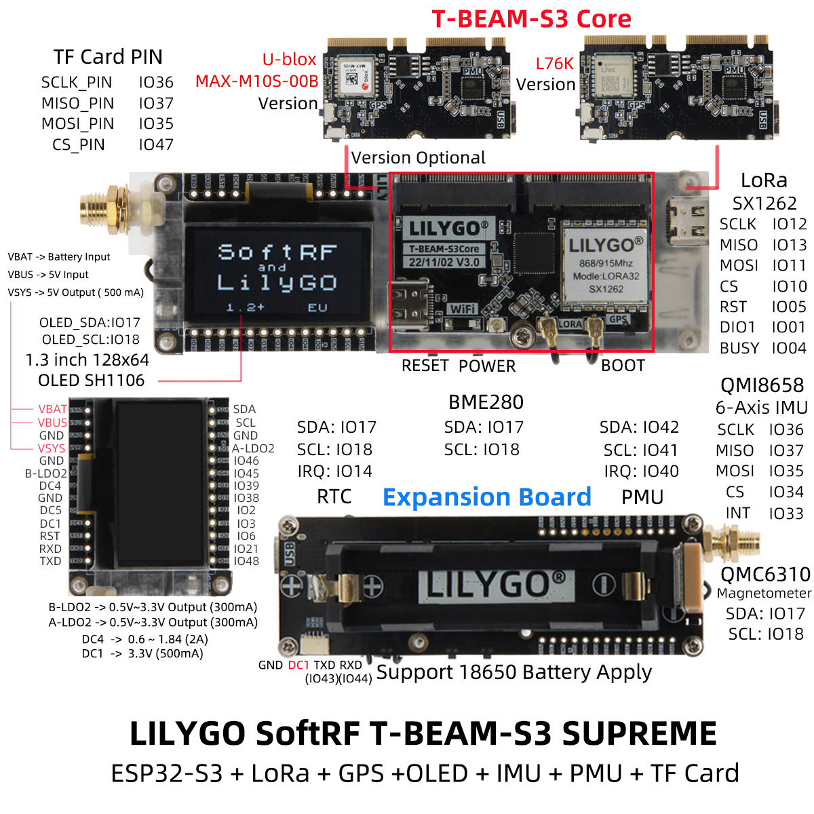
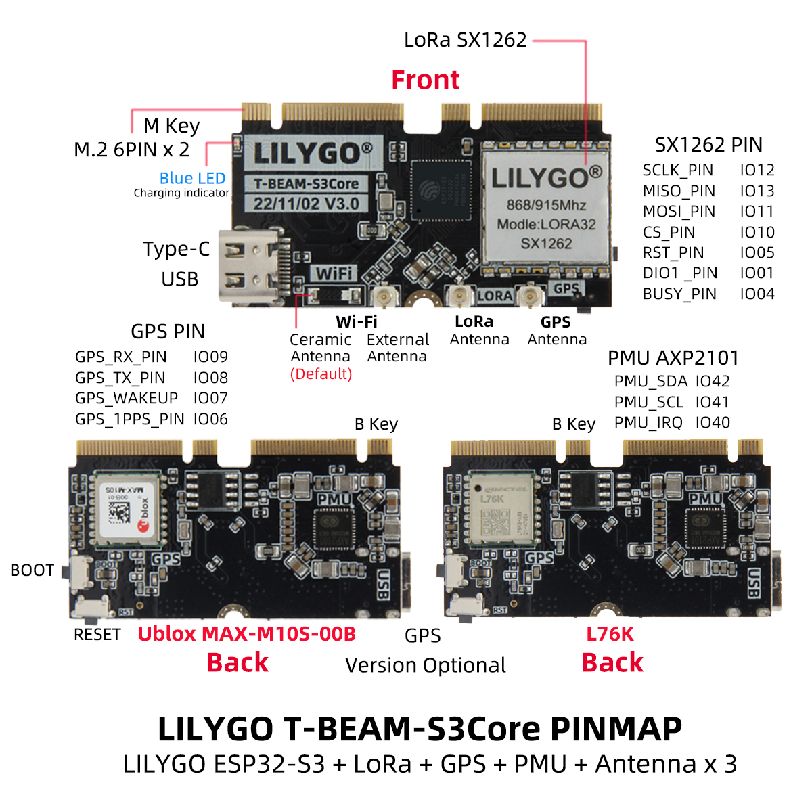
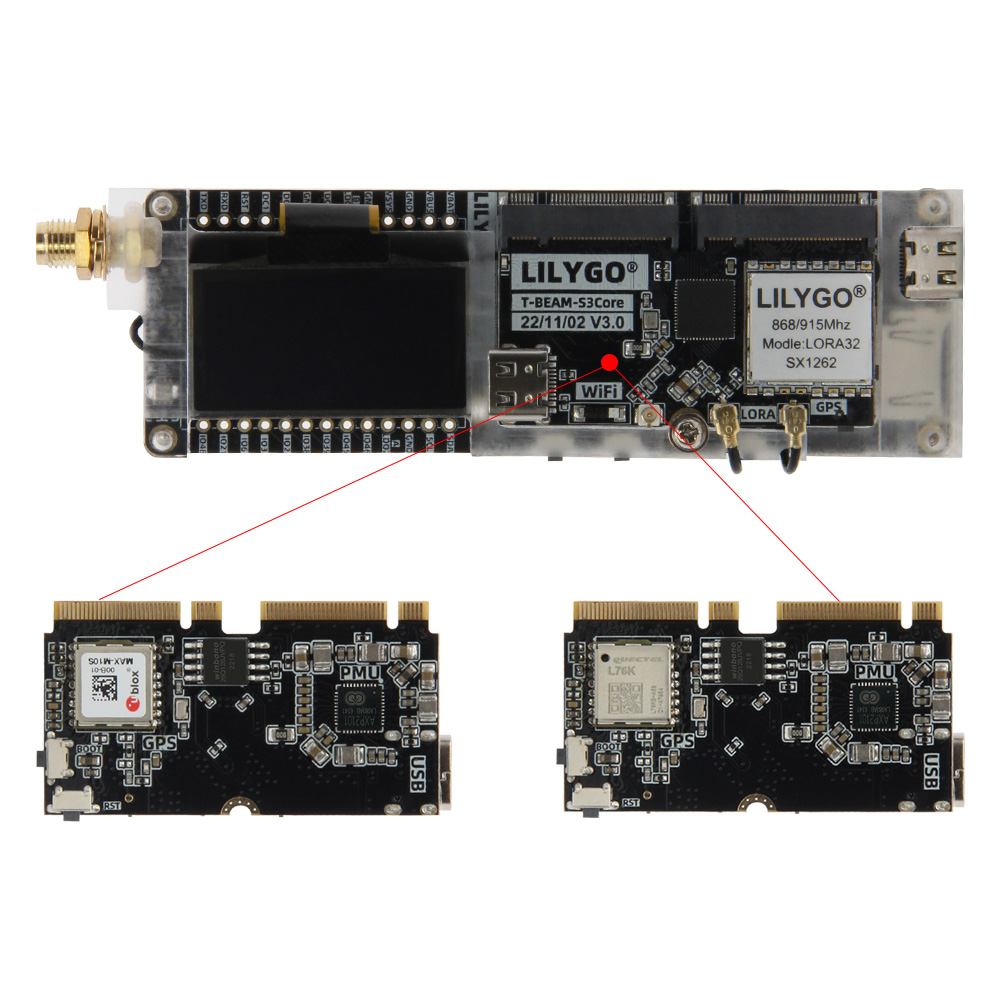
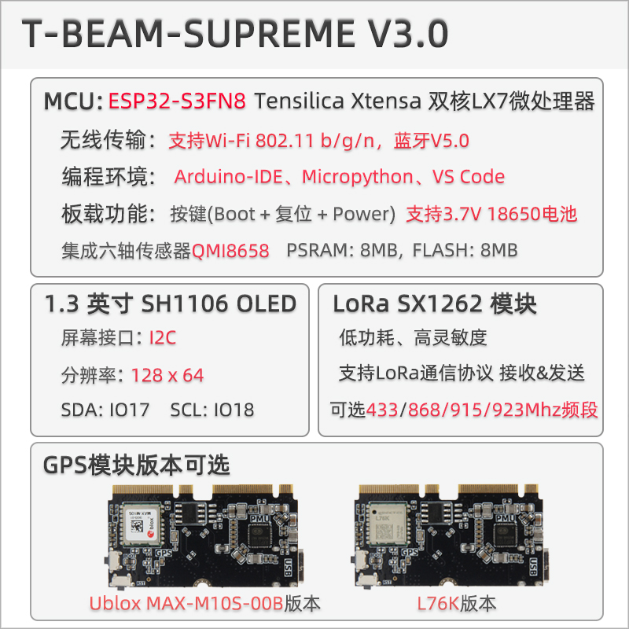

    <a target="_blank" style="margin: 1em;color: white; font-size: 0.9em; border-radius: 0.3em; padding: 0.5em 2em; background-color:rgb(63, 201, 28)" href="https://lilygo.cc/products/t-beam-supreme">官网购买</a>

## 版本迭代:
| Version | Update date | Update description |
| :-----: | :---------: | :---------------- |
| T-Beam-SUPREME_V3.0 | 最新版本 | 高性能多功能物联网开发板 |

## 购买链接

| Product | SOC | FLASH | PSRAM | LoRa | GPS | Link |
| :-----: | :--: | :---: | :---: | :--: | :--: | :--: |
| T-Beam SUPREME | ESP32-S3FN8 | 8M | 8M | SX1262 | MAX-M10S/L76K | [LILYGO Mall](https://lilygo.cc/products/t-beam-supreme) |

## 目录
- [描述](#描述)
- [预览](#预览)
- [模块](#模块)
- [快速开始](#快速开始)
- [引脚总览](#引脚总览)
- [相关测试](#相关测试)
- [常见问题](#常见问题)
- [项目](#项目)
- [资料](#资料)
- [依赖库](#依赖库)

## 描述

T-BEAM-SUPREME V3.0 是一款高性能多功能的物联网开发板，基于 ESP32-S3FN8 双核处理器设计，支持 Wi-Fi 802.11 b/g/n 和蓝牙 5.0，提供灵活的无线连接能力。开发板兼容 Arduino-IDE、MicroPython 和 VS Code 编程环境，搭载 8MB PSRAM 和 8MB Flash 存储，并集成六轴传感器（QMI8658）、温湿度气压传感器（BME280）、3.7V 18650 电池供电接口及多功能按键（Boot/复位/电源）。

其配备 1.3 英寸 SH1106 OLED 屏幕（128x64 分辨率，I2C 接口），支持 LoRa SX1262 模块（覆盖 433/868/915/923MHz 频段），可实现远距离低功耗通信。此外，用户可灵活选择 Ublox MAX-M10S 或 L76K GPS 模块版本，满足精准定位需求，适用于智能硬件、环境监测及物联网节点开发等场景。

## 预览

### 实物图

### 引脚图

### 核心板与拓展板

## 模块

### MCU

* 芯片：ESP32-S3FN8
* PSRAM：8MB
* FLASH：8MB
* 其他说明：更多资料请访问[乐鑫官方ESP32-S3数据手册](https://www.espressif.com.cn/sites/default/files/documentation/esp32-s3_datasheet_en.pdf)

### 屏幕

* 尺寸：1.3英寸 OLED
* 分辨率：128x64px
* 屏幕类型：OLED
* 驱动芯片：SH1106
* 总线通信协议：I2C

### LoRa

* 芯片：SX1262
* 频率：433/868/915/923MHz
* 其他：可选 LR1121

### GPS

* 芯片：MAX-M10S 或 L76K（可选）
* 特性：MAX-M10S 支持 NMEA 0183 协议，L76K 支持 UBX 协议
* 波特率：9600/19200/38400/57600/115200

### 传感器

* 六轴传感器：QMI8658
* 温湿度气压传感器：BME280
* 磁力计：QMC6309 or QMC6310U/QMC6310N（可选）

### 电源管理

* 芯片：AXP2101
* 特性：支持 3.7V 18650 电池供电

### RTC

* 芯片：PCF85063ATL
* 总线通信协议：I2C

### I2C 设备地址

| Devices                                 | 7-Bit Address | Share Bus      |
| --------------------------------------- | ------------- | -------------- |
| OLED Display (**SH1106**)               | 0x3C/0x3D     | ✅️  (I2C Bus 0) |
| MAG Sensor(**QMC6310U OR QMC6310N**)    | 0x1C/0x3C     | ✅️  (I2C Bus 0) |
| MAG Sensor(**QMC6309**)                 | 0x7C          | ✅️  (I2C Bus 0) |
| Temperature/humidity Sensor(**BME280**) | 0x77          | ✅️  (I2C Bus 0) |
| RTC (**PCF8563**)                       | 0x51          | ❌ (I2C Bus 1)  |
| Power Manager (**AXP2101**)             | 0x34          | ❌ (I2C Bus 1)  |

### 电气参数

| Features             | Details                     |
| -------------------- | --------------------------- |
| 🔗USB-C Input Voltage | 3.9V-6V                     |
| ⚡Charge Current      | 0-1024mA (\(Programmable\)) |
| 🔋Battery Voltage     | 3.7V                        |

### LR1121 RF Module 参数信息

| Features            | Details                       |
| ------------------- | ----------------------------- |
| RF  Module          | LR1121                        |
| Frequency range     | 830-945MHz，2.4-2.5GHz        |
| Transfer rate(LoRa) | 0.6 K~300 Kbps@FSK@ Sub1G     |
| Transfer rate(FSK)  | 0.018 K~62.5 Kbps@LoRa@ Sub1G |
| Transfer rate(FSK)  | 0.476 K~101.5 Kbps@LoRa@ 2.4G |
| Modulation          | LoRa,(G)FSK ，LR-FHSS         |

### 电源管理

| Channel    | Peripherals                              |
| ---------- | ---------------------------------------- |
| DC1        | **ESP32-S3**                             |
| DC2        | Unused                                   |
| DC3        | External M.2 Socket                      |
| DC4        | External M.2 Socket                      |
| DC5        | External M.2 Socket                      |
| LDO1(VRTC) | Unused                                   |
| ALDO1      | **BME280 Sensor & Display & MAG Sensor** |
| ALDO2      | **Sensor**                               |
| ALDO3      | **Radio**                                |
| ALDO4      | **GPS**                                  |
| BLDO1      | **SD Card**                              |
| BLDO2      | External pin header                      |
| DLDO1      | Unused                                   |
| CPUSLDO    | Unused                                   |
| VBACKUP    | Unused                                   |

* T-Beam Supreme GPS 备用电源由 18650 电池提供。若您移除 18650 电池，将无法实现 GPS 热启动。如需使用 GPS 热启动，请连接 18650 电池。

### 概述

| 组件 | 描述 |
| :--: | :--: |
| MCU | ESP32-S3FN8 Dual-core LX7 microprocessor |
| FLASH| 8MB |
| PSRAM | 8MB|
| 屏幕 | 1.3 英寸 SH1106 OLED |
| LoRa | SX1262 (868/915MHz) / LR1121 |
| GPS | MAX-M10S 或 L76K |
| RTC | PCF85063ATL (I2C) |
| 传感器 | QMI8658 (六轴) + BME280 (温湿度气压) |
| 电源管理 | AXP2101 |
| 存储 | TF 卡 |
| 无线 | 2.4GHz Wi-Fi + Bluetooth 5.0 |
| USB | 1 × USB Port and OTG (TYPE-C接口) |
| IO 接口 | 2.54mm间距 2*13 拓展IO接口 |
| 拓展接口 | WiFi天线 + LoRa天线 + GPS天线 + Qwiic接口 |
| 按键 | 1 x RESET + 1 x BOOT + 1 x Power |
| 电池 | 支持 3.7V 18650 电池 |
| 尺寸 | **114x33x28mm** |

## 快速开始

### 示例支持

~~~bash
./examples/
├── ArduinoLoRa                              # Only support SX1276/SX1278 radio module (仅支持 SX1276/SX1278 无线电模块)
│   ├── LoRaReceiver
│   └── LoRaSender
├── Display                                  # Only supports TBeam TFT Shield
│   ├── Free_Font_Demo
│   ├── TBeam_TFT_Shield
│   ├── TFT_Char_times
│   └── UTFT_demo
├── GPS                                      # T-Beam GPS demo examples
│   ├── TinyGPS_Example
│   ├── TinyGPS_FullExample
│   ├── TinyGPS_KitchenSink
│   ├── UBlox_BasicNMEARead                  # Only support Ublox GNSS Module           
│   ├── UBlox_NMEAParsing                    # Only support Ublox GNSS Module           
│   ├── UBlox_OutputRate                     # Only support Ublox GNSS Module      
│   └── UBlox_Recovery                       # Only support Ublox GNSS Module      
├── LoRaWAN                                  # LoRaWAN examples
│   ├── LMIC_Library_OTTA
│   └── RadioLib_OTAA
├── OLED
│   ├── SH1106FontUsage
│   ├── SH1106GraphicsTest
│   ├── SH1106IconMenu
│   ├── SH1106PrintUTF8
│   ├── SSD1306SimpleDemo
│   └── SSD1306UiDemo
├── PMU                                      # T-Beam & T-Beam S3 PMU demo examples
├── RadioLibExamples                         # RadioLib examples,Support SX1276/78/62/80...
│   ├── Receive_Interrupt
│   └── Transmit_Interrupt
├── Sensor                                   # Sensor examples,only support t-beams3-supreme
│   ├── BME280_AdvancedsettingsExample
│   ├── BME280_TestExample
│   ├── BME280_UnifiedExample
│   ├── PCF8563_AlarmByUnits
│   ├── PCF8563_SimpleTime
│   ├── PCF8563_TimeLib
│   ├── PCF8563_TimeSynchronization
│   ├── QMC6310_CalibrateExample
│   ├── QMC6310_CompassExample
│   ├── QMC6310_GetDataExample
│   ├── QMC6310_GetPolarExample
│   ├── QMI8658_BlockExample
│   ├── QMI8658_GetDataExample
│   ├── QMI8658_InterruptBlockExample
│   ├── QMI8658_InterruptExample
│   ├── QMI8658_LockingMechanismExample
│   ├── QMI8658_MadgwickAHRS
│   ├── QMI8658_PedometerExample
│   ├── QMI8658_ReadFromFifoExample
│   └── QMI8658_WakeOnMotion
|── T3S3Factory                              # T3 S3 factory test examples
└── Factory                                  # T-Beam & T-Beam S3 and BPF factory test examples
~~~

### PlatformIO

1.  安装 [Visual Studio Code](https://code.visualstudio.com/) 和 [Python](https://www.python.org/)
2.  在 `Visual Studio Code` 的扩展中搜索 `PlatformIO` 插件并安装
3.  安装完成后，需要重启 `Visual Studio Code`
4.  重启后，在左上角选择 `文件` -> `打开文件夹` -> 选择 `LilyGo-LoRa-Series` 目录
5.  等待第三方依赖库安装完成
6.  点击打开 `platformio.ini` 文件，在 `platformio` 栏目中
7.  在 `default_envs` 下选择您要使用的开发板名称，并取消其注释
8.  取消其中一行 `src_dir = xxxx` 的注释，确保只有一行生效。请注意示例注释，其中说明了哪些功能可用、哪些不可用。
9.  点击左下角的 (✔) 符号进行编译
10. 使用 USB-C 数据线将开发板连接至电脑（Micro-USB 接口用于模块固件升级）
11. 点击 (→) 上传固件
12. 点击 (插头符号) 监视串行输出
13. 若无法烧录或 USB 设备持续闪烁，请查看下方的**常见问题解答**

### Arduino

1.  安装 [Arduino IDE](https://www.arduino.cc/en/software)
2.  安装 [Arduino ESP32](https://docs.espressif.com/projects/arduino-esp32/en/latest/)
3.  将 `lib` 目录中的所有文件夹复制到 `Sketchbook location` 目录中。如何查找库文件位置，[请参阅此处](https://support.arduino.cc/hc/en-us/articles/4415103213714-Find-sketches-libraries-board-cores-and-other-files-on-your-computer)
    * Windows: `C:\Users\{用户名}\Documents\Arduino`
    * macOS: `/Users/{用户名}/Documents/Arduino`
    * Linux: `/home/{用户名}/Arduino`
4.  打开相应示例
    * 打开已下载的 `LilyGo-LoRa-Series` 文件夹
    * 打开 `examples` 文件夹
    * 选择示例文件并打开后缀为 `ino` 的文件
5.  在 Arduino IDE 工具菜单中选择对应开发板型号，点击下方列表中的对应选项进行选择

| Name                                 | Value                             |
| ------------------------------------ | --------------------------------- |
| Board                                | **ESP32S3 Dev Module**            |
| Port                                 | Your port                         |
| USB CDC On Boot                      | Enable                            |
| CPU Frequency                        | 240MHZ(WiFi)                      |
| Core Debug Level                     | None                              |
| USB DFU On Boot                      | Disable                           |
| Erase All Flash Before Sketch Upload | Disable                           |
| Events Run On                        | Core1                             |
| Flash Mode                           | QIO 80MHZ                         |
| Flash Size                           | **8MB(64Mb)**                     |
| Arduino Runs On                      | Core1                             |
| USB Firmware MSC On Boot             | Disable                           |
| Partition Scheme                     | **8M Flash(3M APP/1.5MB SPIFFS)** |
| PSRAM                                | **QSPI PSRAM**                    |
| Upload Mode                          | **UART0/Hardware CDC**            |
| Upload Speed                         | 921600                            |
| USB Mode                             | **CDC and JTAG**                  |
| Programmer                           | **Esptool**                       |

6. 请根据您的开发板型号取消 `utilities.h` 文件中对应型号的注释，例如 `T_BEAM_S3_SUPREME_SX1262` 或者 `T_BEAM_S3_SUPREME_LR1121`，否则编译将报错
7. 上传程序

### 开发平台
1. [Arduino IDE](https://www.arduino.cc/en/software)
2. [Platform IO](https://platformio.org/)
3. [ESP-IDF](https://www.espressif.com/zh-hans/products/sdks/esp-idf)
4. [Micropython](https://micropython.org/)

## 引脚总览

|Name       | GPIO NUM         | Free |
| -------------------------------------------- | -------------------------- | ---- |
| Uart1 TX                                     | 43(External QWIIC Socket)  | ✅️    |
| Uart1 RX                                     | 44(External QWIIC Socket)  | ✅️    |
| SDA                                          | 17                         | ❌    |
| SCL                                          | 18                         | ❌    |
| OLED(**SH1106**) SDA                         | Share with I2C bus         | ❌    |
| OLED(**SH1106**) SCL                         | Share with I2C bus         | ❌    |
| RTC(**PCF8563**) SDA                         | Share with **PMU** I2C bus | ❌    |
| RTC(**PCF8563**) SCL                         | Share with **PMU** I2C bus | ❌    |
| MAG Sensor(**QMC6310U/QMC6310N/QC6309**) SDA | Share with I2C bus         | ❌    |
| MAG Sensor(**QMC6310U/QMC6310N/QC6309**) SCL | Share with I2C bus         | ❌    |
| RTC(**PCF8563**) Interrupt                   | 14                         | ❌    |
| IMU Sensor(**QMI8658**) Interrupt            | 33                         | ❌    |
| IMU Sensor(**QMI8658**) MISO                 | Share with SPI bus         | ❌    |
| IMU Sensor(**QMI8658**) MOSI                 | Share with SPI bus         | ❌    |
| IMU Sensor(**QMI8658**) SCK                  | Share with SPI bus         | ❌    |
| IMU Sensor(**QMI8658**) CS                   | 34                         | ❌    |
| SPI MOSI                                     | 35                         | ❌    |
| SPI MISO                                     | 37                         | ❌    |
| SPI SCK                                      | 36                         | ❌    |
| SD CS                                        | 47                         | ❌    |
| SD MOSI                                      | Share with SPI bus         | ❌    |
| SD MISO                                      | Share with SPI bus         | ❌    |
| SD SCK                                       | Share with SPI bus         | ❌    |
| GNSS(**L76K or Ublox M10**) TX               | 8                          | ❌    |
| GNSS(**L76K or Ublox M10**) RX               | 9                          | ❌    |
| GNSS(**L76K or Ublox M10**) PPS              | 6                          | ❌    |
| GNSS(**L76K**) Wake-up                       | 7                          | ❌    |
| LoRa(**SX1262 or LR1121**) SCK               | 12                         | ❌    |
| LoRa(**SX1262 or LR1121**) MISO              | 13                         | ❌    |
| LoRa(**SX1262 or LR1121**) MOSI              | 11                         | ❌    |
| LoRa(**SX1262 or LR1121**) RESET             | 5                          | ❌    |
| LoRa(**SX1262 or LR1121**) DIO1/DIO9         | 1                          | ❌    |
| LoRa(**SX1262 or LR1121**) BUSY              | 4                          | ❌    |
| LoRa(**SX1262 or LR1121**) CS                | 10                         | ❌    |
| Button1 (BOOT)                               | 0                          | ❌    |
| PMU (**AXP2101**) IRQ                        | 40                         | ❌    |
| PMU (**AXP2101**) SDA                        | 42                         | ❌    |
| PMU (**AXP2101**) SCL                        | 41                         | ❌    |
> 1. GNSS 唤醒功能仅在 L76K 版本中可用。
> 
> 2. 收音机有自己的 SPI 总线，而其他外设 SPI 设备则共享该 SPI 总线
> 3. T-BeamSupreme 有三种磁力计版本：QMC6310N, QMC6310U, 和 QMC6309，每个都有不同的设备地址。

## 相关测试

*测试数据待补充*

## 常见问题

* **Q. 如何选择 GPS 模块版本？**  
  A. MAX-M10S 精度更高功耗更低，L76K 成本更有优势。根据定位精度和预算需求选择。

* **Q. LoRa 通信距离不理想怎么办？**  
  A. 检查天线连接，确保在开阔环境使用，调整 LoRa 参数（扩频因子、带宽等）。

* **Q. 电池供电时间短？**  
  A. 启用深度睡眠模式，关闭不必要的传感器和外设，选择低功耗运行模式。

* **Q. 设备无法烧录程序？**  
  A. 确保 USB CDC On Boot 已启用，按住 BOOT 按键再点击 RESET 进入下载模式。

## 项目

* [T-Beam Supreme schematic](https://github.com/Xinyuan-LilyGO/LilyGo-LoRa-Series/blob/master/schematic/LilyGo_T-BeamS3Supreme.pdf)

## 资料

* [原理图](https://github.com/Xinyuan-LilyGO/LilyGo-LoRa-Series/blob/master/schematic/LilyGo_T-BeamS3Supreme.pdf)
* [SX1262 数据手册](https://www.semtech.com/products/wireless-rf/lora-transceivers/sx1262)
* [MAX-M10S 数据手册](https://www.u-blox.com/zh/product/max-m10-series)
* [L76K 协议规范](https://github.com/Xinyuan-LilyGO/LilyGo-LoRa-Series/blob/master/docs/datasheet/Quectel_L76KL26K_GNSS_协议规范_V1.2.pdf)
* [BME280 数据手册](https://www.bosch-sensortec.com/products/environmental-sensors/humidity-sensors-bme280/)
* [QMI8658 数据手册](https://github.com/Xinyuan-LilyGO/LilyGo-LoRa-Series/blob/master/lib/SensorsLib/datasheet/QMI8658A%20Datasheet%20Rev1.0.pdf)

## 依赖库

* [AXP202X_Library](https://github.com/lewisxhe/AXP202X_Library)
* [Arduino_GFX](https://github.com/moononournation/Arduino_GFX)
* [Adafruit_BME280_Library](https://github.com/adafruit/Adafruit_BME280_Library)
* [RadioLib](https://github.com/jgromes/RadioLib)
* [TinyGPSPlus](https://github.com/mikalhart/TinyGPSPlus)
* [U8g2](https://github.com/olikraus/u8g2)
* [SensorsLib](https://github.com/lewisxhe/SensorsLib)