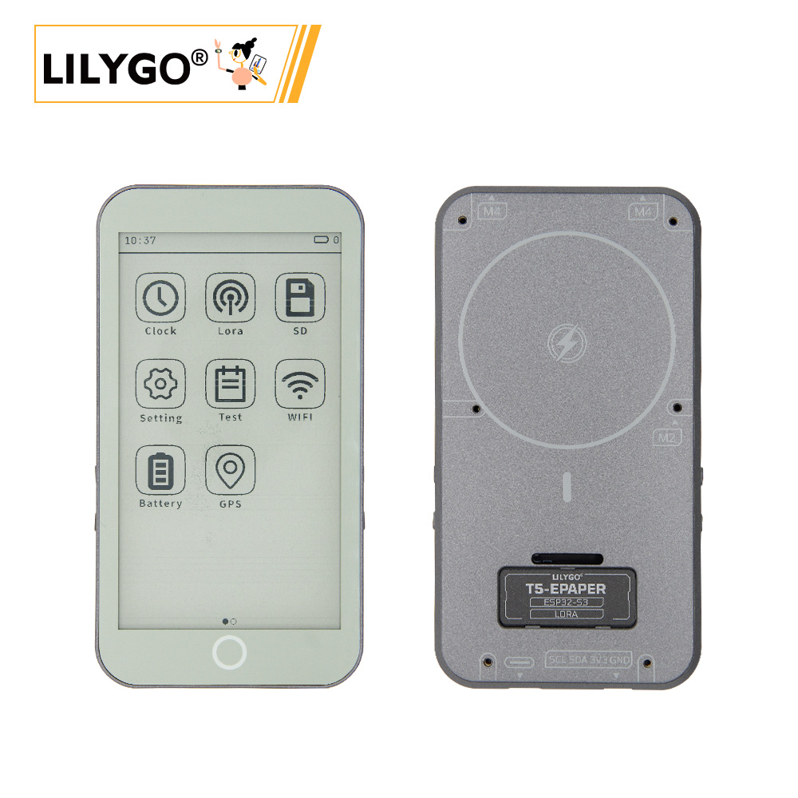
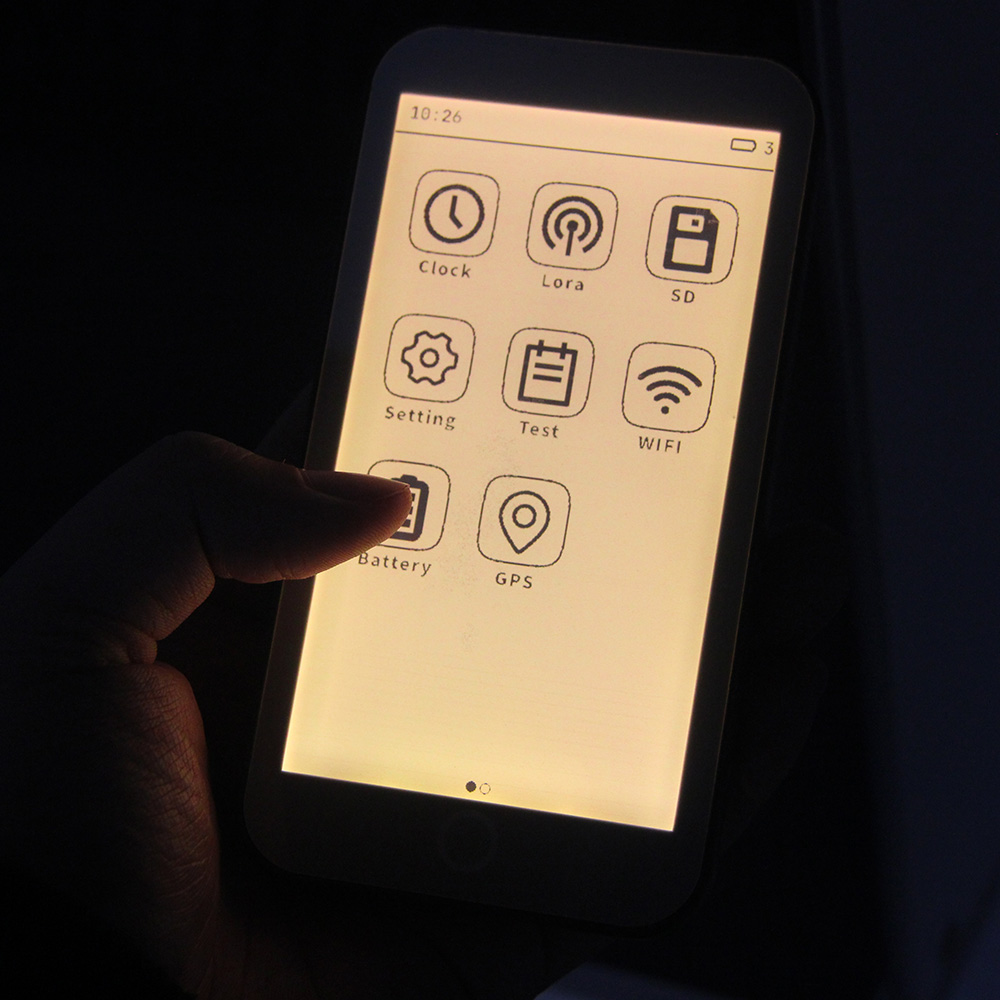
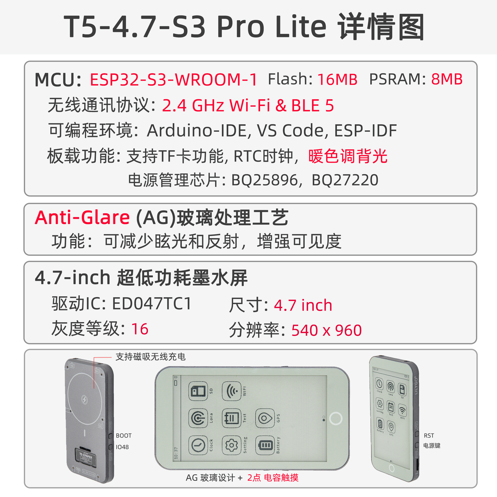

<div style="width:100%; display:flex;justify-content: center;">



</div>

<div style="padding: 1em 0 0 0; display: flex; justify-content: center">
    <a target="_blank" style="margin: 1em;color: white; font-size: 0.9em; border-radius: 0.3em; padding: 0.5em 2em; background-color:rgb(63, 201, 28)" href="#">官网购买</a>
</div>

## 版本迭代:
| Version | Update date | Update description |
| :-----: | :---------: | :---------------- |
| T5-ePaper-S3-V2.4 |  | 当前版本（Pro版） |
| T5-ePaper-S3-Lite |  | 新增Lite版（移除GPS/LoRa，AG玻璃+暖光背光） |

## 购买链接

| Product | SOC | FLASH | PSRAM | Link |
| :-----: | :--: | :---: | :---: | :--: |
| T5-4.7-S3 Pro | ESP32-S3-WROOM-1-N16R8 | 16MB | 8MB | [LILYGO Mall](#) |
| T5-4.7-S3 Lite | ESP32-S3-WROOM-1-N16R8 | 16MB | 8MB | [LILYGO Mall](#) |

## 目录
- [描述](#描述)
- [版本差异](#版本差异)
- [预览](#预览)
- [模块](#模块)
- [快速开始](#快速开始)
- [引脚总览](#引脚总览)
- [相关测试](#相关测试)
- [常见问题](#常见问题)
- [项目](#项目)
- [资料](#资料)
- [依赖库](#依赖库)

## 描述

LILYGO T5-4.7-S3 系列是基于 ESP32-S3-WROOM-1-N16R8 芯片（内置 8MB PSRAM 和 16MB Flash）的 4.7 英寸电子墨水屏（E-Paper）开发方案，分为 **Pro 版** 和 **Lite 版** 两个型号：

### Pro 版
集成电容式触摸功能（支持两点触控），配备 PCF8563 实时时钟芯片，Type-C USB 接口以及 Li-Po 电池接口（JST-PH 2.0mm），支持电池电压监测（Bat ADC）。提供兼容树莓派 40-PIN 的 GPIO 扩展接口，板载 TF 卡槽，具备专用的屏幕驱动信号（STV/LE）和 SPI 接口（CS/SCLK/MOSI/MISO），采用 2.5D 弧面设计，适合全功能低功耗墨水屏应用开发。

### Lite 版
**专为低成本墨水屏应用优化**，移除了 GPS 与 LoRa 模块，大幅降低硬件成本，更适合电子书、墨水屏相册、气象站等纯显示类应用开发。核心升级：
- 屏幕玻璃采用 **AG 防眩光工艺**，户外可视性大幅提升
- 背光改为 **暖色调**，长时间阅读更护眼
- 保留 ESP32-S3 核心性能、电子墨水屏、触控、RTC 等核心功能

## 版本差异


| 功能 | T5-4.7-S3 Pro | T5-4.7-S3 Lite |
| :--: | :---: | :---: |
| 核心芯片 | ESP32-S3-WROOM-1-N16R8 | ESP32-S3-WROOM-1-N16R8 |
| Flash/PSRAM | 16MB/8MB | 16MB/8MB |
| 电子墨水屏 | 4.7英寸 EDO47TC1 (540×960) | 4.7英寸 EDO47TC1 (540×960) |
| 触控功能 | GT911 两点电容触控 | GT911 两点电容触控 |
| RTC 时钟 | PCF8563 | PCF8563 |
| GPS/LoRa 模块 | ✅ 支持 | ❌ 移除 |
| 玻璃工艺 | 普通玻璃 | AG 防眩光玻璃 |
| 背光 | 标准白光 | 暖色调背光 |
| 适用场景 | 全功能物联网终端 | 电子书/相册/气象站等纯显示应用 |
| 成本 | 较高 | 大幅降低 |

## 预览

### 实物图

<div style="width:100%; display:flex;justify-content: center;">




</div>

### 引脚图


### 产品信息图

<div style="width:100%; display:flex;justify-content: center; gap: 1em; flex-wrap: wrap;">
  
</div>

## 模块

### MCU

* 芯片：ESP32-S3-WROOM-1-N16R8
* PSRAM：8MB
* FLASH：16MB
* 无线：Wi-Fi 802.11 b/g/n; Bluetooth 5.0 (BLE)
* 其他说明：更多资料请访问[乐鑫官方ESP32-S3数据手册](https://www.espressif.com.cn/sites/default/files/documentation/esp32-s3_datasheet_en.pdf)

### 电子墨水屏

* 型号：EDO47TC1
* 尺寸：4.7英寸
* 分辨率：540×960像素
* 类型：低功耗电子墨水屏
* 接口：SPI + 专用驱动信号（STV/LE）
* Lite 版升级：AG 防眩光玻璃 + 暖色调背光

### 触摸屏

* 芯片：GT911
* 类型：电容式触摸屏
* 支持：两点触控
* 接口：I²C

### 实时时钟

* 芯片：PCF8563
* 功能：实时时钟，时间保持
* 接口：I²C

### 电源管理

* 电池接口：JST-PH 2.0mm Li-Po电池接口
* 电压监测：电池电压ADC监测
* USB供电：Type-C接口

### 概述

| 组件 | Pro 版描述 | Lite 版描述 |
| :--: | :--: | :--: |
| MCU | ESP32-S3-WROOM-1-N16R8 | ESP32-S3-WROOM-1-N16R8 |
| FLASH | 16MB | 16MB |
| PSRAM | 8MB | 8MB |
| 屏幕 | EDO47TC1 4.7英寸电子墨水屏 (540×960) | EDO47TC1 4.7英寸电子墨水屏 (540×960) + AG玻璃+暖光背光 |
| 触摸 | GT911电容触摸屏（两点触控） | GT911电容触摸屏（两点触控） |
| 时钟 | PCF8563实时时钟 | PCF8563实时时钟 |
| GPS/LoRa | ✅ 支持 | ❌ 移除 |
| 存储 | TF卡扩展 | TF卡扩展 |
| 无线 | 2.4 GHz Wi-Fi & Bluetooth 5 (LE) | 2.4 GHz Wi-Fi & Bluetooth 5 (LE) |
| USB | 1 × USB Port and OTG (TYPE-C接口) | 1 × USB Port and OTG (TYPE-C接口) |
| IO扩展 | 2 × 20pin扩展接口（兼容树莓派40-PIN） | 2 × 20pin扩展接口（兼容树莓派40-PIN） |
| 扩展接口 | 1 × JST-PH 2.0mm电池接口 + 2 × 4pin Molex连接器 | 1 × JST-PH 2.0mm电池接口 |
| 按键 | 1 x RST按键 + 1 x SIR_io0按键 + 1 x io21按键 | 1 x RST按键 + 1 x SIR_io0按键 + 1 x io21按键 |
| 定位孔 | 6 × 3.8mm定位孔 | 6 × 3.8mm定位孔 |
| 尺寸 | **121×67×12mm** | **121×67×12mm** |
| 设计 | 2.5D弧面设计 | 2.5D弧面设计 |

## 快速开始

### 示例支持

```txt
examples/
├── button              ; Keystroke example
├── demo                ; Comprehensive test example including sleep current test
├── drawExample         ; Simple examples of drawing lines and circles
├── drawImages          ; Show image example
├── grayscale_test      ; Grayscale example
├── screen_repair       ; Full screen refresh example
├── spi_driver          ; Display as slave device
├── touch               ; Touch example
└── wifi_sync           ; WiFi Comprehensive Example
```

### PlatformIO
1. 安装[VisualStudioCode](https://code.visualstudio.com/Download)，根据你的系统类型选择安装。
2. 打开VisualStudioCode软件侧边栏的"扩展"（或者使用<kbd>Ctrl</kbd>+<kbd>Shift</kbd>+<kbd>X</kbd>打开扩展），搜索"PlatformIO IDE"扩展并下载。
3. 在安装扩展的期间，你可以前往GitHub下载程序，你可以通过点击带绿色字样的"<> Code"下载主分支程序，也通过侧边栏下载"Releases"版本程序。
4. 扩展安装完成后，打开侧边栏的资源管理器（或者使用<kbd>Ctrl</kbd>+<kbd>Shift</kbd>+<kbd>E</kbd>打开），点击"打开文件夹"，找到刚刚你下载的项目代码（整个文件夹），点击"添加"，此时项目文件就添加到你的工作区了。
5. 打开项目文件中的"platformio.ini"（添加文件夹成功后PlatformIO会自动打开对应文件夹的"platformio.ini"）,在"[platformio]"目录下取消注释选择你需要烧录的示例程序（以"default_envs = xxx"为标头），然后点击左下角的"<kbd>√</kbd>"进行编译，如果编译无误，将单片机连接电脑，点击左下角"<kbd>→</kbd>"即可进行烧录。

### Arduino
1. 安装[Arduino](https://www.arduino.cc/en/software)，根据你的系统类型选择安装。
2. 打开项目文件夹的"`example`"目录，选择示例项目文件夹，打开以".ino"结尾的文件即可打开Arduino IDE项目工作区。
3. 打开右上角"`工具`"菜单栏->选择"`开发板`"->"`开发板管理器`"，找到或者搜索"`esp32`"，下载作者名为"`Espressif Systems`"的开发板文件。接着返回"开发板"菜单栏，选择"`ESP32 Arduino`"开发板下的开发板类型。
4. 打开菜单栏"文件"->"首选项"，找到"项目文件夹位置"这一栏，将项目目录下的"`libraries`"文件夹里的所有库文件连带文件夹复制粘贴到这个目录下的"`libraries`"里边。
5. 在"`工具`"菜单中选择正确的设置，如下表所示。

#### ESP32-S3
| Setting | Value |
| :-----: | :---: |
| Board | ESP32S3 Dev Module |
| Upload Speed | 921600 |
| USB Mode | Hardware CDC and JTAG |
| USB CDC On Boot | Enabled |
| USB Firmware MSC On Boot | Disabled |
| USB DFU On Boot | Disabled |
| CPU Frequency | 240MHz (WiFi) |
| Flash Mode | QIO 80MHz |
| Flash Size | 16MB (128Mb) |
| Core Debug Level | None |
| Partition Scheme | 16M Flash (3MB APP/9.9MB FATFS) |
| PSRAM | OPI PSRAM |
| Arduino Runs On | Core 1 |
| Events Run On | Core 1 |

6. 选择正确的端口。
7. 点击右上角"<kbd>√</kbd>"进行编译，如果编译无误，将单片机连接电脑，点击右上角"<kbd>→</kbd>"即可进行烧录。

### 开发平台
1. [ESP-IDF](https://www.espressif.com/zh-hans/products/sdks/esp-idf)
2. [Arduino IDE](https://www.arduino.cc/en/software)
3. [VS Code](https://code.visualstudio.com/)
4. [Micropython](https://micropython.org/)

## 引脚总览

| ESP32S3 GPIO | Connect To          | Free |
| ------------ | ------------------- | ---- |
| 13           | 74HCT4094D CFG_DATA | ❌    |
| 12           | 74HCT4094D CFG_CLK  | ❌    |
| 0            | 74HCT4094D CFG_STR  | ❌    |
| 38           | E-paper CKV         | ❌    |
| 40           | E-paper STH         | ❌    |
| 41           | E-paper CKH         | ❌    |
| 8            | E-paper D0          | ❌    |
| 1            | E-paper D1          | ❌    |
| 2            | E-paper D2          | ❌    |
| 3            | E-paper D3          | ❌    |
| 4            | E-paper D4          | ❌    |
| 5            | E-paper D5          | ❌    |
| 6            | E-paper D6          | ❌    |
| 7            | E-paper D7          | ❌    |
| 21           | Button              | ❌    |
| 14           | Battery ADC         | ❌    |
| 16           | SD MISO             | ❌*   |
| 15           | SD MOSI             | ❌*   |
| 11           | SD  SCK             | ❌*   |
| 42           | SD  CS              | ❌*   |
| 18           | SDA                 | ❌    |
| 17           | SCL                 | ❌    |
| 47           | TouchPanel IRQ      | ❌    |
| 45           | No Connect any      | ✅    |
| 10           | No Connect any      | ✅    |
| 48           | No Connect any      | ✅    |
| 39           | No Connect any      | ✅    |

- 标有 ✅ 的 GPIO 可以自由使用。GPIO10 可用于模拟输入，但不能用于其他用途。
- SD 引脚 如果您不使用 SD 卡，这些 GPIO（16、15、11、42）可以自由使用。
- 由于设计中 RTC_GPIO 未连接到触摸中断，ESP 无法通过触摸中断唤醒。不过，可以将 GPIO10 连接到 GPIO47 以实现触摸唤醒功能。详情请见此处 [issues/93](https://github.com/Xinyuan-LilyGO/LilyGo-EPD47/issues/93#issuecomment-2488500117)


## 相关测试


## 常见问题

* **Q. 看了以上教程我还是不会搭建编程环境怎么办？**  
  A. 如果看了以上教程还不懂如何搭建环境的可以参考[LilyGo-Document](https://github.com/Xinyuan-LilyGO/LilyGo-Document)文档说明来搭建。

* **Q. 为什么打开Arduino IDE时他会提醒我是否要升级库文件？我应该升级还是不升级？**  
  A. 选择不升级库文件，不同版本的库文件可能不会相互兼容所以不建议升级库文件。

* **Q. 电子墨水屏的刷新率如何？**  
  A. 电子墨水屏具有极低的功耗特性，但刷新率相对较低，适合显示静态或更新不频繁的内容。

* **Q. 为什么我的板子一直烧录失败呢？**  
  A. 请按住"BOOT"按键重新下载程序。

* **Q. Lite 版和 Pro 版的代码可以通用吗？**  
  A. 核心显示、触控、RTC 等功能代码完全通用；

* **Q. 为什么我的板子一直烧录失败呢？**  
  A. AG 防眩光玻璃可大幅减少屏幕反光，户外阳光下可视性提升明显；暖色调背光更接近纸质书观感，长时间阅读更护眼，适合电子书、阅读器类应用。

## 项目

* [T5-ePaper-S3-V2.4](https://github.com/Xinyuan-LilyGO/LilyGo-EPD47/blob/esp32s3/schematic/T5-ePaper-S3-V2.4.pdf)

## 资料
* [ESP32-S3 Datasheet](https://www.espressif.com.cn/sites/default/files/documentation/esp32-s3_datasheet_en.pdf)
* [ED047TC1 Screen Datasheet](https://github.com/Xinyuan-LilyGO/LilyGo-EPD47/blob/esp32s3/datasheet/ED047TC1.pdf)

## 依赖库
* [Button2](https://github.com/LennartHennigs/Button2)
* [SensorLib@0.19](https://github.com/lewisxhe/SensorsLib)
* [GxEPD2](https://github.com/ZinggJM/GxEPD2)
* [Adafruit_GFX](https://github.com/adafruit/Adafruit-GFX-Library)